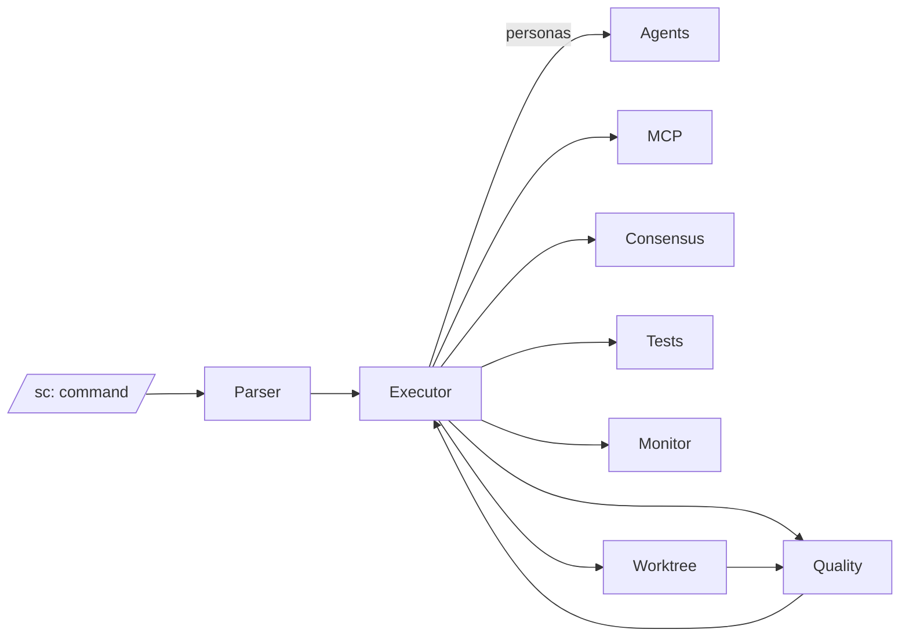

# 1. Executive Summary
- **Mission fit:** Framework is positioned as an offline-first orchestrator that delivers verifiable code changes through agent collaboration; recent guardrail decisions reinforce evidence-first delivery but downstream integrations remain incomplete.
- **Overall health:** Yellow — the command executor now enforces consensus, auto-tests, static validation, and telemetry for `requires_evidence` flows, yet hallucination controls still rely on stubs and lack semantic validation or calibrated model ensembles.
- **Top 3 risks:**
  - ConsensusBuilder lacks real model executors, so consensus gates degrade to single-model behavior despite enforcement hooks (`SuperClaude/ModelRouter/consensus.py`).
  - Static validation only performs syntax/JSON/YAML checks, leaving semantic hallucinations (missing imports, dead symbols) undetected (`SuperClaude/Commands/executor.py:3097-3230`).
  - Metrics for plan-only outcomes flow to the monitor, but no dashboards or thresholds act on them, so regressions remain invisible in practice (`SuperClaude/Commands/executor.py:3345-3394`).
- **Top 3 recommendations:**
  - Wire real multi-model executors into `ConsensusBuilder` with calibrated agreement thresholds per command criticality.
  - Layer semantic validation (AST import checks, module existence, dependency inventory) ahead of success to surface hallucinated references.
  - Turn hallucination telemetry into actionable alerts and regression dashboards (e.g., treat plan-only spikes as CI failures).

# 2. Product Context
- Decisions log (2025-10-17, 2025-10-25, 2025-10-26) documents MCP consolidation, UnifiedStore adoption, and stricter `requires_evidence` handling, but no mission/roadmap docs exist locally.
- Intended users are Claude Code operators who need verifiable diffs with offline guarantees; success metrics would center on executed vs plan-only rates, loop iterations required, and quality scores.
- Constraints: offline mode by default, limited MCP roster (Sequential, PAL, Deepwiki), reliance on git/git tests for evidence, and absence of networked verification.

# 3. Architecture Overview
- **Entry:** `/sc:` commands parsed via registry metadata (`SuperClaude/Commands/registry.py`) and executed through `CommandExecutor`.
- **Coordination:** Executor loads personas, activates configured MCP servers, runs command-specific logic, enforces consensus via `_ensure_consensus`, launches tests, snapshots diffs, and aggregates artifacts (`SuperClaude/Commands/executor.py:300-620`).
- **Quality loop:** Optional loop re-invokes quality scorer to improve outputs until thresholds met (`SuperClaude/Quality/quality_scorer.py`).
- **Consensus:** `ConsensusBuilder` supports majority/quorum voting but ships without bound executors; router provides ensemble members yet defaults to placeholders (`SuperClaude/ModelRouter/router.py`, `SuperClaude/ModelRouter/consensus.py`).
- **Observability:** `PerformanceMonitor` persists metrics through SQLite/JSONL sinks; executor emits requires-evidence counters and quality scores when monitor is present (`SuperClaude/Monitoring/performance_monitor.py`, `SuperClaude/Commands/executor.py:3345-3394`).
- **Assumptions:** Most agents remain config-driven stubs; quality gating depends on local repo state and cannot fetch external truth sources.

- **Notes:** UnifiedStore handles session persistence; Rube automations execute after telemetry, but no hallucination-specific remediation is triggered automatically.

# 4. Quality & Health
- **Tests:** Pytest suite covers command parsing, model router, worktree state, and MCP coverage; there is still no end-to-end test that ensures an `implement` run produces non-stub diffs under guardrail enforcement.
- **Lint/format:** `pyproject.toml` defines `black`, `flake8`, `mypy`, yet CI configuration for automatic enforcement is not present.
- **Security/deps:** Guardrails block auto stubs, but shell invocations and MCP activation rely on local trust; dependency auditing routines are absent.
- **Performance:** Monitoring captures CPU/memory and custom metrics, but hallucination outcomes are not correlated with loop iteration counts or model usage.
- **Documentation:** README and CHANGELOG describe v6 ambitions; no up-to-date roadmap/spec gives measurable hallucination targets.
- **Observability:** Metrics sinks exist, yet no dashboards, alerts, or regression thresholds are configured; loop/consensus outcomes are only stored in command outputs.

# 5. Roadmap Alignment
- Decisions emphasize MCP simplification and guardrail tightening, aligning with hallucination mitigation intent, but lack downstream items (e.g., semantic validators, consensus calibration). Without specs or roadmap artifacts, team cannot prioritize mitigation milestones.

# 6. Risks
| ID | Risk | Area | Likelihood | Impact | Notes |
|----|------|------|------------|--------|-------|
| R1 | Consensus gate falls back to single-model behavior | Model routing | High | 5 | ConsensusBuilder ships without registered executors; enforcement simply annotates outputs. |
| R2 | Static validation misses semantic hallucinations | Validation | High | 4 | Only syntax/JSON/YAML checks run; unresolved imports or wrong APIs slip through. |
| R3 | Telemetry unused for feedback loops | Monitoring | Medium | 4 | Metrics recorded but no thresholds/dashboards trigger remediation. |
| R4 | Lack of integration tests for `requires_evidence` flows | QA | Medium | 3 | Guardrail regressions may slip into releases unnoticed. |

# 7. Recommendations (Prioritized)
| # | Title | Why | Outcome | Effort | Impact | Owner |
|---|-------|-----|---------|--------|--------|-------|
| 1 | Register real model executors for consensus voting | Enforced consensus currently uses placeholder outputs | Deterministic cross-model validation before success | M | 5 | Agent platform |
| 2 | Implement semantic static validation (imports, symbols, API schemas) | Syntax-only checks miss hallucinated references | Fail fast on missing modules/functions | M | 4 | Framework core |
| 3 | Add golden-path integration tests for `implement`/`build` | Guardrail regressions slip through without E2E checks | CI blocks hallucinated plan-only completions | S | 4 | QA |
| 4 | Calibrate consensus thresholds per command criticality | Uniform majority vote may under- or over-block | Tuned quorum/unanimous rules reduce false positives/negatives | S | 3 | Agent platform |
| 5 | Turn telemetry into alerts & dashboards | Metrics exist but nobody consumes them | Plan-only spikes trigger CI failure or pager | S | 3 | DevOps |
| 6 | Maintain hallucination failure corpus for quality scorer | Scorer lacks examples to learn from | Iterative loop surfaces known failure classes | M | 3 | Framework core |
| 7 | Provide retrieval-grounding hook for agents | Agents rely on prompt-only memory | Context-grounded plans reduce speculative outputs | L | 5 | Agent platform |

# 8. Plan
- **Milestone 1 (Week 1):** Wire consensus executors, enable semantic validators, and extend CI with integration tests covering `implement` and `build` success/failure paths.
- **Milestone 2 (Week 2):** Stand up hallucination telemetry dashboards, add alert thresholds, curate failure corpus, and document calibrated consensus policies.

# 9. Appendix
- Commands executed: `ls`, `ls -a`, `ls .codex-os`, `ls .codex-os/product`, `cat ~/.codex-os/instructions/core/analyze-product.md`, `cat .codex-os/product/analysis.md`, `ls SuperClaude`, `rg -n "requires_evidence" SuperClaude`, `sed -n '300,420p' SuperClaude/Commands/executor.py`, `sed -n '420,520p' SuperClaude/Commands/executor.py`, `sed -n '520,640p' SuperClaude/Commands/executor.py`, `sed -n '640,840p' SuperClaude/Commands/executor.py`, `sed -n '3097,3230p' SuperClaude/Commands/executor.py`, `sed -n '3340,3405p' SuperClaude/Commands/executor.py`, `sed -n '1,200p' SuperClaude/ModelRouter/consensus.py`, `sed -n '1,200p' SuperClaude/Quality/quality_scorer.py`, `sed -n '1,200p' SuperClaude/Monitoring/performance_monitor.py`, `cat .git/HEAD`, `cat .git/refs/heads/main`.
- Assumptions: Offline execution enforced; agent personas remain stub implementations; external truth sources unavailable.
