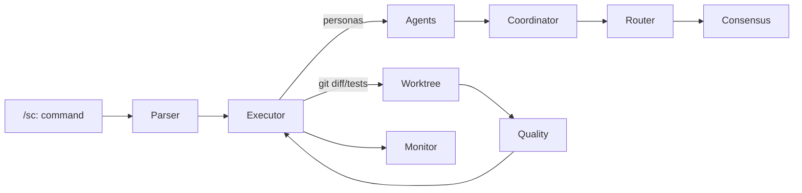

# 1. Executive Summary
- **Mission fit:** The framework targets multi-agent orchestration for Claude Code, but top-level product artifacts are missing so intent must be inferred from in-repo docs.
- **Overall health:** Yellow — strong modular scaffolding exists, yet key anti-hallucination controls remain disconnected or stubbed, so high-value safeguards are not enforced in practice.
- **Top 3 risks:**
  - Multi-model consensus builder is defined but never invoked, leaving decisions to a single model and increasing hallucination risk (SuperClaude/ModelRouter/consensus.py:61).
  - Critical `/sc:*` workflows return plan-only responses because the executor lacks real agent integrations despite requiring evidence (SuperClaude/Commands/executor.py:183, SuperClaude/Commands/executor.py:396).
  - Quality scoring logic penalizes missing evidence, but nothing feeds it during normal command execution so low-quality outputs slip through unchecked (SuperClaude/Quality/quality_scorer.py:482, SuperClaude/Commands/executor.py:199).
- **Top 3 recommendations:**
  - Wire the consensus builder into validator/validator-agents for `/sc:implement` and similar commands to obtain cross-model agreement before reporting success.
  - Run quality scoring and static validation automatically for any command marked `requires_evidence` so hallucinated diffs are blocked with actionable feedback.
  - Track plan-only outcomes as hallucination metrics via the monitoring layer to surface hotspots and regression signals.

# 2. Product Context
- No local `.codex-os/product` docs exist; roadmap in `ROADMAP.md` covers older milestones (v4–v5) and does not match v6 messaging, so we lack authoritative goals or KPIs.
- Users appear to be Claude Code operators who need reliable agent orchestration, with success tied to producing verifiable code changes backed by tests and evidence.
- Constraints: offline execution (no network), git-based evidence, emphasis on MCP integrations, yet current artifacts do not define explicit non-goals or SLAs.

# 3. Architecture Overview
- **Layers:** `/sc:` command parser & registry (SuperClaude/Commands/parser.py, SuperClaude/Commands/registry.py:115) → command executor enforcing evidence & test hooks (SuperClaude/Commands/executor.py:136-233) → agent registry/selector (SuperClaude/Agents/registry.py:37, SuperClaude/Agents/selector.py:33) → coordination strategies with consensus/competitive modes (SuperClaude/Coordination/agent_coordinator.py:143-561) → model router & consensus builder (SuperClaude/ModelRouter/router.py:44-275, SuperClaude/ModelRouter/consensus.py:61) → quality scoring & worktree gating (SuperClaude/Quality/quality_scorer.py:81-540, SuperClaude/Core/worktree_manager.py:21-210) → monitoring sinks (SuperClaude/Monitoring/performance_monitor.py:33-180).
- **Data flow:** commands capture flags (e.g., `requires_evidence`) and snapshot git changes, agents mostly derive from Markdown configs, model router provides ensemble suggestions, worktree manager can run pytest and feed quality scoring but only when invoked directly.
- **External services:** MCP integrations enumerated in `Config/mcp.yaml`, but executors only instantiate stubs; no live API callers are present in repo.

- **Assumptions:** Agents currently return structured dicts but rarely touch disk; consensus builder and monitoring are optional utilities awaiting deeper integration.

# 4. Quality & Health
- **Tests:** Pytest suite covers registry, executor, router, and loaders (tests/test_commands.py, tests/test_model_router.py, tests/test_extended_loader.py). No end-to-end proof that agent outputs modify files or pass quality gates.
- **Lint/format:** `pyproject.toml` defines `black`, `flake8`, and `mypy`, but automation is absent; formatter adherence relies on manual execution.
- **Security/deps:** Runtime deps minimal, but no policy to validate MCP credentials or sanitize shell inputs; placeholder subprocess calls run in trusted mode.
- **Performance:** PerformanceMonitor collects system metrics (SuperClaude/Monitoring/performance_monitor.py:33-180) yet nothing records hallucination-related events or model error rates.
- **Documentation:** README is detailed, but roadmap is outdated and there is no spec library; many markdown guides describe aspirational behavior rather than shipped code.
- **Observability:** Monitoring sinks exist (JSONL/SQLite) but no integration from command executor, so quality regressions are invisible unless users inspect logs manually.

# 5. Roadmap Alignment
- Published roadmap (ROADMAP.md) targets v4–v5 stabilization and basic agents, whereas codebase advertises v6 features; planned anti-hallucination workstreams (e.g., consensus, quality gates) remain unfinished or disconnected.
- No active specs or task breakdowns were found, so there is no authoritative acceptance criteria for hallucination suppression.

# 6. Risks
| ID | Risk | Area | Likelihood | Impact | Notes |
|----|------|------|------------|--------|-------|
| R1 | Consensus builder unused so high-risk commands rely on single-model output | Model orchestration | High | 5 | Only defined in code, never invoked (SuperClaude/ModelRouter/consensus.py:61); consensus option in coordinator just compares agent confidences. |
| R2 | Executor reports plan-only stubs without remediation path | Command execution | High | 4 | `/sc:implement` returns placeholder dict (SuperClaude/Commands/executor.py:396) so users get no actionable rewrite despite evidence requirement. |
| R3 | Quality scoring not integrated with executor; hallucination signals ignored | Quality gating | Medium | 4 | Scorer expects evidence but executor does not feed assessments (SuperClaude/Quality/quality_scorer.py:482, SuperClaude/Commands/executor.py:199). |
| R4 | Roadmap and docs outdated leading to misaligned expectations | Product alignment | Medium | 3 | README promises 131 agents but most are markdown configs; roadmap still references v4 goals. |
| R5 | Lack of telemetry on plan-only failures | Monitoring | Medium | 3 | Performance monitor never records executor outcomes, so hallucination regressions remain invisible. |

# 7. Recommendations (Prioritized)
| # | Title | Why | Outcome | Effort | Impact | Owner |
|---|-------|-----|---------|--------|--------|-------|
| 1 | Integrate ConsensusBuilder into validator pipeline | Unlock multi-model cross-check before success is reported | Reduced hallucinations via agreement threshold | M | 5 | Agent platform |
| 2 | Invoke QualityScorer for every `requires_evidence` command | Convert missing evidence into actionable remediation instead of silent failure | Automatic rejection of hallucinated diffs with guidance | M | 4 | Framework core |
| 3 | Add syntactic & import validation for generated code | Catch hallucinated modules/functions before user sees them | Early failure on invalid code snippets | S | 4 | Framework core |
| 4 | Emit hallucination telemetry to PerformanceMonitor | Track plan-only & failed evidence outcomes | Hotspot visibility and regression alerts | S | 3 | Monitoring |
| 5 | Update roadmap & specs with hallucination safeguards | Align product intent with actual capabilities | Clear targets for future anti-hallucination work | S | 2 | Product |
| 6 | Extend tests to cover all `requires_evidence` commands | Prevent regressions where commands silently skip evidence checks | CI guardrail for hallucination controls | S | 3 | QA |
| 7 | Provide real agent implementations for top personas | Replace placeholder outputs with executable workflows | Deliver end-to-end changes backed by evidence | L | 5 | Agent platform |

# 8. Plan
- **Milestone 1 (Week 1):** Connect consensus builder and quality scorer to command executor, ship telemetry for plan-only events, add regression tests for `/sc:implement`.
- **Milestone 2 (Week 2):** Deliver syntactic validation, refresh roadmap/spec artifacts, and pilot one end-to-end agent flow demonstrating evidence-backed code changes.

# 9. Appendix
- Commands executed: `bash --noprofile --norc -lc "ls"`, `bash --noprofile --norc -lc "sed -n '1,160p' README.md"`, `bash --noprofile --norc -lc "rg -n 'requires_evidence' SuperClaude/Commands/registry.py"`, `bash --noprofile --norc -lc "rg -n 'derived_status' SuperClaude/Commands/executor.py"`, `bash --noprofile --norc -lc "git log -n 10 --oneline --decorate --graph"`, `bash --noprofile --norc -lc \"sed -n '1,80p' ROADMAP.md\"`.
- Assumptions: No product specs available; MCP integrations treated as stubs; network-disabled environment prevents live API validation.
