# SuperClaude Architecture

> Auto-generated architecture documentation for SuperClaude v7.0.0

## Overview

SuperClaude is a **config-driven AI agent orchestration framework** that enhances Claude Code with tiered agent selection, iterative quality loops, and multi-model consensus. It combines a Python orchestration layer, Rust infrastructure services, and a Claude Code skill/command system to deliver structured, quality-gated AI-assisted development workflows.

### Core Design Principles

1. **Tiered Agent Architecture** - 31 agents across core (11), traits (12), and extensions (8) tiers with weighted matching
2. **Command-Driven Workflows** - 17 `/sc:` commands backed by 40 Claude Code skills
3. **Iterative Quality Loops** - Evidence-collecting execution loops with configurable quality thresholds (default: 70/100)
4. **Multi-Model Consensus** - PAL MCP integration for cross-model validation on critical decisions
5. **Config Over Code** - YAML-driven agent selection, model routing, quality gates, and consensus policies

---

## Functional Areas

### 1. Agent System (`agents/`, `SuperClaude/Agents/`, `config/agents.yaml`)

The agent system manages a hierarchy of AI personas that specialize in different development tasks.

| Tier | Directory | Count | Purpose |
|------|-----------|-------|---------|
| Core | `agents/core/` | 11 | Primary agents (developer, architect, guardian, optimizer, communicator) |
| Traits | `agents/traits/` | 12 | Composable modifiers (security-first, test-driven, minimal-changes, etc.) |
| Extensions | `agents/extensions/` | 8 | Domain specialists (React, Python, Rust, Go, K8s, ML, data, fullstack) |

**Selection Algorithm** (`config/agents.yaml`):
- Method: `weighted-match` with trigger (0.35), category (0.25), description (0.20), tool (0.20) weights
- Minimum score: 0.6, confidence threshold: 0.8
- Strategies: `delegate`, `delegate-core`, `delegate-specialist`

**Key Classes**:
- `AgentRegistry` (`SuperClaude/Agents/registry.py`) - Discovers and indexes agents from markdown files with YAML frontmatter
- `AgentSelector` (`SuperClaude/Agents/selector.py`) - Matches tasks to agents using weighted scoring

### 2. Orchestration Engine (`SuperClaude/Orchestrator/`, `core/`)

The orchestration engine runs iterative quality loops that execute tasks, collect evidence, and refine output.

**Execution Flow**:
1. Task received with configuration (`LoopConfig`)
2. SDK query executed with safety and evidence hooks
3. Evidence collected from tool usage, errors, outputs
4. Quality assessed across 6 dimensions (correctness, completeness, performance, maintainability, security, scalability)
5. Loop terminates when quality threshold met or max iterations (hard cap: 5) reached

**Key Modules**:
- `loop_runner.py` - Main `run_agentic_loop()` function with `LoopConfig` and `TerminationReason`
- `evidence.py` - `EvidenceCollector` accumulates execution signals
- `quality.py` - `QualityConfig` and `assess_quality()` scoring engine
- `hooks.py` - SDK hook factories for safety enforcement and evidence gathering
- `events_hooks.py` - `EventsTracker` for Zed panel integration
- `obsidian_hooks.py` - Obsidian vault integration for knowledge capture

### 3. Command & Skill System (`commands/`, `.claude/skills/`)

Commands provide structured workflows invoked via `/sc:` prefix. Each command maps to a Claude Code skill.

**Commands** (17 total, defined in `commands/index.yaml`):

| Category | Commands |
|----------|----------|
| Development | `implement`, `build`, `improve`, `git` |
| Quality | `analyze`, `test`, `pr-check`, `pr-fix` |
| Design | `design`, `brainstorm`, `workflow`, `estimate` |
| Documentation | `document`, `explain`, `readme` |
| Infrastructure | `cicd-setup`, `mcp` |

**Skills** (40 total in `.claude/skills/`):
- 27 command skills (`sc-*`) backing `/sc:` commands
- 8 agent skills (`agent-*`) for persona-based work
- 3 utility skills (`ask`, `ask-multi`, `learned`)
- Helper scripts: `select_agent.py`, `run_tests.py`, `evidence_gate.py`, `skill_learn.py`

### 4. Rust Infrastructure (`crates/`)

Seven Rust crates provide high-performance infrastructure services.

| Crate | Purpose | Key Tech |
|-------|---------|----------|
| `superclaude-proto` | Shared protobuf/gRPC types | tonic, prost |
| `superclaude-core` | Shared types, config parsing, inventory | serde, glob, gray_matter |
| `superclaude-daemon` | Orchestration daemon (Unix socket + TCP gRPC) | tokio, tonic, dashmap |
| `superclaude-runtime` | CLI runtime for agentic loop execution | clap, reqwest, walkdir |
| `dashboard` | Tauri-based visual monitoring dashboard | Tauri, web frontend |
| `snake-game` | Agent capability demo | — |
| `hangman-game` | Agent capability demo | — |

**Daemon** listens on `/tmp/superclaude.sock` (Unix) and `127.0.0.1:50051` (TCP), manages execution lifecycle, spawns Claude CLI processes, and streams events from `.superclaude_metrics/`.

### 5. MCP Integration (`mcp/`, `config/mcp.yaml`)

Two MCP servers extend SuperClaude with external reasoning and automation capabilities.

**PAL MCP** - Multi-model reasoning:
| Tool | Use Case |
|------|----------|
| `consensus` | Multi-model voting on critical decisions |
| `thinkdeep` | Extended reasoning for complex analysis |
| `codereview` | Structured code review |
| `debug` | Systematic debugging with hypotheses |
| `planner` | Sequential task breakdown |
| `precommit` | Git validation before commits |
| `chat` | General queries to specific models |

**Rube MCP** - Tool automation (500+ apps):
| Tool | Use Case |
|------|----------|
| `RUBE_SEARCH_TOOLS` | Discover available integrations |
| `RUBE_MULTI_EXECUTE_TOOL` | Parallel tool execution (up to 50) |
| `RUBE_REMOTE_WORKBENCH` | Python sandbox (4min timeout) |
| `RUBE_REMOTE_BASH_TOOL` | Bash sandbox |

### 6. Model Routing (`config/models.yaml`)

Multi-provider model configuration with strategy-based routing.

| Strategy | Models | Use Case |
|----------|--------|----------|
| `deep_thinking` | gpt-5, gemini-2.5-pro | Complex analysis, architecture |
| `consensus` | gpt-5 + claude-opus + gpt-4.1 (quorum: 2) | Critical decisions |
| `long_context` | gemini-2.5-pro (2M ctx) | Large file analysis |
| `fast_iteration` | grok-code-fast-1, gpt-4o-mini | Rapid prototyping |

### 7. Quality & Evaluation (`config/quality.yaml`, `evals/`)

**Quality Dimensions** (weighted scoring):
- Correctness (25%) - Tests pass, no runtime errors
- Completeness (20%) - Feature coverage, edge cases
- Performance (10%) - Time/space complexity
- Maintainability (10%) - Readability, modularity
- Security (10%) - Input validation, auth, data protection
- Scalability (10%) - Horizontal/vertical, concurrency

**Stochastic Evals** (`evals/tests.yaml`):
- 19 test cases across agent types
- Default: 5 runs per agent, 80% pass threshold
- Critical tests require 100% pass rate

### 8. Setup & Installation (`setup/`, `install-with-sondera.sh`)

CLI-based installation and management system.

| Command | Purpose |
|---------|---------|
| `SuperClaude install` | Interactive installation |
| `SuperClaude update` | Framework update |
| `SuperClaude uninstall` | Clean removal |
| `SuperClaude backup` | Backup/restore |
| `SuperClaude clean` | Fix corrupted files |
| `SuperClaude agent` | Agent management |

### 9. CI/CD & GitHub Automation (`.github/workflows/`)

Multi-phase quality pipeline with 12+ workflows.

| Phase | Workflow | Trigger |
|-------|----------|---------|
| Fast Fail | `ci.yml` | push/PR — ruff, mypy, pytest |
| Claude Review | `claude-review-phase{1,2,3}.yml` | PR — route, execute, publish |
| Nightly | `nightly-review.yml` | Schedule — comprehensive analysis |
| Security | `autonomous-code-scanner.yml` | push — security/lint scanning |
| E2E | `e2e-app-generation.yml` | push — full app generation tests |
| Evals | `stochastic-evals.yml` | Schedule — probabilistic agent testing |
| Automation | `issue-to-pr.yml` | Issue labeled — auto-PR creation |

---

## Key Execution Flows

### Flow 1: User Command Execution (`/sc:implement`)

```
User types /sc:implement "Add auth"
    → Claude Code loads skill (.claude/skills/sc-implement/)
    → AgentSelector picks best agent (developer + security-first)
    → LoopConfig created (max_iter=3, threshold=70)
    → run_agentic_loop() starts
        → Iteration 1: SDK query + evidence hooks
        → Quality assessed: 55/100 (below threshold)
        → Iteration 2: Refined context + re-execute
        → Quality assessed: 78/100 (above threshold)
    → Output returned with quality score
```

### Flow 2: Multi-Model Consensus (Architecture Decision)

```
/sc:design "Microservices vs monolith"
    → PAL MCP consensus invoked
    → gpt-5 votes: microservices (reasoning...)
    → claude-opus votes: modular monolith (reasoning...)
    → gpt-4.1 votes: modular monolith (reasoning...)
    → Quorum reached (2/3): modular monolith
    → Synthesized recommendation returned
```

### Flow 3: PR Quality Pipeline

```
Developer opens PR
    → ci.yml: ruff lint + mypy + pytest (fast fail)
    → claude-review-phase1: Routes to appropriate reviewer agent
    → claude-review-phase2: Agent executes structured review
    → claude-review-phase3: Results published as PR comment
    → Developer addresses feedback
    → /sc:pr-fix: Auto-fix CI failures iteratively
```

### Flow 4: Daemon-Managed Execution

```
Zed IDE panel triggers execution
    → gRPC request to superclaude-daemon (port 50051)
    → Daemon spawns claude CLI process
    → Metrics watcher monitors .superclaude_metrics/
    → Events streamed back to Zed panel in real-time
    → Execution completes, results returned
```

### Flow 5: Nightly Evaluation Cycle

```
2am UTC cron trigger
    → nightly-review.yml: Code quality + security audit
    → stochastic-evals.yml: Run 5x per agent
    → Results: pass rates calculated
    → Failures flagged, reports generated
    → .nightly-review-quality.md updated
```

---

## Architecture Diagram

```mermaid
graph TB
    subgraph User["User Interface"]
        CLI["Claude Code CLI"]
        ZED["Zed IDE Panel"]
        GH["GitHub (PRs/Issues)"]
    end

    subgraph Commands["Command Layer"]
        SC_CMD["/sc: Commands<br/>(17 commands)"]
        SKILLS["Claude Code Skills<br/>(40 skills)"]
        SC_CMD --> SKILLS
    end

    subgraph Agents["Agent System"]
        SELECTOR["AgentSelector<br/>(weighted matching)"]
        REGISTRY["AgentRegistry<br/>(frontmatter parser)"]
        CORE_A["Core Agents (11)<br/>developer, architect,<br/>guardian, optimizer,<br/>communicator"]
        TRAITS["Traits (12)<br/>security-first, test-driven,<br/>minimal-changes, etc."]
        EXTENSIONS["Extensions (8)<br/>react, python, rust,<br/>go, k8s, ml, data"]
        SELECTOR --> REGISTRY
        REGISTRY --> CORE_A
        REGISTRY --> TRAITS
        REGISTRY --> EXTENSIONS
    end

    subgraph Orchestrator["Orchestration Engine"]
        LOOP["run_agentic_loop()<br/>(max 5 iterations)"]
        EVIDENCE["EvidenceCollector"]
        QUALITY["QualityAssessment<br/>(6 dimensions)"]
        HOOKS["SDK Hooks<br/>(safety + evidence)"]
        LOOP --> HOOKS
        LOOP --> EVIDENCE
        EVIDENCE --> QUALITY
        QUALITY -->|"below threshold"| LOOP
    end

    subgraph RustInfra["Rust Infrastructure"]
        DAEMON["superclaude-daemon<br/>(gRPC on :50051)"]
        RUNTIME["superclaude-runtime<br/>(CLI executor)"]
        PROTO["superclaude-proto<br/>(shared types)"]
        CORE_RS["superclaude-core<br/>(config, inventory)"]
        DASH["Dashboard<br/>(Tauri UI)"]
        DAEMON --> PROTO
        RUNTIME --> PROTO
        DAEMON --> CORE_RS
        RUNTIME --> CORE_RS
    end

    subgraph MCP["MCP Servers"]
        PAL["PAL MCP<br/>consensus, thinkdeep,<br/>codereview, debug,<br/>planner, precommit"]
        RUBE["Rube MCP<br/>500+ app integrations,<br/>web search, sandbox"]
    end

    subgraph Config["Configuration"]
        AGENTS_YAML["agents.yaml<br/>(selection weights)"]
        MODELS_YAML["models.yaml<br/>(multi-provider routing)"]
        QUALITY_YAML["quality.yaml<br/>(scoring dimensions)"]
        CONSENSUS_YAML["consensus_policies.yaml<br/>(voting rules)"]
        MCP_YAML["mcp.yaml<br/>(tool registry)"]
    end

    subgraph CICD["CI/CD Pipeline"]
        FAST["Fast Fail<br/>(ruff, mypy, pytest)"]
        REVIEW["Claude Review<br/>(3-phase)"]
        NIGHTLY["Nightly Analysis<br/>(quality + security)"]
        EVALS["Stochastic Evals<br/>(agent testing)"]
        FAST --> REVIEW
    end

    %% User connections
    CLI --> SC_CMD
    CLI --> LOOP
    ZED --> DAEMON
    GH --> CICD

    %% Command to orchestration
    SKILLS --> SELECTOR
    SELECTOR --> LOOP

    %% Orchestration to infrastructure
    LOOP --> RUNTIME
    DAEMON --> RUNTIME

    %% MCP connections
    LOOP --> PAL
    LOOP --> RUBE
    SKILLS --> PAL
    SKILLS --> RUBE
    REVIEW --> PAL

    %% Config connections
    AGENTS_YAML -.-> SELECTOR
    MODELS_YAML -.-> PAL
    QUALITY_YAML -.-> QUALITY
    CONSENSUS_YAML -.-> PAL
    MCP_YAML -.-> MCP

    %% Dashboard
    DASH --> DAEMON

    %% Styling
    classDef userNode fill:#4A90D9,stroke:#2C5F8A,color:#fff
    classDef cmdNode fill:#7B68EE,stroke:#5B48CE,color:#fff
    classDef agentNode fill:#50C878,stroke:#30A858,color:#fff
    classDef orchNode fill:#FF8C00,stroke:#CC7000,color:#fff
    classDef rustNode fill:#DEA584,stroke:#B87A5E,color:#000
    classDef mcpNode fill:#FF6B6B,stroke:#CC4444,color:#fff
    classDef configNode fill:#A0A0A0,stroke:#707070,color:#000
    classDef cicdNode fill:#DDA0DD,stroke:#AA70AA,color:#000

    class CLI,ZED,GH userNode
    class SC_CMD,SKILLS cmdNode
    class SELECTOR,REGISTRY,CORE_A,TRAITS,EXTENSIONS agentNode
    class LOOP,EVIDENCE,QUALITY,HOOKS orchNode
    class DAEMON,RUNTIME,PROTO,CORE_RS,DASH rustNode
    class PAL,RUBE mcpNode
    class AGENTS_YAML,MODELS_YAML,QUALITY_YAML,CONSENSUS_YAML,MCP_YAML configNode
    class FAST,REVIEW,NIGHTLY,EVALS cicdNode
```



---

## Directory Map

```
SuperClaude/
├── SuperClaude/                  # Python package (v7.0.0)
│   ├── Agents/                   #   Agent registry & selector
│   ├── Orchestrator/             #   Loop runner, evidence, quality, hooks
│   └── Telemetry/                #   Metrics & JSONL logging
├── crates/                       # Rust workspace (7 crates)
│   ├── superclaude-proto/        #   Protobuf/gRPC types
│   ├── superclaude-core/         #   Shared config, inventory, types
│   ├── superclaude-daemon/       #   gRPC orchestration daemon
│   ├── superclaude-runtime/      #   CLI agentic loop executor
│   ├── dashboard/                #   Tauri monitoring UI
│   ├── snake-game/               #   Demo: snake game
│   └── hangman-game/             #   Demo: hangman game
├── agents/                       # Agent definitions (31 total)
│   ├── core/                     #   11 primary agents
│   ├── traits/                   #   12 composable modifiers
│   └── extensions/               #   8 domain specialists
├── commands/                     # /sc: command templates (17)
├── .claude/                      # Claude Code integration
│   ├── skills/                   #   40 skill implementations
│   ├── hooks/                    #   Pre/post tool-use hooks
│   └── rules/                    #   Safety guardrails
├── config/                       # YAML configuration
│   ├── agents.yaml               #   Agent selection weights
│   ├── models.yaml               #   Multi-provider model routing
│   ├── quality.yaml              #   Quality scoring dimensions
│   ├── consensus_policies.yaml   #   Voting rules
│   └── mcp.yaml                  #   MCP tool registry
├── core/                         # Python core modules
│   ├── loop_orchestrator.py      #   Main loop manager
│   ├── pal_integration.py        #   PAL MCP wrapper
│   ├── quality_assessment.py     #   Quality scoring
│   └── skill_learning_integration.py  # Skill learning
├── setup/                        # CLI installer & management
│   ├── cli/commands/             #   install, update, uninstall, backup
│   ├── core/                     #   installer, validator, registry
│   ├── services/                 #   config, settings, obsidian
│   └── utils/                    #   UI, logger, security
├── scripts/                      # Automation scripts
├── tests/                        # pytest suite
│   ├── agents/                   #   Agent registry/selector tests
│   ├── orchestrator/             #   Loop, hooks, quality tests
│   ├── e2e/                      #   App generation tests
│   └── integration/              #   Cross-module tests
├── evals/                        # Stochastic evaluation framework
├── .github/workflows/            # 12+ CI/CD workflows
├── mcp/                          # MCP server configs
└── templates/                    # Workflow templates
```

---

## Technology Stack

| Layer | Technology | Purpose |
|-------|-----------|---------|
| **Python** | 3.8+, PyYAML, asyncio | Orchestration, agent selection, quality scoring |
| **Rust** | tokio, tonic, clap, Tauri | Daemon, runtime CLI, dashboard, gRPC services |
| **Protobuf** | prost, tonic | Service communication between daemon and runtime |
| **Claude Code** | Skills, hooks, rules | User-facing command system and safety enforcement |
| **PAL MCP** | Multi-model consensus | Cross-model validation, deep thinking, code review |
| **Rube MCP** | 500+ integrations | Web search, app automation, sandboxed execution |
| **GitHub Actions** | 12+ workflows | CI/CD, nightly reviews, stochastic evals, auto-PR |
| **pytest** | pytest-asyncio, fixtures | Unit, integration, and E2E testing |
