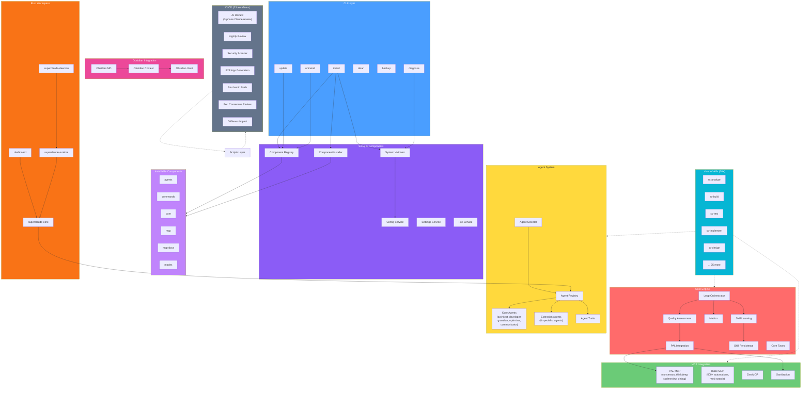

# SuperClaude Architecture

> Auto-generated by GitNexus knowledge graph analysis.
> Last updated: 2026-04-04 16:44 UTC

## Codebase Overview

<!-- auto:overview -->
| Metric | Count |
|--------|-------|
| Total symbols | 6,388 |
| Relationships | 16,783 |
| Execution flows | 300 |
| Python files | 191 |
| Rust files | 34 |
| GitHub workflows | 20 |
| Documentation files | 122 |
<!-- /auto:overview -->

SuperClaude is a framework for augmenting Claude Code with structured commands, agent personas, quality orchestration, and MCP integrations. It ships as an installable CLI toolkit with both Python and Rust components.

## Architecture Diagram


```mermaid
graph TB
    subgraph CLI["CLI Layer"]
        Install["install"]
        Update["update"]
        Uninstall["uninstall"]
        Clean["clean"]
        Backup["backup"]
        Diagnose["diagnose"]
    end

    subgraph Core["Core Engine"]
        LoopOrch["Loop Orchestrator"]
        QualityAssess["Quality Assessment"]
        PALInteg["PAL Integration"]
        Metrics["Metrics"]
        SkillLearn["Skill Learning"]
        SkillPersist["Skill Persistence"]
        Types["Core Types"]
    end

    subgraph AgentSystem["Agent System"]
        AgentReg["Agent Registry"]
        AgentSel["Agent Selector"]
        CoreAgents["Core Agents<br/>(architect, developer,<br/>guardian, optimizer,<br/>communicator)"]
        ExtAgents["Extension Agents<br/>(8 specialist agents)"]
        Traits["Agent Traits"]
    end

    subgraph MCPLayer["MCP Integration"]
        PAL["PAL MCP<br/>(consensus, thinkdeep,<br/>codereview, debug)"]
        Rube["Rube MCP<br/>(500+ automations,<br/>web search)"]
        Zen["Zen MCP"]
        Sanitize["Sanitization"]
    end

    subgraph SetupCore["Setup & Components"]
        Registry["Component Registry"]
        Installer["Component Installer"]
        Validator["System Validator"]
        ConfigSvc["Config Service"]
        SettingsSvc["Settings Service"]
        FileSvc["File Service"]
    end

    subgraph Components["Installable Components"]
        CompAgents["agents"]
        CompCommands["commands"]
        CompCore["core"]
        CompMCP["mcp"]
        CompMCPDocs["mcp-docs"]
        CompModes["modes"]
    end

    subgraph Skills[".claude/skills (30+)"]
        SCAnalyze["sc-analyze"]
        SCBuild["sc-build"]
        SCTest["sc-test"]
        SCImpl["sc-implement"]
        SCDesign["sc-design"]
        SCMore["... 25 more"]
    end

    subgraph RustCrates["Rust Workspace"]
        Dashboard["dashboard"]
        SCCore["superclaude-core"]
        SCRuntime["superclaude-runtime"]
        SCDaemon["superclaude-daemon"]
    end

    subgraph Obsidian["Obsidian Integration"]
        ObsVault["Obsidian Vault"]
        ObsContext["Obsidian Context"]
        ObsMD["Obsidian MD"]
    end

    subgraph CICD["CI/CD (23 workflows)"]
        AIReview["AI Review<br/>(3-phase Claude review)"]
        NightlyReview["Nightly Review"]
        Security["Security Scanner"]
        E2EWorkflow["E2E App Generation"]
        StochEvals["Stochastic Evals"]
        PALConsensus["PAL Consensus Review"]
        GitNexusCI["GitNexus Impact"]
    end

    %% CLI → Setup Core
    Install --> Registry
    Install --> Installer
    Install --> Validator
    Update --> Registry
    Uninstall --> Registry
    Diagnose --> Validator

    %% Setup Core → Components
    Registry --> Components
    Installer --> Components
    Validator --> ConfigSvc

    %% Core Engine flows
    LoopOrch --> QualityAssess
    LoopOrch --> Metrics
    LoopOrch --> SkillLearn
    SkillLearn --> SkillPersist
    QualityAssess --> PALInteg
    PALInteg --> PAL

    %% Agent System
    AgentSel --> AgentReg
    AgentReg --> CoreAgents
    AgentReg --> ExtAgents
    AgentReg --> Traits

    %% MCP
    PALInteg --> Sanitize

    %% Rust crates
    Dashboard --> SCCore
    SCRuntime --> SCCore
    SCDaemon --> SCRuntime
    SCCore --> AgentReg

    %% Obsidian
    ObsMD --> ObsContext
    ObsContext --> ObsVault

    %% Cross-cutting
    Skills -.-> Core
    Skills -.-> MCPLayer
    Skills -.-> AgentSystem
    CICD -.-> Scripts
    Scripts["Scripts Layer"] -.-> CICD

    style CLI fill:#4a9eff,color:#fff
    style Core fill:#ff6b6b,color:#fff
    style AgentSystem fill:#ffd93d,color:#333
    style MCPLayer fill:#6bcb77,color:#fff
    style SetupCore fill:#8b5cf6,color:#fff
    style Components fill:#c084fc,color:#fff
    style RustCrates fill:#f97316,color:#fff
    style Skills fill:#06b6d4,color:#fff
    style Obsidian fill:#ec4899,color:#fff
    style CICD fill:#64748b,color:#fff
```

## Functional Areas

### Core Engine (`core/`)
The central orchestration layer. **184 symbols, 72% cohesion.**

| Module | Purpose |
|--------|---------|
| `loop_orchestrator.py` | Agentic loop runner with iteration control, timeouts, and quality gates |
| `quality_assessment.py` | Multi-dimensional scoring (tests, coverage, evidence, errors) |
| `pal_integration.py` | PAL MCP review signal generation and feedback incorporation |
| `metrics.py` | Telemetry collection with counter/gauge/histogram support |
| `skill_learning_integration.py` | Injects relevant learned skills into loop context |
| `skill_persistence.py` | Stores/retrieves/evaluates learned skills across sessions |
| `types.py` | Core data types (LoopContext, IterationResult, QualityBand) |

### Agent System (`SuperClaude/Agents/`, `agents/`)
Agent discovery, selection, and persona management. **63 symbols, 78% cohesion.**

| Component | Purpose |
|-----------|---------|
| `registry.py` | Discovers and indexes tiered agents from markdown definitions |
| `selector.py` | Matches user intent to best agent via trigger patterns |
| `agents/core/` | 5 core personas: architect, developer, guardian, optimizer, communicator |
| `agents/extensions/` | 8 specialist agents (data-engineer, fullstack, k8s, ML, perf, React, security, tech-writer) |
| `agents/traits/` | Composable behavioral traits applied to agents |

### Setup & Installer (`setup/`)
CLI toolkit for installing/managing SuperClaude components. **178 symbols (Commands), 103 symbols (Components), 86% cohesion.**

| Subsystem | Path | Purpose |
|-----------|------|---------|
| CLI Commands | `setup/cli/commands/` | install, update, uninstall, clean, backup, agent |
| Component Registry | `setup/core/registry.py` | Discovers and instantiates installable components |
| Component Installer | `setup/core/installer.py` | Orchestrates component installation with validation |
| System Validator | `setup/core/validator.py` | Checks Python, Node, system requirements |
| Config Service | `setup/services/config.py` | Loads requirements and validates configuration |
| Settings Service | `setup/services/settings.py` | Manages installed component tracking and versioning |
| File Service | `setup/services/files.py` | Safe file operations with backup support |
| Components | `setup/components/` | agents, commands, core, mcp, mcp-docs, modes |

### MCP Integration (`mcp/`, `core/pal_integration.py`)
External tool integration via Model Context Protocol. **229 symbols, 77% cohesion.**

| Integration | Purpose |
|-------------|---------|
| PAL MCP | Multi-model consensus, deep thinking, code review, debugging, planning |
| Rube MCP | 500+ app automations, web search (Linkup), remote execution |
| Zen MCP | Additional MCP capabilities |
| Sanitization | PII scrubbing (phone numbers, credit cards) before MCP calls |

### Rust Workspace (`crates/`)
Performance-critical components and the dashboard. **88 Rust files.**

| Crate | Purpose |
|-------|---------|
| `superclaude-core` | Inventory scanning, agent parsing, shared types |
| `superclaude-runtime` | Safety hooks, command validation, event system, skill retrieval |
| `superclaude-daemon` | Background server for execution management |
| `dashboard` | TUI dashboard for metrics, inventory, execution monitoring |

### Commands (`commands/`)
Structured playbooks for `/sc:` commands. **18 command definitions.**

| Command | Purpose |
|---------|---------|
| `analyze.md` | Code analysis and quality assessment |
| `implement.md` | Feature implementation with persona activation |
| `design.md` | System architecture and API design |
| `build.md` | Build, compile, and package projects |
| `test.md` | Test execution with coverage analysis |
| `brainstorm.md` | Requirements discovery via Socratic dialogue |
| `improve.md` | Systematic code quality improvements |
| `explain.md` | Educational code explanations |
| `git.md` | Git workflow optimization |
| `workflow.md` | Implementation workflow generation |

### Skills (`.claude/skills/`)
On-demand structured workflows invoked via `/sc:` prefix. **30+ skills.**

Categories include: analysis (sc-analyze, sc-principles), development (sc-implement, sc-build, sc-tdd), testing (sc-test, sc-e2e), documentation (sc-document, sc-readme), git/CI (sc-git, sc-pr-fix, sc-pr-check, sc-push), research (sc-research, sc-mcp), and code review (sc-code-review, sc-evaluate).

### Obsidian Integration (`setup/services/obsidian_*.py`)
Knowledge management through Obsidian vault integration. **Part of Services cluster, 235 symbols.**

| Module | Purpose |
|--------|---------|
| `obsidian_vault.py` | Scans knowledge folders, parses notes with frontmatter |
| `obsidian_context.py` | Generates context from relevant notes by category/tag |
| `obsidian_md.py` | Status checking and configuration |

### Scripts (`scripts/`)
CI/automation utilities. **576 symbols, 74% cohesion.**

Key scripts: `validate_agents.py` (agent definition validation), `validate_schema.py` (schema validation), `security_consensus.py` (multi-model security review), `notify_slack.py` (notifications), `readme_checker.py` (link validation), `compute_e2e_pass_rates.py` (E2E reporting), `apply_docstrings.py` / `apply_type_hints.py` (code augmentation).

### CI/CD (`.github/workflows/`)
**23 GitHub Actions workflows** covering:

| Category | Workflows |
|----------|-----------|
| AI Review | `claude-review-phase1/2/3.yml`, `ai-review.yml`, `pal-consensus-review.yml` |
| Quality | `ci.yml`, `security.yml`, `readme-quality-check.yml` |
| Testing | `e2e-app-generation.yml`, `stochastic-evals.yml`, `package-test.yml` |
| Automation | `nightly-review.yml`, `nightly-docs-update.yml`, `issue-to-pr.yml`, `ai-issue-triage.yml` |
| Release | `package-publish.yml`, `release-notes.yml` |
| Monitoring | `ai-review-cost-monitor.yml`, `commit-notifications.yml` |
| Analysis | `gitnexus-impact.yml`, `update-architecture.yml` |

## Key Execution Flows

### 1. System Validation (7 steps)
The longest execution flow, validating system prerequisites before installation.

```
get_system_info → check_node → get_installation_help → load_installation_commands
    → load_requirements → validate → ValidationError
```
`setup/core/validator.py` → `setup/services/config.py`

### 2. Component Installation (6 steps)
Installs a component with prerequisite validation and file discovery.

```
install_component → install → _install → validate_prerequisites
    → get_files_to_install → _get_source_dir
```
`setup/core/installer.py` → `setup/core/base.py`

### 3. Component Update (6 steps)
Updates components through the registry discovery pipeline.

```
perform_update → create_component_instances → get_component_instance
    → discover_components → _load_component_module → get_metadata
```
`setup/cli/commands/update.py` → `setup/core/registry.py` → `setup/core/base.py`

### 4. Component Uninstall (6 steps)
Mirrors the update flow through the same registry pipeline.

```
perform_uninstall → create_component_instances → get_component_instance
    → discover_components → _load_component_module → get_metadata
```
`setup/cli/commands/uninstall.py` → `setup/core/registry.py` → `setup/core/base.py`

### 5. Obsidian Status Check (6 steps)
Retrieves knowledge status by scanning the Obsidian vault.

```
get_status → get_note_count → get_relevant_notes → scan_knowledge_folder
    → _parse_note → ObsidianNote
```
`setup/services/obsidian_md.py` → `obsidian_context.py` → `obsidian_vault.py`

### 6. Cross-Language Inventory (6 steps)
Rust dashboard calls into Python for version parsing -- a key cross-language boundary.

```
get_inventory → scan_all → scan_agent_dir → parse_agent_md
    → parse → SimpleVersion
```
`crates/dashboard/` → `crates/superclaude-core/` → `setup/core/validator.py`

### 7. System Diagnostics (6 steps)
Checks Python installation and provides remediation guidance.

```
diagnose_system → check_python → get_installation_help
    → load_installation_commands → load_requirements → ValidationError
```
`setup/core/validator.py` → `setup/services/config.py`

### 8. Environment Cleanup on Uninstall (6 steps)
Handles environment variable cleanup during component removal.

```
get_components_to_uninstall → interactive_uninstall_selection
    → get_superclaude_environment_variables → _load_env_tracking
    → get_logger → Logger
```
`setup/cli/commands/uninstall.py` → `setup/utils/environment.py` → `setup/utils/logger.py`

## Testing Architecture

Tests mirror the source structure across 12 test directories:

| Directory | Coverage Area |
|-----------|---------------|
| `tests/core/` | Loop orchestrator, quality, PAL integration, metrics, skills |
| `tests/orchestrator/` | Quality scoring, loop runner, hooks |
| `tests/services/` | Telemetry, Obsidian vault/context/config |
| `tests/mcp/` | PAL/Rube response parsing, sanitization |
| `tests/loop/` | Loop invariants, learning loop, metrics |
| `tests/agents/` | Registry, selector, tier filtering |
| `tests/setup/` | Uninstall cleanup, environment cleanup |
| `tests/integration/` | Workflow configs, nightly review |
| `tests/e2e/` | Full pipeline validation with Python/Node/Rust validators |
| `tests/skills/` | Skill structure validation |
| `tests/scripts/` | Script unit tests |
| `tests/github_scripts/` | CI script tests |

---
*Generated by [GitNexus](https://github.com/nicholasgriffintn/gitnexus) code intelligence*
