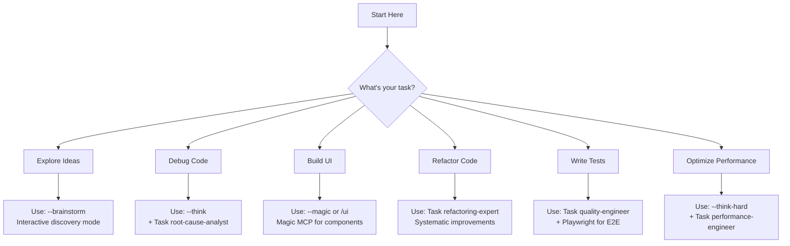

# SuperClaude Framework - Quick Start Guide

## 🎯 What Do You Want To Do?



## 🚀 Common Scenarios

> **Detailed Workflows**: See [WORKFLOWS.md](WORKFLOWS.md) for complete step-by-step processes

| Scenario | Quick Start | Full Workflow |
|----------|-------------|---------------|
| **Starting new project** | `--brainstorm → --task-manage → TodoWrite` | [New Project Kickoff](WORKFLOWS.md#new-project-kickoff) |
| **Code is failing** | `git status → --think → Task(root-cause-analyst) → --test` | [Debug Failed Test](WORKFLOWS.md#debug-failed-test) |
| **Add feature** | `Read code → --task-manage → Implement → --test --review` | [New Feature](WORKFLOWS.md#new-feature-standard) |
| **Improve quality** | `Task(refactoring-expert) → --delegate → --safe-mode` | [Refactoring](WORKFLOWS.md#refactoring-workflow) |
| **UI components** | `--magic or /ui → Magic MCP → Playwright` | [UI Creation](WORKFLOWS.md#ui-component-creation) |

## 📝 Essential Commands

| Command | Purpose | Reference |
|---------|---------|-----------|
| `git status` | Always start here - check repo state | [RULES.md](RULES.md#git-workflow) |
| `--brainstorm` | When you're not sure what you need | [MODE_CORE.md](MODE_CORE.md#brainstorming-mode) |
| `--task-manage` | For any multi-step project | [MODE_EXECUTION.md](MODE_EXECUTION.md#task-management-mode) |
| `TodoWrite` | Track your progress | [RULES.md](RULES.md#workflow-rules) |
| `--think` | Analyze complex problems | [FLAGS.md](FLAGS.md#analysis-depth-flags) |
| `--test` | Run tests after changes | [FLAGS.md](FLAGS.md#testing--quality-flags) |

> **Complete Flag Reference**: See [FLAGS.md](FLAGS.md) for all available flags and combinations

## 🔄 Standard Workflow Pattern

```
1. Start → git status + git branch
2. Plan → Use appropriate mode/flag  
3. Track → TodoWrite for >3 steps
4. Execute → Implement with quality gates
5. Validate → Run tests + lint
6. Complete → Clean workspace
```

> **Detailed Patterns**: See [WORKFLOWS.md](WORKFLOWS.md#core-workflow-pattern) and [RULES.md](RULES.md#workflow-rules)

## ⚡ Quick Reference

### Flag Combinations
- `--think --sequential` → Deep structured analysis  
- `--task-manage --uc` → Efficient task tracking
- `--safe-mode --validate` → Maximum safety

> **All Combinations**: See [FLAGS.md](FLAGS.md#flag-priority-rules)

### Task Agents by Purpose
- **Exploration** → `general-purpose` 
- **Debugging** → `root-cause-analyst`
- **Refactoring** → `refactoring-expert`
- **Documentation** → `technical-writer`

> **Complete Agent Guide**: See [AGENTS.md](AGENTS.md#agent-catalog)

### Mode Selection  
- **Uncertain requirements** → [Brainstorming Mode](MODE_CORE.md#brainstorming-mode)
- **Complex multi-step** → [Task Management Mode](MODE_EXECUTION.md#task-management-mode)  
- **Resource constraints** → [Token Efficiency Mode](MODE_CORE.md#token-efficiency-mode)

> **All Modes**: See [MODE_CORE.md](MODE_CORE.md) and [MODE_EXECUTION.md](MODE_EXECUTION.md)

## 🚨 Common Mistakes to Avoid

> **Complete Rules**: See [RULES.md](RULES.md#quick-reference--decision-trees) for all critical, important, and recommended practices

1. **Don't skip git status** - Always check state first ([Git Workflow](RULES.md#git-workflow))
2. **Don't ignore quality gates** - Run tests after changes ([Quality Framework](RULES.md#quality-evaluation-system))  
3. **Don't skip planning** - Use TodoWrite for >3 steps ([Workflow Rules](RULES.md#workflow-rules))
4. **Don't leave temp files** - Clean workspace ([Workspace Hygiene](RULES.md#workspace-hygiene))
5. **Don't accept poor quality** - Iterate when score < 70 ([Quality Rules](RULES.md#failure-investigation))

## 🎓 Learning Path

| Level | Focus | Key Resources |
|-------|-------|---------------|
| **Beginner** | Basic flags and scenarios | This guide + [CHEATSHEET.md](CHEATSHEET.md) |
| **Intermediate** | Task agents and workflows | [AGENTS.md](AGENTS.md) + [WORKFLOWS.md](WORKFLOWS.md) |
| **Advanced** | Mode combinations and optimization | [MODE_CORE.md](MODE_CORE.md) + [FLAGS.md](FLAGS.md) |
| **Expert** | Quality loops and parallel ops | [RULES.md](RULES.md) + [MODE_EXECUTION.md](MODE_EXECUTION.md) |

## 🆘 Need Help?

| Situation | Action | Reference |
|-----------|--------|-----------|
| **Lost or confused** | Use `--brainstorm` to explore | [Brainstorming Mode](MODE_CORE.md#brainstorming-mode) |
| **Quick lookup** | Check the cheatsheet | [CHEATSHEET.md](CHEATSHEET.md) |
| **Debugging issues** | Use `--introspect` | [Introspection Mode](MODE_CORE.md#introspection-mode) |
| **Complex task** | Break down with `--task-manage` | [Task Management](MODE_EXECUTION.md#task-management-mode) |

## ✅ Ready to Start?

1. **Jump in**: Pick a scenario above and follow the quick start
2. **Learn patterns**: Explore [WORKFLOWS.md](WORKFLOWS.md) for detailed processes  
3. **Master tools**: Study [FLAGS.md](FLAGS.md) and [AGENTS.md](AGENTS.md)
4. **Follow rules**: Keep [RULES.md](RULES.md) handy for quality standards

The framework will guide you to the right tools and approaches - start with `--brainstorm` if unsure!