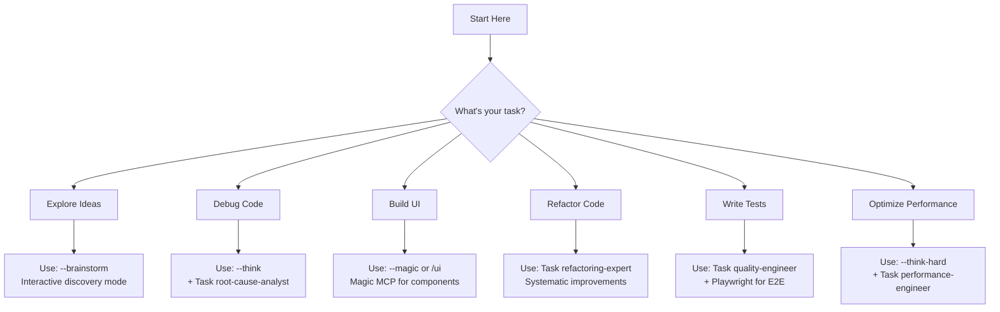

# SuperClaude Framework - Quick Start Guide

## 🎯 What Do You Want To Do?



## 🚀 Common Scenarios

### "I'm starting a new project"
```bash
--brainstorm                    # Explore requirements
--task-manage                   # Plan implementation
TodoWrite                       # Track progress
```

### "My code is failing"
```bash
git status                      # Check current state
--think                        # Analyze the issue
Task (root-cause-analyst)      # Deep investigation
--test                         # Verify fixes
```

### "I need to add a feature"
```bash
Read existing code             # Understand patterns
--task-manage                  # Plan the feature
Implementation                 # Build it
--test --review               # Validate
```

### "I want to improve code quality"
```bash
Task (refactoring-expert)      # Analyze improvements
--delegate                     # Multi-file changes
--safe-mode                    # Ensure safety
```

### "I need UI components"
```bash
--magic or /ui                 # Generate components
Magic MCP                      # Design system integration
Playwright                     # Test interactions
```

## 📝 First Commands to Know

| Command | What it does |
|---------|-------------|
| `git status` | Always start here - check repo state |
| `--brainstorm` | When you're not sure what you need |
| `--task-manage` | For any multi-step project |
| `TodoWrite` | Track your progress |
| `--think` | Analyze complex problems |
| `--test` | Run tests after changes |
| `--uc` | Save tokens when context is high |

## 🔄 Typical Workflow

1. **Start**: Check git status
2. **Plan**: Use appropriate flag/mode
3. **Track**: TodoWrite for progress
4. **Execute**: Implement with tools
5. **Validate**: Run tests/lint
6. **Complete**: Clean workspace

## ⚡ Power User Tips

### Combine Flags for Power
```bash
--think --sequential           # Structured deep analysis
--task-manage --uc            # Efficient task tracking
--safe-mode --validate        # Maximum safety
```

### Know Your Task Agents
- **Exploration**: `general-purpose`
- **Debugging**: `root-cause-analyst`
- **Refactoring**: `refactoring-expert`
- **Documentation**: `technical-writer`

### MCP Server Selection
- **UI Work**: Magic MCP
- **Docs Needed**: Deepwiki MCP
- **Complex Analysis**: Sequential MCP
- **Symbol Operations**: Serena MCP
- **Bulk Edits**: Morphllm MCP
- **Browser Testing**: Playwright MCP

## 🚨 Common Mistakes to Avoid

1. **Don't skip git status** - Always know your state
2. **Don't ignore tests** - Run them after changes
3. **Don't use wrong MCP** - Check the cheatsheet
4. **Don't skip planning** - Use TodoWrite for complex tasks
5. **Don't leave temp files** - Clean your workspace

## 🎓 Learning Path

1. **Beginner**: Start with `--brainstorm` and basic flags
2. **Intermediate**: Learn Task agents and MCP servers
3. **Advanced**: Master flag combinations and delegation
4. **Expert**: Optimize with `--uc` and parallel operations

## 🆘 Getting Help

- **Lost?** Use `--brainstorm` to explore
- **Confused?** Check `CHEATSHEET.md`
- **Debugging?** Use `--introspect` for self-analysis
- **Complex task?** Break it down with `--task-manage`

## ✅ You're Ready!

Start with any scenario above or just type `--brainstorm` to begin exploring. The framework will guide you to the right tools and approaches.