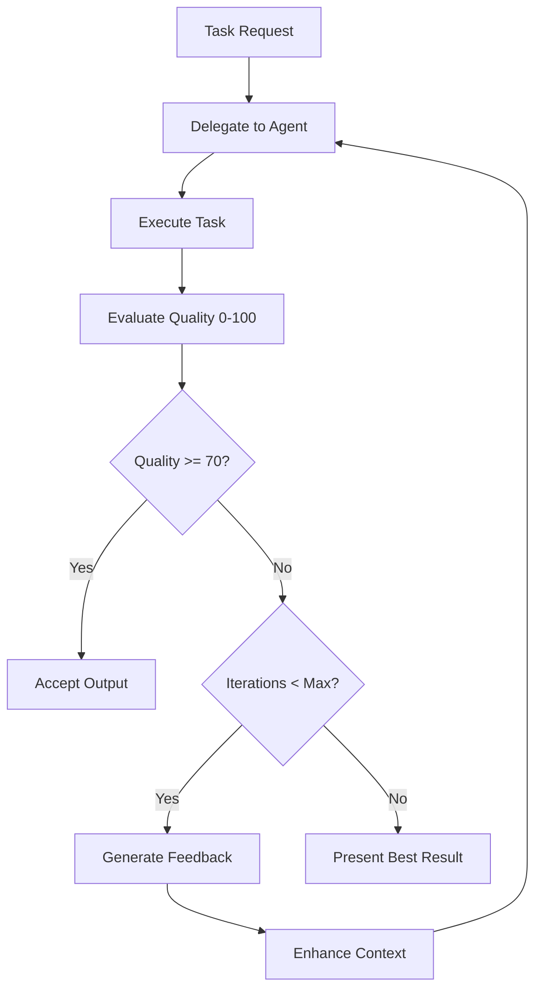

# SuperClaude Framework - Enhanced with Quality-Driven Agentic Loops

## 🚀 Overview

SuperClaude is an advanced framework for Claude Code that introduces **quality-driven agentic loops**, systematic task management, and intelligent agent delegation. This latest version integrates automatic quality evaluation (0-100 scoring) with mandatory iteration when outputs fall below acceptable thresholds.

### Key Enhancements
- **Quality Evaluation System**: Every Task agent output is scored 0-100 with automatic iteration when quality < 70
- **Agentic Loop Implementation**: Execute → Evaluate → Iterate pattern with context preservation
- **Enhanced Rules with Imperatives**: "You MUST" and "You MUST NOT" directives for clear behavioral enforcement
- **Comprehensive Agent Framework**: 15+ specialized agents with quality factors and decision trees

## 📋 Latest Changes

### Quality Evaluation System (NEW)
- **Scoring Dimensions**:
  - Correctness (40%): Does it solve the stated problem?
  - Completeness (30%): Are all requirements addressed?
  - Code Quality (20%): Maintainability, readability, best practices
  - Performance (10%): Efficiency and resource usage

- **Action Thresholds**:
  | Score | Action | Description |
  |-------|--------|-------------|
  | 90-100 | ✅ Accept | Production-ready |
  | 70-89 | ⚠️ Review | Acceptable with notes |
  | 50-69 | 🔄 Iterate | Auto-iteration required |
  | 0-49 | ❌ Reject | Fundamental issues |

### Context Enhancement Protocol (NEW)
Every Task delegation now includes structured context:
```yaml
context:
  goal: "High-level objective"
  constraints: ["resource limits", "requirements"]
  prior_work: {"agent_1": "output"}
  dependencies: ["related files"]
  quality_criteria: {"min_score": 70}
```

### Enhanced Rules with Imperatives (UPDATED)
- **You MUST** evaluate output quality systematically
- **You MUST** iterate automatically when quality < 70
- **You MUST NOT** accept suboptimal outputs without explicit override
- **IMPORTANT**: Quality gates throughout workflow

## 🛠️ Command Reference

### Core Commands

#### `/sc:analyze` - Code Analysis & Quality Assessment
```bash
/sc:analyze [target] [--focus quality|security|performance] [--depth quick|deep]

# Examples:
/sc:analyze                    # Full project analysis
/sc:analyze src/auth --focus security --depth deep  # Security audit
/sc:analyze --focus performance --format report     # Performance analysis
```

#### `/sc:explain` - Code & Concept Explanation
```bash
/sc:explain [target] [--level basic|intermediate|advanced] [--format text|examples]

# Examples:
/sc:explain authentication.js --level basic         # Beginner-friendly
/sc:explain react-hooks --context react            # Framework-specific
/sc:explain jwt --context security                 # Security concepts
```

#### `/sc:document` - Documentation Generation
```bash
/sc:document [target] [--type inline|api|guide] [--style brief|detailed]

# Examples:
/sc:document src/api --type api                    # API documentation
/sc:document components/ --type external           # Component docs
/sc:document payment-module --type guide           # User guide
```

#### `/sc:load` - Load Project Context
```bash
/sc:load    # Load saved project context and memories
```

#### `/sc:save` - Save Project Context
```bash
/sc:save    # Save current work state and memories
```

## 🎯 Flags System

### Mode Activation Flags

| Flag | Purpose | Triggers |
|------|---------|----------|
| `--brainstorm` | Collaborative discovery | Vague requirements, exploration |
| `--introspect` | Self-analysis mode | Error recovery, meta-cognition |
| `--task-manage` | Task management | >3 steps, complex operations |
| `--orchestrate` | Tool optimization | Multi-tool operations |
| `--token-efficient` / `--uc` | Compressed output | Context >75%, efficiency needs |

### Quality & Iteration Flags

| Flag | Purpose | Example |
|------|---------|---------|
| `--loop` | Enable quality-driven iteration | Auto-iterate when quality < 70 |
| `--iterations [n]` | Set max iterations | `--iterations 5` (default: 3) |
| `--quality [n]` | Set quality threshold | `--quality 80` (default: 70) |
| `--delegate` | Auto-delegate to Task agents | Complex operations |

### Analysis Depth Flags

| Flag | Token Usage | When to Use |
|------|-------------|-------------|
| `--think` | ~4K tokens | Multi-component analysis |
| `--think-hard` | ~10K tokens | Architecture review |
| `--ultrathink` | ~32K tokens | System redesign |

### MCP Server Control

| Flag | Purpose |
|------|---------|
| `--dw` / `--deepwiki` | Library documentation |
| `--seq` / `--sequential` | Complex reasoning |
| `--magic` | UI components |
| `--morph` / `--morphllm` | Pattern-based edits |
| `--serena` | Symbol operations |
| `--play` / `--playwright` | Browser testing |
| `--all-mcp` | Enable all MCP servers |
| `--no-mcp` | Disable all MCP servers |

## 🤖 Task Agent Catalog

### Discovery & Analysis
- **general-purpose**: Unknown scope exploration
- **root-cause-analyst**: Debugging, error investigation

### Code Quality & Improvement
- **refactoring-expert**: Technical debt reduction
- **quality-engineer**: Test coverage, edge cases
- **performance-engineer**: Optimization, bottlenecks

### Documentation & Planning
- **technical-writer**: API docs, guides
- **requirements-analyst**: PRD analysis, scoping
- **learning-guide**: Tutorials, education

### Architecture & Design
- **system-architect**: System design, scalability
- **backend-architect**: API design, database
- **frontend-architect**: UI/UX, components

### Specialized Operations
- **security-engineer**: Security audits
- **devops-architect**: Infrastructure, CI/CD
- **socratic-mentor**: Teaching, exploration

## 💡 Quick Start Examples

### 1. Quality-Driven Development
```bash
# Request a feature with automatic quality control
"Implement user authentication" --loop --quality 85
# → Task executes → Quality: 65 → Auto-iterates → Quality: 88 ✅
```

### 2. Complex Debugging with Agentic Loops
```bash
"API is slow and failing intermittently" --delegate --think-hard
# → root-cause-analyst investigates → Quality: 55 → Auto-iterate
# → Enhanced context → Quality: 88 → performance-engineer fixes
```

### 3. Multi-Agent Refactoring
```bash
"Refactor authentication module" --task-manage --loop
# → general-purpose finds debt → refactoring-expert cleans
# → quality-engineer validates → All quality > 70 ✅
```

### 4. Comprehensive Analysis
```bash
/sc:analyze --focus security --depth deep --delegate
# → security-engineer performs audit → Quality scored
# → Automatic iteration if needed → Final report
```

## 📁 File Structure

```
~/.claude/
├── CLAUDE.md              # Entry point (imports all components)
├── FLAGS.md               # Behavioral flags and triggers
├── RULES.md               # Enhanced with quality controls
├── PRINCIPLES.md          # Core engineering philosophy
├── MODE_*.md              # Operational modes
│   ├── MODE_Brainstorming.md
│   ├── MODE_Introspection.md
│   ├── MODE_Orchestration.md
│   ├── MODE_Task_Management.md  # Enhanced with quality eval
│   └── MODE_Token_Efficiency.md
├── MCP_*.md               # MCP server documentation
└── AGENTS.md              # NEW: Comprehensive agent framework
```

## 🔄 Agentic Loop Workflow



## ⚙️ Configuration Tips

### Enable Quality-Driven Development
```bash
# Add to your command
--loop --quality 80 --iterations 5
```

### Optimize for Large Projects
```bash
# Combine flags for best results
--delegate --task-manage --think-hard --all-mcp
```

### Token-Efficient Operations
```bash
# When context is high
--uc --orchestrate --no-mcp
```

## 📊 Quality Metrics

Track these for continuous improvement:
- Average quality scores by agent type
- Iteration success rates
- Context preservation effectiveness
- Time-to-acceptable-quality
- Agent selection accuracy

## 🚦 Best Practices

### DO ✅
- Always let quality evaluation complete
- Use specialized agents over general-purpose
- Preserve context across iterations
- Track quality metrics in memory
- Enable --loop for critical tasks

### DON'T ❌
- Skip quality evaluation to save time
- Accept outputs below quality threshold
- Lose context between delegations
- Exceed iteration limits without user consent
- Ignore quality feedback

## 🆘 Troubleshooting

### Quality Score Too Low
- Check if correct agent type selected
- Enhance context with more details
- Break complex tasks into subtasks

### Too Many Iterations
- Adjust quality threshold: `--quality 70`
- Increase max iterations: `--iterations 10`
- Simplify requirements

### Context Lost Between Agents
- Use structured context packages
- Enable memory persistence with Serena
- Check context preservation in logs

## 📚 Learn More

- **AGENTS.md**: Complete agent catalog with examples
- **RULES.md**: Enhanced behavioral rules with imperatives
- **MODE_Task_Management.md**: Quality-driven task management
- **FLAGS.md**: All available flags and triggers

## 🔧 Customization

To customize SuperClaude:

1. **Adjust Quality Thresholds**: Edit scoring in AGENTS.md
2. **Add Custom Agents**: Extend agent catalog
3. **Modify Rules**: Update RULES.md with your imperatives
4. **Create New Modes**: Add MODE_*.md files
5. **Configure Flags**: Customize FLAGS.md triggers

## 💾 Saving Your Configuration

```bash
# Backup your customizations
cd ~/Desktop/SuperClaude
git checkout -b my-enhancements
cp ~/.claude/*.md ./
git add . && git commit -m "feat: My SuperClaude enhancements"
```

---

*SuperClaude Framework - Quality-Driven Development with Agentic Loops*
*Last Updated: 2025*