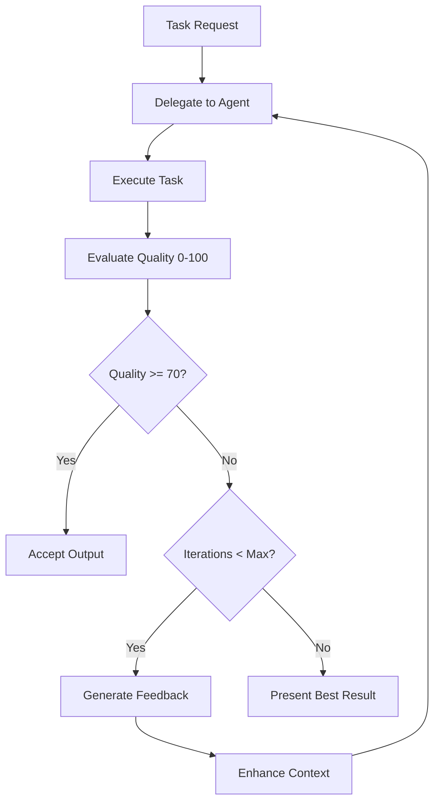

# SuperClaude Framework - Enhanced with Quality-Driven Agentic Loops

## 🚀 Overview

SuperClaude is an advanced framework for Claude Code that introduces **quality-driven agentic loops**, systematic task management, and intelligent agent delegation. This latest version integrates automatic quality evaluation (0-100 scoring) with mandatory iteration when outputs fall below acceptable thresholds.

### Key Enhancements
- **Quality Evaluation System**: Every Task agent output is scored 0-100 with automatic iteration when quality < 70
- **Agentic Loop Implementation**: Execute → Evaluate → Iterate pattern with context preservation
- **Enhanced Rules with Imperatives**: "You MUST" and "You MUST NOT" directives for clear behavioral enforcement
- **Comprehensive Agent Framework**: 15+ specialized agents with quality factors and decision trees

## 📋 Latest Changes

### Quality Evaluation System (NEW)
- **Scoring Dimensions**:
  - Correctness (40%): Does it solve the stated problem?
  - Completeness (30%): Are all requirements addressed?
  - Code Quality (20%): Maintainability, readability, best practices
  - Performance (10%): Efficiency and resource usage

- **Action Thresholds**:
  | Score | Action | Description |
  |-------|--------|-------------|
  | 90-100 | ✅ Accept | Production-ready |
  | 70-89 | ⚠️ Review | Acceptable with notes |
  | 50-69 | 🔄 Iterate | Auto-iteration required |
  | 0-49 | ❌ Reject | Fundamental issues |

### Context Enhancement Protocol (NEW)
Every Task delegation now includes structured context:
```yaml
context:
  goal: "High-level objective"
  constraints: ["resource limits", "requirements"]
  prior_work: {"agent_1": "output"}
  dependencies: ["related files"]
  quality_criteria: {"min_score": 70}
```

### Enhanced Rules with Imperatives (UPDATED)
- **You MUST** evaluate output quality systematically
- **You MUST** iterate automatically when quality < 70
- **You MUST NOT** accept suboptimal outputs without explicit override
- **IMPORTANT**: Quality gates throughout workflow

## 🛠️ Command Reference

### Command Overview

The SuperClaude framework provides 25+ specialized commands organized into categories:

| Category | Commands | Purpose |
|----------|----------|---------|
| **Core** | `/sc:analyze`, `/sc:explain`, `/sc:document`, `/sc:load`, `/sc:save` | Foundation commands for analysis, documentation, and session management |
| **Task Management** | `/sc:plan`, `/sc:checkpoint`, `/sc:delegate` | Task organization with quality-driven delegation |
| **Development** | `/sc:refactor`, `/sc:test`, `/sc:debug`, `/sc:optimize` | Code improvement and debugging |
| **Security & Quality** | `/sc:security`, `/sc:review` | Security audits and code reviews |
| **Discovery** | `/sc:brainstorm`, `/sc:learn` | Requirements discovery and learning |
| **UI/UX** | `/ui`, `/21`, `/logo` | UI component generation and assets |
| **Utility** | `/sc:cleanup`, `/help`, `/feedback` | Workspace management, help and issue reporting |

All `/sc:` commands support:
- **Quality evaluation** (0-100 scoring)
- **Automatic iteration** when quality < 70
- **Flag combinations** for enhanced behavior
- **Agent delegation** for specialized tasks

### Core Commands

#### `/sc:analyze` - Code Analysis & Quality Assessment
```bash
/sc:analyze [target] [--focus quality|security|performance] [--depth quick|deep] [--delegate]

# Purpose: Systematic code analysis with quality evaluation
# Quality: Auto-evaluates output quality 0-100, iterates if <70

# Examples:
/sc:analyze                                         # Full project analysis
/sc:analyze src/auth --focus security --depth deep  # Security audit
/sc:analyze --focus performance --delegate          # Delegate to performance-engineer
/sc:analyze --think-hard --all-mcp                 # Deep analysis with all tools
```

#### `/sc:explain` - Code & Concept Explanation
```bash
/sc:explain [target] [--level basic|intermediate|advanced] [--format text|examples] [--context framework]

# Purpose: Educational explanations tailored to audience level
# Quality: Clarity and completeness scored, auto-enhanced if needed

# Examples:
/sc:explain authentication.js --level basic         # Beginner-friendly
/sc:explain react-hooks --context react            # Framework-specific
/sc:explain jwt --context security                 # Security concepts
/sc:explain design-patterns --format examples      # With code examples
```

#### `/sc:document` - Documentation Generation
```bash
/sc:document [target] [--type inline|api|guide|readme] [--style brief|detailed] [--format md|jsdoc|openapi]

# Purpose: Comprehensive documentation generation
# Quality: Completeness and accuracy evaluated

# Examples:
/sc:document src/api --type api --format openapi   # OpenAPI spec
/sc:document components/ --type external           # Component library docs
/sc:document payment-module --type guide           # User guide
/sc:document . --type readme --style detailed      # Project README
```

#### `/sc:load` - Load Project Context
```bash
/sc:load [project] [--memory all|recent|specific]

# Purpose: Load saved project context, memories, and session state
# Integrates with: Serena MCP for persistence

# Examples:
/sc:load                                # Load current project
/sc:load auth-project                   # Load specific project
/sc:load --memory recent               # Load only recent memories
```

#### `/sc:save` - Save Project Context
```bash
/sc:save [--checkpoint] [--compress] [--tag label]

# Purpose: Save current work state, memories, and context
# Quality: Validates completeness before saving

# Examples:
/sc:save                                # Standard save
/sc:save --checkpoint                   # Quick checkpoint save
/sc:save --tag "auth-complete"         # Tagged milestone save
```

### Task Management Commands

#### `/sc:plan` - Create Task Hierarchy
```bash
/sc:plan [goal] [--phases n] [--delegate auto|manual] [--quality threshold]

# Purpose: Generate hierarchical task plan with quality gates
# Quality: Each task gets quality criteria (min 70)

# Examples:
/sc:plan "implement authentication" --phases 3      # 3-phase plan
/sc:plan "refactor codebase" --delegate auto       # Auto-delegation
/sc:plan "add feature" --quality 85                # High quality bar
```

#### `/sc:checkpoint` - Save Work Progress
```bash
/sc:checkpoint [--quick] [--with-todos] [--tag label]

# Purpose: Quick progress save with task state
# Integrates with: TodoWrite and memory systems

# Examples:
/sc:checkpoint                          # Standard checkpoint
/sc:checkpoint --quick                   # Minimal checkpoint
/sc:checkpoint --with-todos --tag "v1" # Full state capture
```

#### `/sc:delegate` - Smart Task Delegation
```bash
/sc:delegate [task] [--agent auto|specific] [--loop] [--iterations n]

# Purpose: Delegate to specialized Task agents with quality control
# Quality: Auto-iterates until quality >= 70

# Examples:
/sc:delegate "debug API" --agent root-cause-analyst
/sc:delegate "refactor auth" --loop --iterations 5
/sc:delegate "optimize queries" --agent performance-engineer
```

### Development Commands

#### `/sc:refactor` - Code Refactoring
```bash
/sc:refactor [target] [--type extract|inline|rename|restructure] [--preserve tests|api|behavior]

# Purpose: Systematic refactoring with quality preservation
# Quality: Ensures tests pass, complexity reduced

# Examples:
/sc:refactor src/auth --type restructure --preserve tests
/sc:refactor "extract getUserData" --preserve api
/sc:refactor . --delegate refactoring-expert --loop
```

#### `/sc:test` - Testing & Validation
```bash
/sc:test [target] [--type unit|integration|e2e] [--coverage target] [--fix]

# Purpose: Run tests with quality validation
# Quality: Coverage and test quality evaluated

# Examples:
/sc:test                                # Run all tests
/sc:test auth --type unit --coverage 90
/sc:test --fix                         # Auto-fix test issues
/sc:test --delegate quality-engineer   # Comprehensive testing
```

#### `/sc:debug` - Systematic Debugging
```bash
/sc:debug [issue] [--depth shallow|deep] [--approach systematic|targeted]

# Purpose: Root cause analysis with evidence gathering
# Quality: Solution completeness and accuracy scored

# Examples:
/sc:debug "API returns 500"            # Debug specific issue
/sc:debug --depth deep --think-hard    # Deep investigation
/sc:debug --delegate root-cause-analyst --loop
```

#### `/sc:optimize` - Performance Optimization
```bash
/sc:optimize [target] [--focus speed|memory|size] [--measure before|after|both]

# Purpose: Performance improvement with metrics
# Quality: Measurable improvement required (>20%)

# Examples:
/sc:optimize database-queries --focus speed
/sc:optimize bundle --focus size --measure both
/sc:optimize --delegate performance-engineer
```

### Security & Quality Commands

#### `/sc:security` - Security Audit
```bash
/sc:security [target] [--standard owasp|cwe|custom] [--severity all|high|critical]

# Purpose: Security vulnerability assessment
# Quality: Coverage and remediation quality scored

# Examples:
/sc:security                           # Full security scan
/sc:security auth --standard owasp     # OWASP compliance
/sc:security --delegate security-engineer --loop
```

#### `/sc:review` - Code Review
```bash
/sc:review [target] [--focus quality|security|performance|all] [--suggest fixes]

# Purpose: Comprehensive code review with suggestions
# Quality: Review thoroughness evaluated

# Examples:
/sc:review pull-request                # Review PR changes
/sc:review src/ --suggest fixes       # With fix suggestions
/sc:review --focus all --think-hard   # Deep review
```

### Discovery Commands

#### `/sc:brainstorm` - Requirements Discovery
```bash
/sc:brainstorm [topic] [--mode explore|define|refine] [--output brief|prd]

# Purpose: Collaborative discovery and ideation
# Quality: Requirement clarity and feasibility scored

# Examples:
/sc:brainstorm "user dashboard"        # Explore ideas
/sc:brainstorm --mode define --output prd
/sc:brainstorm --delegate requirements-analyst
```

#### `/sc:learn` - Learning & Tutorials
```bash
/sc:learn [topic] [--level beginner|intermediate|advanced] [--format tutorial|guide|reference]

# Purpose: Educational content generation
# Quality: Pedagogical effectiveness evaluated

# Examples:
/sc:learn "react hooks" --level beginner
/sc:learn authentication --format tutorial
/sc:learn --delegate learning-guide
```

### UI/UX Commands

#### `/ui` or `/21` - UI Component Generation
```bash
/ui [component] [--framework react|vue|angular] [--style material|tailwind|custom]
/21 [search-term]

# Purpose: Generate modern UI components from 21st.dev
# Quality: Accessibility and reusability scored

# Examples:
/ui login-form --framework react       # React login component
/21 data-table                        # Search 21st.dev patterns
/ui navbar --style tailwind           # Tailwind navbar
```

#### `/logo` - Logo Search & Integration
```bash
/logo [company] [--format svg|png|jsx|tsx] [--theme light|dark|both]

# Purpose: Find and integrate company logos
# Quality: Resolution and compatibility checked

# Examples:
/logo github --format svg              # GitHub logo as SVG
/logo "discord slack" --format tsx     # Multiple logos as TSX
/logo microsoft --theme dark           # Dark theme variant
```

#### `/sc:cleanup` - Workspace Cleanup & Hygiene
```bash
/sc:cleanup [--scope session|current|all] [--preserve patterns] [--pattern cleanup-patterns] [--dry-run]

# Purpose: Maintain clean workspace by removing temporary files and build artifacts
# Quality: Validates cleanup safety, preserves important files

# Examples:
/sc:cleanup                                      # Standard session cleanup
/sc:cleanup --dry-run                           # Preview what will be deleted
/sc:cleanup --scope session --preserve tests    # Keep test files
/sc:cleanup --pattern "*.log,*.tmp,debug.*"    # Target specific patterns
/sc:cleanup --scope all --confirm               # Deep cleanup with confirmation
```

**Best Practices:**
- Always run `git status` before cleanup to ensure changes are committed
- Use `--dry-run` first in unfamiliar projects to preview deletions
- Preserve important artifacts with `--preserve` flag
- Schedule regular cleanups at session end or before commits

**Scope Options:**
- `session`: Recent temporary files from current session (default)
- `current`: Current working directory only
- `all`: Deep cleanup of entire project (use carefully)

**Smart Pattern Recognition:**
- **Node.js**: Preserves `node_modules`, removes `*.log`, temp test files
- **Python**: Preserves `venv/`, removes `__pycache__`, `*.pyc`
- **Build Projects**: Preserves final artifacts, removes intermediate files

**Integration with Git Workflow:**
```bash
# Before committing
/sc:cleanup --scope session
git add .
git commit -m "Feature complete"

# After testing
npm test
/sc:cleanup --pattern "*.coverage,*.test-results"

# Post-build cleanup
npm run build
/sc:cleanup --preserve dist --pattern "*.map,*.cache"
```

### Utility Commands

#### `/help` - Get Help
```bash
/help [command|topic]

# Purpose: Get help and documentation

# Examples:
/help                                  # General help
/help refactor                        # Command-specific help
/help agents                          # Topic help
```

#### `/feedback` - Report Issues
```bash
/feedback [type bug|feature|improvement]

# Purpose: Report issues to https://github.com/anthropics/claude-code/issues

# Examples:
/feedback bug "command not working"
/feedback feature "add new command"
```

## 🎯 Flags System

### Mode Activation Flags

| Flag | Purpose | Triggers |
|------|---------|----------|
| `--brainstorm` | Collaborative discovery | Vague requirements, exploration |
| `--introspect` | Self-analysis mode | Error recovery, meta-cognition |
| `--task-manage` | Task management | >3 steps, complex operations |
| `--orchestrate` | Tool optimization | Multi-tool operations |
| `--token-efficient` / `--uc` | Compressed output | Context >75%, efficiency needs |

### Quality & Iteration Flags

| Flag | Purpose | Example |
|------|---------|---------|
| `--loop` | Enable quality-driven iteration | Auto-iterate when quality < 70 |
| `--iterations [n]` | Set max iterations | `--iterations 5` (default: 3) |
| `--quality [n]` | Set quality threshold | `--quality 80` (default: 70) |
| `--delegate` | Auto-delegate to Task agents | Complex operations |

### Analysis Depth Flags

| Flag | Token Usage | When to Use |
|------|-------------|-------------|
| `--think` | ~4K tokens | Multi-component analysis |
| `--think-hard` | ~10K tokens | Architecture review |
| `--ultrathink` | ~32K tokens | System redesign |

### MCP Server Control

| Flag | Purpose |
|------|---------|
| `--dw` / `--deepwiki` | Library documentation |
| `--seq` / `--sequential` | Complex reasoning |
| `--magic` | UI components |
| `--morph` / `--morphllm` | Pattern-based edits |
| `--serena` | Symbol operations |
| `--play` / `--playwright` | Browser testing |
| `--all-mcp` | Enable all MCP servers |
| `--no-mcp` | Disable all MCP servers |

## 🤖 Task Agent Catalog

### Discovery & Analysis
- **general-purpose**: Unknown scope exploration
- **root-cause-analyst**: Debugging, error investigation

### Code Quality & Improvement
- **refactoring-expert**: Technical debt reduction
- **quality-engineer**: Test coverage, edge cases
- **performance-engineer**: Optimization, bottlenecks

### Documentation & Planning
- **technical-writer**: API docs, guides
- **requirements-analyst**: PRD analysis, scoping
- **learning-guide**: Tutorials, education

### Architecture & Design
- **system-architect**: System design, scalability
- **backend-architect**: API design, database
- **frontend-architect**: UI/UX, components

### Specialized Operations
- **security-engineer**: Security audits
- **devops-architect**: Infrastructure, CI/CD
- **socratic-mentor**: Teaching, exploration

## 💡 Quick Start Examples

### 1. Quality-Driven Development
```bash
# Request a feature with automatic quality control
"Implement user authentication" --loop --quality 85
# → Task executes → Quality: 65 → Auto-iterates → Quality: 88 ✅
```

### 2. Complex Debugging with Agentic Loops
```bash
/sc:debug "API returns 500" --delegate --think-hard
# → root-cause-analyst investigates → Quality: 55 → Auto-iterate
# → Enhanced context → Quality: 88 → performance-engineer fixes
```

### 3. Multi-Agent Refactoring
```bash
/sc:refactor authentication --task-manage --loop
# → general-purpose finds debt → refactoring-expert cleans
# → quality-engineer validates → All quality > 70 ✅
```

### 4. Comprehensive Security Audit
```bash
/sc:security --standard owasp --delegate --all-mcp
# → security-engineer performs audit → Quality scored
# → Automatic iteration if needed → Final report
```

## 📖 Command Workflows

### Complete Feature Development
```bash
# 1. Discovery & Planning
/sc:brainstorm "user dashboard" --mode explore
/sc:plan "implement dashboard" --phases 4 --quality 80

# 2. Implementation
/sc:refactor existing-code --preserve api
/ui dashboard-layout --framework react
/sc:optimize --focus performance

# 3. Quality & Testing
/sc:test --type unit --coverage 90
/sc:security --standard owasp
/sc:review --focus all --suggest fixes

# 4. Documentation & Save
/sc:document --type api --format openapi
/sc:save --tag "dashboard-v1"
```

### Debugging Workflow
```bash
# 1. Initial Analysis
/sc:analyze --focus performance --think-hard

# 2. Debug Investigation
/sc:debug "slow queries" --depth deep --delegate

# 3. Optimization
/sc:optimize database --measure both --loop

# 4. Validation
/sc:test --type integration
/sc:checkpoint --tag "perf-fix"
```

### Learning & Documentation Flow
```bash
# 1. Learn Concepts
/sc:learn "microservices" --level intermediate

# 2. Explain Existing Code
/sc:explain src/services --context architecture

# 3. Generate Documentation
/sc:document . --type guide --style detailed

# 4. Create Tutorial
/sc:learn "how to use API" --format tutorial
```

### UI Component Development
```bash
# 1. Generate Components
/ui data-table --framework react --style material
/21 responsive-navbar

# 2. Add Branding
/logo "github microsoft" --format tsx

# 3. Test Accessibility
/sc:test --focus accessibility

# 4. Document Components
/sc:document components/ --type external
```

## 📁 File Structure

```
~/.claude/
├── CLAUDE.md              # Entry point (imports all components)
├── FLAGS.md               # Behavioral flags and triggers
├── RULES.md               # Enhanced with quality controls
├── PRINCIPLES.md          # Core engineering philosophy
├── MODE_*.md              # Operational modes
│   ├── MODE_Brainstorming.md
│   ├── MODE_Introspection.md
│   ├── MODE_Orchestration.md
│   ├── MODE_Task_Management.md  # Enhanced with quality eval
│   └── MODE_Token_Efficiency.md
├── MCP_*.md               # MCP server documentation
└── AGENTS.md              # NEW: Comprehensive agent framework
```

## 🔗 Command Chaining & Integration

### Command Integration Patterns

Commands can be chained together for powerful workflows:

#### Sequential Chaining
```bash
/sc:load → /sc:analyze → /sc:refactor → /sc:test → /sc:save
```

#### Parallel Execution
```bash
# Run multiple analyses simultaneously
/sc:analyze --focus security & /sc:analyze --focus performance
```

#### Quality-Driven Chains
```bash
# Auto-chain based on quality scores
/sc:implement → (quality < 70) → /sc:refactor → /sc:test
```

### Flag Combinations

Combine flags for enhanced behavior:

```bash
# Maximum Analysis Depth
/sc:analyze --think-hard --all-mcp --delegate

# Ultra-Efficient Mode
/sc:refactor --uc --orchestrate --no-mcp

# Quality-Enforced Development
/sc:implement --loop --quality 90 --iterations 10

# Comprehensive Testing
/sc:test --delegate quality-engineer --coverage 95 --fix
```

### MCP Server Coordination

Commands automatically coordinate MCP servers:

| Command Pattern | MCP Servers Used |
|----------------|------------------|
| `/sc:analyze --think-hard` | Sequential + Serena |
| `/ui component` | Magic + Deepwiki |
| `/sc:debug --delegate` | Sequential + Task Agent |
| `/sc:optimize` | Performance-engineer + Morphllm |
| `/sc:security` | Security-engineer + All relevant |

### Context Preservation

Commands maintain context across operations:

```bash
# Session Management
/sc:load                    # Load context
/sc:plan "feature"         # Context enriched
/sc:implement              # Context preserved
/sc:checkpoint             # Context saved
/sc:save                   # Full persistence

# Memory Integration
/sc:brainstorm → write_memory("requirements")
/sc:implement → read_memory("requirements")
/sc:test → write_memory("test_results")
```

## 🔄 Agentic Loop Workflow



## ⚙️ Configuration Tips

### Enable Quality-Driven Development
```bash
# Add to your command
--loop --quality 80 --iterations 5
```

### Optimize for Large Projects
```bash
# Combine flags for best results
--delegate --task-manage --think-hard --all-mcp
```

### Token-Efficient Operations
```bash
# When context is high
--uc --orchestrate --no-mcp
```

## 📊 Quality Metrics

Track these for continuous improvement:
- Average quality scores by agent type
- Iteration success rates
- Context preservation effectiveness
- Time-to-acceptable-quality
- Agent selection accuracy

## 🚦 Best Practices

### DO ✅
- Always let quality evaluation complete
- Use specialized agents over general-purpose
- Preserve context across iterations
- Track quality metrics in memory
- Enable --loop for critical tasks

### DON'T ❌
- Skip quality evaluation to save time
- Accept outputs below quality threshold
- Lose context between delegations
- Exceed iteration limits without user consent
- Ignore quality feedback

## 🆘 Troubleshooting

### Quality Score Too Low
- Check if correct agent type selected
- Enhance context with more details
- Break complex tasks into subtasks

### Too Many Iterations
- Adjust quality threshold: `--quality 70`
- Increase max iterations: `--iterations 10`
- Simplify requirements

### Context Lost Between Agents
- Use structured context packages
- Enable memory persistence with Serena
- Check context preservation in logs

## 📚 Learn More

- **AGENTS.md**: Complete agent catalog with examples
- **RULES.md**: Enhanced behavioral rules with imperatives
- **MODE_Task_Management.md**: Quality-driven task management
- **FLAGS.md**: All available flags and triggers

## 🔧 Customization

To customize SuperClaude:

1. **Adjust Quality Thresholds**: Edit scoring in AGENTS.md
2. **Add Custom Agents**: Extend agent catalog
3. **Modify Rules**: Update RULES.md with your imperatives
4. **Create New Modes**: Add MODE_*.md files
5. **Configure Flags**: Customize FLAGS.md triggers

## 💾 Saving Your Configuration

```bash
# Backup your customizations
cd ~/Desktop/SuperClaude
git checkout -b my-enhancements
cp ~/.claude/*.md ./
git add . && git commit -m "feat: My SuperClaude enhancements"
```

---

*SuperClaude Framework - Quality-Driven Development with Agentic Loops*
*Last Updated: 2025*