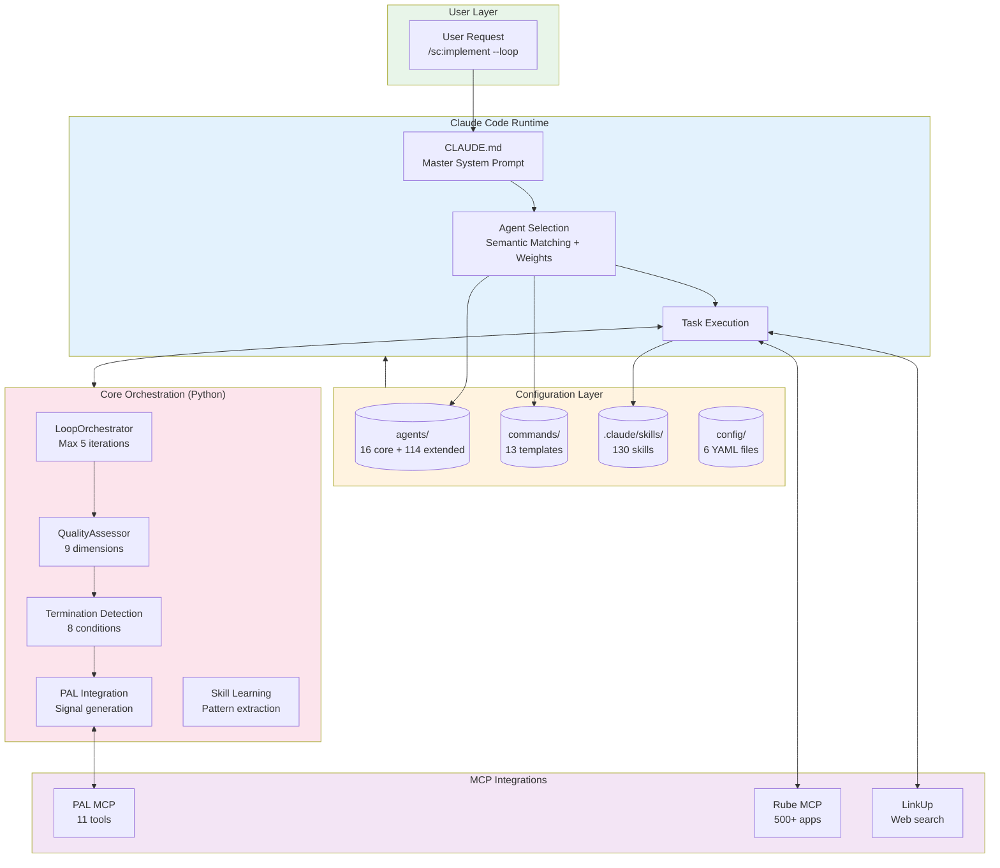
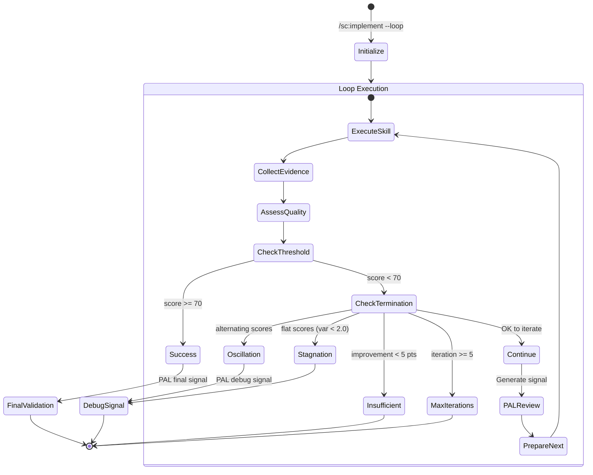
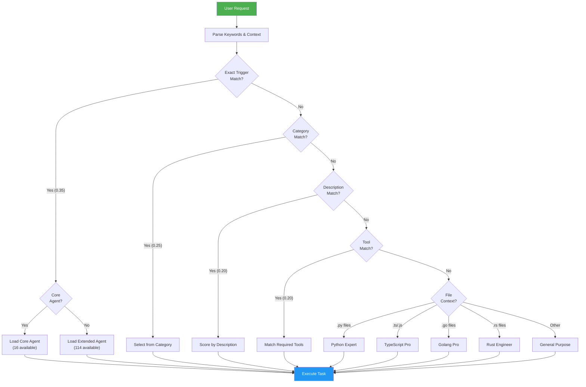
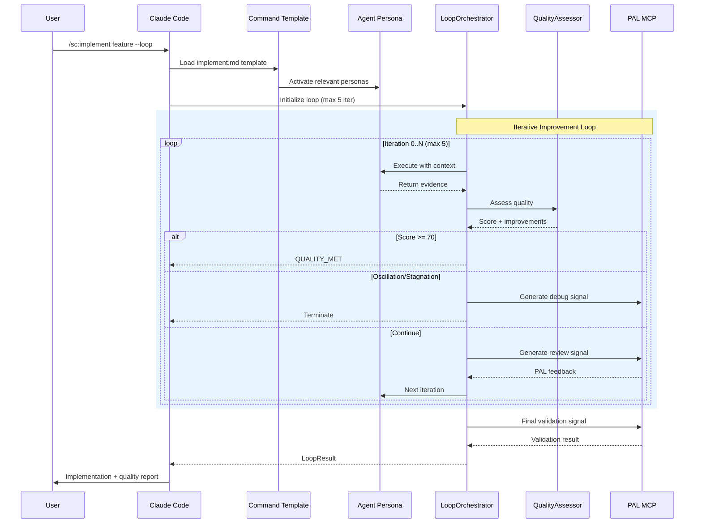
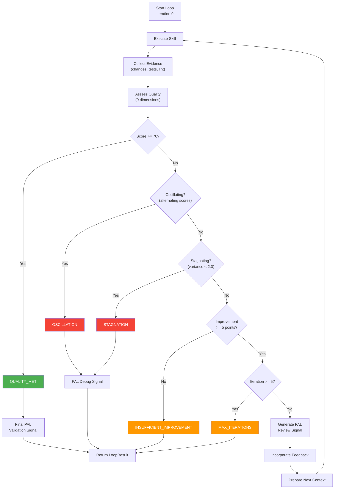
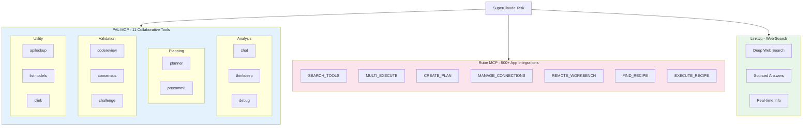
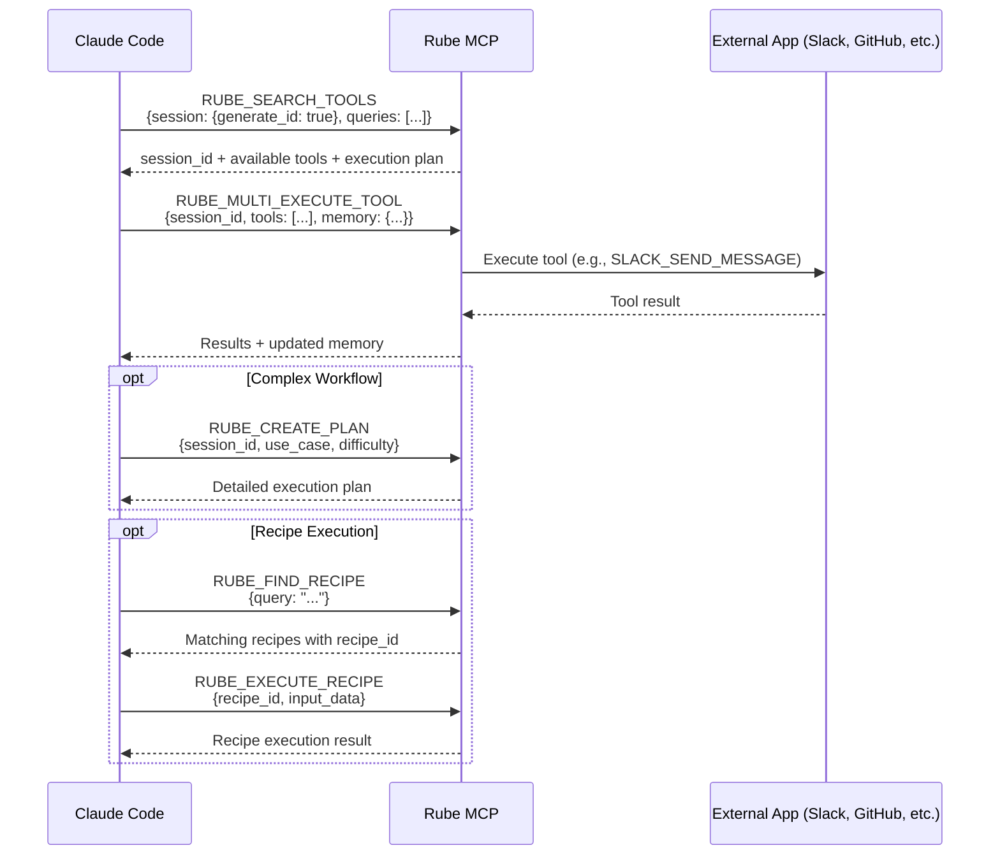
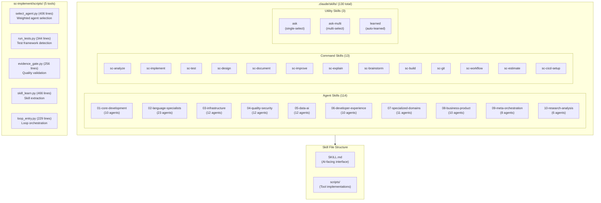
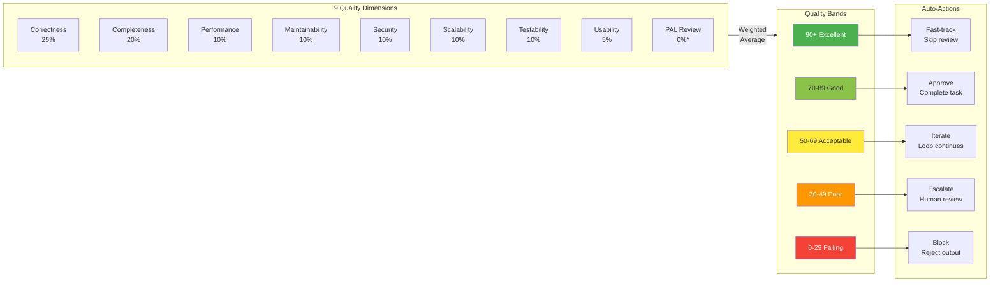

# SuperClaude Framework

<p align="center">
  
  
  
  
  
  
</p>

**A config-first meta-framework for Claude Code that provides 130 specialized agent personas, 13 structured commands, 130 skills, and comprehensive MCP integration with quality-driven iterative workflows.**

SuperClaude transforms Claude Code into a powerful development platform with specialized agent prompts, signal-based loop orchestration, and multi-model consensus capabilities. The core interface is markdown and YAML configuration files, with a Python orchestration layer for advanced workflows including quality gates, termination detection, and PAL MCP integration.

---

## Table of Contents

- [Overview](#overview)
- [Key Features](#key-features)
- [Architecture](#architecture)
- [Core Orchestration Layer](#core-orchestration-layer)
- [Installation](#installation)
- [Quick Start](#quick-start)
- [Agent System](#agent-system)
- [Command System](#command-system)
- [Loop Orchestration](#loop-orchestration)
- [MCP Integrations](#mcp-integrations)
- [Skills System](#skills-system)
- [Quality System](#quality-system)
- [Type System](#type-system)
- [Configuration](#configuration)
- [Directory Structure](#directory-structure)
- [Creating Custom Agents](#creating-custom-agents)
- [Contributing](#contributing)

---

## Overview

SuperClaude is a meta-prompt framework that enhances Claude Code with:

- **130 Specialized Agents**: 16 core + 114 extended agents across 10 categories
- **130 Claude Skills**: 114 agent personas + 13 command workflows + 3 utility skills
- **13 Structured Commands**: analyze, implement, test, design, document, and more
- **6 Framework Modes**: normal, brainstorming, introspection, task_management, token_efficiency, orchestration
- **MCP Integration**: PAL (11 tools), Rube (500+ apps via Composio), LinkUp (web search)
- **Quality-Driven Loop**: 8-dimension scoring with 8 termination conditions
- **Core Orchestration**: Python layer for loop management, PAL integration, and skill learning
- **Signal-Based Architecture**: Structured communication between components

---

## Key Features

### Config-First Hybrid Architecture

SuperClaude v6.0.0 is a **config-first hybrid framework**:

- **Markdown Agent Personas**: Each agent is a self-contained markdown file with YAML frontmatter
- **YAML Configuration**: 6 configuration files for agents, commands, quality, models, MCP, and framework settings
- **Python Orchestration**: Loop orchestrator, quality assessment, PAL integration, and skill learning
- **Portable**: Works with any Claude Code instance
- **Extensible**: Add agents by creating markdown files

### Why Config-First Hybrid?

| Benefit | Description |
|---------|-------------|
| **Simplicity** | Core interface is markdown/YAML files |
| **Portability** | Works with any Claude Code instance |
| **Extensibility** | Add agents by creating markdown files |
| **Maintainability** | Prompts are easy to refine and version |
| **Version Control** | Easy to diff and review prompt changes |
| **Advanced Workflows** | Python orchestration for quality gates and loop control |
| **Safety** | Hard limits on iterations, termination detection |

### Specialized Agent System

130 agents organized across 10 categories:

| Category | Count | Examples |
|----------|-------|----------|
| Core Development | 10 | API Designer, Backend Developer, Mobile Developer |
| Language Specialists | 23 | Python Pro, TypeScript Pro, Rust Engineer, Go Pro |
| Infrastructure | 12 | Cloud Architect, Kubernetes Specialist, SRE Engineer |
| Quality & Security | 12 | Code Reviewer, Security Auditor, Chaos Engineer |
| Data & AI | 12 | Data Scientist, ML Engineer, LLM Architect, Prompt Engineer |
| Developer Experience | 10 | CLI Developer, DX Optimizer, Git Workflow Manager |
| Specialized Domains | 11 | Blockchain Developer, IoT Engineer, Game Developer |
| Business & Product | 10 | Product Manager, Scrum Master, UX Researcher |
| Meta Orchestration | 8 | Agent Organizer, Context Manager, Workflow Orchestrator |
| Research & Analysis | 6 | Data Researcher, Competitive Analyst, Trend Analyst |

### Command System

13 structured commands with consistent patterns:

```
/sc:analyze    - Static analysis, security review, performance bottlenecks
/sc:implement  - Feature implementation with quality gates and loop support
/sc:test       - Test generation, coverage analysis, quality reporting
/sc:design     - Architecture and system design with ADRs
/sc:document   - Documentation generation and maintenance
/sc:brainstorm - Creative ideation and exploration
/sc:explain    - Educational explanations and learning
/sc:improve    - Code improvement, refactoring, optimization
/sc:build      - Build system and compilation workflows
/sc:git        - Git operations, smart commits, branch management
/sc:workflow   - Multi-step task orchestration
/sc:estimate   - Effort estimation and planning
/sc:cicd-setup - CI/CD workflow and pre-commit generation
```

---

## Architecture

### How SuperClaude Works



### File-Based Configuration

SuperClaude uses a layered file-based architecture:

1. **CLAUDE.md** - Master system prompt loaded by Claude Code
2. **agents/index.yaml** - Agent registry with triggers, categories, and selection weights
3. **agents/core/*.md** - 16 core agent persona prompts
4. **agents/extended/**/*.md** - 114 extended agent persona prompts across 10 categories
5. **commands/index.yaml** - Command registry with flags and aliases
6. **commands/*.md** - 13 command templates
7. **config/*.yaml** - 6 configuration files
8. **core/*.py** - Python orchestration modules
9. **mcp/*.md** - MCP integration guides
10. **.claude/skills/** - 130 Claude Code skills

---

## Core Orchestration Layer

SuperClaude v6.0.0 includes a Python orchestration layer in `core/` for advanced workflows:

### Modules

| Module | Lines | Purpose |
|--------|-------|---------|
| `loop_orchestrator.py` | 362 | Manages iterative improvement with quality gates |
| `quality_assessment.py` | ~200 | 9-dimension quality scoring with evidence collection |
| `pal_integration.py` | ~250 | PAL MCP signal generation (review, debug, validation) |
| `termination.py` | ~100 | Termination condition detection (oscillation, stagnation) |
| `types.py` | 159 | Core type definitions (TerminationReason, LoopConfig, etc.) |
| `skill_learning_integration.py` | ~300 | Skill extraction from successful executions |
| `skill_persistence.py` | ~200 | Skill storage, retrieval, and promotion |

### LoopOrchestrator

The `LoopOrchestrator` class manages the `--loop` flag behavior:



**Key Features:**

- **Safety**: Hard maximum of 5 iterations (cannot be overridden via `hard_max_iterations`)
- **Quality-Driven**: Stops when score >= 70 (configurable threshold)
- **Pattern Detection**: Detects oscillation (alternating scores) and stagnation (flat scores)
- **PAL Integration**: Generates review signals within loop for external validation
- **Signal-Based**: Communicates with Claude Code via structured signals
- **Evidence Collection**: Tracks changes, tests, lint results, and file modifications

### Signal Architecture

The orchestrator uses structured signals for component communication:

```python
# Skill invocation signal
{
    "action": "execute_skill",
    "skill": "sc-implement",
    "parameters": {
        "task": "description",
        "improvements_needed": [...],
        "iteration": 2,
        "focus": "remediation"  # "implementation" for iter 0
    },
    "collect": ["changes", "tests", "lint", "changed_files"],
    "context": {...}
}
```

---

## Installation

### Option 1: Clone Repository

```bash
git clone https://github.com/SuperClaude-Org/SuperClaude_Framework.git
cd SuperClaude_Framework
```

### Option 2: Add as Git Submodule

```bash
git submodule add https://github.com/SuperClaude-Org/SuperClaude_Framework.git superclaud
```

### Setup Claude Code

Add to your project's `.claude/settings.json`:

```json
{
  "systemPromptFiles": ["superclaud/CLAUDE.md"]
}
```

Or copy `CLAUDE.md` to your project root.

### Optional: Python Dependencies

For advanced workflows using the core orchestration layer:

```bash
pip install -e .
```

---

## Quick Start

### 1. Basic Usage

Once configured, Claude Code automatically loads SuperClaude capabilities:

```
User: Help me debug this authentication issue
Claude: [Selects root-cause-analyst agent, applies debugging methodology]
```

### 2. Using Commands

```
User: /sc:analyze src/auth/
Claude: [Runs comprehensive static analysis, security review, quality assessment]
```

### 3. Specifying Agents

```
User: @python-expert Review this Flask application
Claude: [Uses Python expert persona with framework-specific knowledge]
```

### 4. Iterative Improvement

```
User: /sc:implement new user registration --loop
Claude: [Implements with quality gates, iterates until score >= 70 or max 5 iterations]
```

### 5. Using MCP Tools

With PAL MCP configured:
```
User: Use PAL to review this code
Claude: [Invokes mcp__pal__codereview for multi-model code review]
```

---

## Agent System

### Core Agents (16)

High-priority generalists for common tasks:

| Agent | Triggers | Purpose |
|-------|----------|---------|
| general-purpose | help, assist, general | Versatile task handling |
| root-cause-analyst | debug, bug, error, crash, broken, not working | Deep debugging and investigation |
| refactoring-expert | refactor, clean, improve, technical debt | Code quality improvement |
| technical-writer | document, docs, readme | Documentation generation |
| security-engineer | security, auth, vulnerability, authorization | Security analysis and hardening |
| performance-engineer | performance, optimize, slow, bottleneck | Performance optimization |
| quality-engineer | test, qa, coverage | Testing and quality assurance |
| python-expert | python, django, flask | Python development |
| system-architect | architecture, design, scalability | System design |
| backend-architect | backend, api, database | Backend systems |
| frontend-architect | frontend, ui, react | Frontend development |
| devops-architect | devops, ci/cd, kubernetes | Infrastructure automation |
| fullstack-developer | fullstack, end-to-end | Full-stack coordination |
| learning-guide | learn, teach, tutorial | Educational guidance |
| requirements-analyst | requirements, spec, user story | Requirements analysis |
| socratic-mentor | mentor, coach, why | Guided discovery learning |

### Extended Agents (114)

Specialized agents across 10 categories in `agents/extended/`:

| Category | Directory | Count | Examples |
|----------|-----------|-------|----------|
| Core Development | `01-core-development/` | 10 | API Designer, GraphQL Architect, Mobile Developer |
| Language Specialists | `02-language-specialists/` | 23 | Python Pro, TypeScript Pro, Rust Engineer, Go Pro |
| Infrastructure | `03-infrastructure/` | 12 | Cloud Architect, Kubernetes Specialist, Terraform Engineer |
| Quality & Security | `04-quality-security/` | 12 | Security Auditor, Penetration Tester, Chaos Engineer |
| Data & AI | `05-data-ai/` | 12 | Data Scientist, ML Engineer, LLM Architect, NLP Engineer |
| Developer Experience | `06-developer-experience/` | 10 | CLI Developer, DX Optimizer, MCP Developer |
| Specialized Domains | `07-specialized-domains/` | 11 | Blockchain Developer, IoT Engineer, Game Developer |
| Business & Product | `08-business-product/` | 10 | Product Manager, Scrum Master, Sales Engineer |
| Meta Orchestration | `09-meta-orchestration/` | 8 | Agent Organizer, Task Distributor, Workflow Orchestrator |
| Research & Analysis | `10-research-analysis/` | 6 | Data Researcher, Competitive Analyst, Market Researcher |

### Agent Selection Algorithm

Agents are selected using weighted semantic matching:



**Selection Weights (from `agents/index.yaml`):**

```yaml
selection:
  weights:
    trigger_match: 0.35      # Keyword triggers (highest priority)
    category_match: 0.25     # Category alignment
    description_match: 0.20  # Description relevance
    tool_match: 0.20         # Required tool availability

  thresholds:
    minimum_score: 0.6       # Minimum match score
    confidence_level: 0.8    # Confidence threshold
```

---

## Command System

Commands provide structured execution patterns with optional quality gates.

### Command Format

Each command is a markdown file with YAML frontmatter:

```markdown
---
name: implement
description: Feature implementation with quality gates
aliases: [build, create, develop]
flags: [--loop, --tests, --docs, --pal-review, --consensus]
evidence_required: true
---

# Implement Command

[Structured implementation methodology...]
```

### Command Execution Flow



### Available Commands

| Command | Aliases | Evidence | Key Flags |
|---------|---------|----------|-----------|
| analyze | analyse, check, inspect | No | --security, --deep, --performance |
| implement | build, create, develop | Yes | --loop, --pal-review, --consensus, --tests |
| test | verify, check | Yes | --coverage, --unit, --integration |
| design | architect, plan | No | --adr, --diagram, --review |
| document | docs, readme | No | --api, --readme, --changelog |
| brainstorm | ideate, explore | No | --divergent, --constraints |
| explain | teach, learn, understand | No | --verbose, --simple, --diagram |
| improve | refactor, enhance, optimize | Yes | --performance, --readability, --security |
| build | compile, package | No | --watch, --production, --docker |
| git | commit, branch | No | --commit, --pr, --branch |
| workflow | pipeline, sequence | No | --spec, --parallel |
| estimate | scope, size | No | --breakdown, --risks |
| cicd-setup | cicd-init, pipeline-setup | No | --lang, --minimal, --full |

---

## Loop Orchestration

The loop orchestration system manages iterative improvement workflows with safety guarantees.

### Termination Conditions



### All 8 Termination Reasons

| Reason | Trigger | PAL Signal |
|--------|---------|------------|
| `QUALITY_MET` | Score >= threshold (70) | Final validation |
| `MAX_ITERATIONS` | Iteration >= 5 (hard cap) | None |
| `INSUFFICIENT_IMPROVEMENT` | Score gain < 5 points | None |
| `STAGNATION` | Score variance < 2.0 over window | Debug signal |
| `OSCILLATION` | Alternating score pattern | Debug signal |
| `ERROR` | Skill execution failure | None |
| `HUMAN_ESCALATION` | Requires human review | None |
| `TIMEOUT` | Wall-clock time exceeded | None |

### PAL Signal Types

The loop orchestrator generates three types of PAL signals:

1. **Review Signal** - Within-loop review for quality improvement
2. **Debug Signal** - When loop terminates due to oscillation/stagnation
3. **Final Validation Signal** - After successful completion (score >= 70)

---

## MCP Integrations

SuperClaude integrates with powerful MCP servers for enhanced capabilities:



### PAL MCP (11 Tools)

Collaborative intelligence for code review, debugging, and multi-model consensus:

| Tool | Purpose | Use Case |
|------|---------|----------|
| `mcp__pal__chat` | General collaborative thinking | Brainstorming, second opinions |
| `mcp__pal__thinkdeep` | Multi-stage investigation | Complex problem analysis |
| `mcp__pal__planner` | Interactive sequential planning | Project planning with revision |
| `mcp__pal__consensus` | Multi-model decision making | Architecture decisions, evaluations |
| `mcp__pal__codereview` | Systematic code review | Quality assessment, security review |
| `mcp__pal__precommit` | Git change validation | Pre-commit checks, change impact |
| `mcp__pal__debug` | Root cause analysis | Complex debugging, issue diagnosis |
| `mcp__pal__challenge` | Critical thinking | Push back on assumptions |
| `mcp__pal__apilookup` | API documentation lookup | Current SDK/API information |
| `mcp__pal__listmodels` | List available models | Model selection and capabilities |
| `mcp__pal__clink` | External AI CLI linking | Connect to Gemini, Codex, etc. |

### Rube MCP (Composio)

Session-based workflow automation with 500+ app integrations:



**Connected Services:**
| Category | Examples |
|----------|----------|
| Development | GitHub, GitLab, Bitbucket, Linear, Jira |
| Communication | Slack, Discord, Teams, Email |
| Productivity | Notion, Asana, Trello, Airtable |
| Google Workspace | Gmail, Calendar, Drive, Sheets, Docs |
| Microsoft | Outlook, Teams, OneDrive, SharePoint |
| Social | X (Twitter), LinkedIn, Meta apps |
| AI Tools | Various AI services and APIs |

### LinkUp Search

Web search capabilities for real-time information:
- Deep or standard search depth
- Sourced answers with citations and URLs
- Accessed via `LINKUP_SEARCH` tool in Rube MCP

---

## Skills System

SuperClaude includes 130 Claude Code skills in `.claude/skills/`:



### Skill Types

| Type | Pattern | Count | Purpose |
|------|---------|-------|---------|
| Agent Skills | `agent-*` | 114 | Specialized personas for domains |
| Command Skills | `sc-*` | 13 | Structured workflow implementations |
| Utility Skills | `ask`, `ask-multi`, `learned` | 3 | User interaction and learning |

### Skill Architecture

Each skill follows a standard structure:

```
.claude/skills/agent-python-pro/
└── SKILL.md                 # AI-facing interface (what Claude reads)

.claude/skills/sc-implement/
├── SKILL.md                 # Command interface
└── scripts/                 # Optional tool implementations
    ├── select_agent.py      # Weighted agent selection algorithm
    ├── run_tests.py         # Test framework detection and execution
    ├── evidence_gate.py     # Quality validation (production_ready/acceptable/needs_review)
    ├── skill_learn.py       # Skill extraction from successful executions
    └── loop_entry.py        # Loop orchestration entry point
```

**Important Distinction:**
- `SKILL.md` = The interface Claude reads to understand when/how to invoke
- `scripts/*.py` = Backend implementations executed by the host system

This follows standard agentic patterns: config-first architecture means the AI-facing interface is pure configuration, while Python handles orchestration.

### Skill Learning System

The `learned/` skill directory stores patterns extracted from successful executions:

- **Extraction**: `skill_learn.py` extracts patterns from successful `--loop` executions
- **Promotion**: Skills promoted when quality score >= 85.0 and success rate >= 70%
- **Retrieval**: Auto-retrieved based on task keywords, file types, domain context
- **Metadata**: Tracks provenance (session ID, timestamp, quality progression)

### Using Skills

Skills are invoked via:
1. **Semantic selection** - Claude automatically selects based on task context
2. **Direct reference** - `@agent-python-pro` or `/sc-implement`
3. **Skill tool** - `Skill("agent-python-pro")` for explicit invocation

---

## Quality System

SuperClaude uses a 9-dimension quality scoring system with automated actions:



*PAL Review: Dynamic weight when `--pal-review` enabled

### Quality Dimensions

| Dimension | Weight | Indicators |
|-----------|--------|------------|
| Correctness | 25% | Tests pass, no runtime errors, output validation |
| Completeness | 20% | Feature coverage, edge cases, documentation |
| Performance | 10% | Time/space complexity, resource usage |
| Maintainability | 10% | Readability, modularity, naming conventions |
| Security | 10% | Input validation, authentication, data protection |
| Scalability | 10% | Architecture patterns, database design, caching |
| Testability | 10% | Unit tests, integration tests, test quality |
| Usability | 5% | UI consistency, error messages, accessibility |
| PAL Review | 0%* | External code review score (dynamic weight) |

### Evidence Requirements

| Requires Evidence | Does Not Require Evidence |
|-------------------|---------------------------|
| `sc-implement` - File diffs, test results | `sc-analyze` - Analysis output |
| `sc-improve` - Before/after, metrics | `sc-design` - Specifications, diagrams |
| `sc-test` - Test output, coverage | `sc-document` - Documentation files |
| | `sc-git` - Git history (self-documenting) |
| | `sc-explain` - Learning materials |

### Quality Thresholds (from `evidence_gate.py`)

| Status | Score | Action |
|--------|-------|--------|
| Production Ready | 90.0+ | Fast-track, skip additional review |
| Acceptable | 70.0-89.9 | Approve, task complete |
| Needs Review | 50.0-69.9 | Iterate or escalate |
| Below Threshold | < 50.0 | Block, requires significant rework |

---

## Type System

Core types defined in `core/types.py`:

### TerminationReason

```python
class TerminationReason(Enum):
    """Reasons for loop termination."""
    QUALITY_MET = "quality_threshold_met"          # Score >= 70
    MAX_ITERATIONS = "max_iterations_reached"      # Hard cap at 5
    INSUFFICIENT_IMPROVEMENT = "insufficient_improvement"  # < 5 point gain
    STAGNATION = "score_stagnation"               # Variance < 2.0
    OSCILLATION = "score_oscillation"             # Alternating scores
    ERROR = "improver_error"                      # Skill execution failure
    HUMAN_ESCALATION = "requires_human_review"    # Needs human input
    TIMEOUT = "timeout"                           # Wall-clock exceeded
```

### LoopConfig

```python
@dataclass
class LoopConfig:
    """Configuration for the agentic loop."""
    max_iterations: int = 3           # Requested max (user-configurable)
    hard_max_iterations: int = 5      # P0 SAFETY: Cannot be overridden
    min_improvement: float = 5.0      # Minimum score improvement to continue
    quality_threshold: float = 70.0   # Target score to meet
    oscillation_window: int = 3       # Number of scores to check for oscillation
    stagnation_threshold: float = 2.0 # Score variance below which = stagnation
    timeout_seconds: Optional[float]  # Wall-clock timeout (optional)
    pal_review_enabled: bool = True   # Enable PAL MCP review within loop
    pal_model: str = "gpt-5"          # Model to use for PAL reviews
```

### QualityAssessment

```python
@dataclass
class QualityAssessment:
    """Result of quality assessment for an iteration."""
    overall_score: float              # Numeric quality score (0-100)
    passed: bool                      # Whether quality threshold was met
    threshold: float = 70.0           # The threshold checked against
    improvements_needed: list[str]    # Specific improvements to make
    metrics: dict[str, float]         # Detailed breakdown by dimension
    band: str = "unknown"             # Quality band (excellent/good/acceptable/poor)
    metadata: dict[str, Any]          # Additional context from evidence
```

### IterationResult

```python
@dataclass
class IterationResult:
    """Result of a single loop iteration."""
    iteration: int                    # Zero-based iteration number
    input_quality: float              # Quality score before this iteration
    output_quality: float             # Quality score after this iteration
    improvements_applied: list[str]   # Improvements that were applied
    time_taken: float = 0.0           # Duration in seconds
    success: bool = False             # Whether iteration improved quality
    termination_reason: str = ""      # If loop terminated, why
    pal_review: Optional[Dict] = None # PAL MCP review results
    changed_files: list[str]          # Files modified in this iteration
```

### LoopResult

```python
@dataclass
class LoopResult:
    """Final result of complete loop execution."""
    final_output: dict[str, Any]              # Final state after all iterations
    final_assessment: QualityAssessment       # Quality assessment of final state
    iteration_history: list[IterationResult]  # All iteration results
    termination_reason: TerminationReason     # Why the loop stopped
    total_iterations: int                     # Number of iterations executed
    total_time: float = 0.0                   # Total wall-clock time
```

---

## Configuration

SuperClaude uses 6 YAML configuration files:

### config/superclaud.yaml

Main framework configuration:

```yaml
version: 6.0.0
name: SuperClaude Framework

modes:
  default: normal
  available: [normal, brainstorming, introspection, task_management, token_efficiency, orchestration]

agents:
  max_delegation_depth: 5
  circular_detection: true
  parallel_execution: true
  default_timeout: 300

commands:
  prefix: "/sc:"
  discovery_path: SuperClaude/Commands
  cache_ttl: 3600

quality:
  enabled: true
  default_threshold: 70.0
  max_iterations: 5
  dimensions:
    correctness: 0.25
    completeness: 0.20
    performance: 0.10
    maintainability: 0.10
    security: 0.10
    scalability: 0.10
    testability: 0.10
    usability: 0.05
    pal_review: 0.00  # Dynamic when enabled

mcp_servers:
  enabled: true
  timeout: 300
  retry_attempts: 3
  servers:
    pal:
      enabled: true
      models: [gpt-5, claude-opus-4.1, gemini-2.5-pro]

triggers:
  mode_triggers:
    brainstorming: [explore, brainstorm, "figure out", "not sure"]
    introspection: ["analyze my reasoning", reflect, meta-cognitive]
  agent_triggers:
    root-cause-analyst: [debug, error, broken, "not working"]
    refactoring-expert: [refactor, "improve code", "clean up"]

workflows:
  default_workflow: [analyze, plan, implement, test, document]
  debug_workflow: [reproduce, analyze, isolate, fix, verify]
```

### config/quality.yaml

Quality scoring configuration:

```yaml
dimensions:
  correctness:
    weight: 0.25
    description: Code works as intended, tests pass
  completeness:
    weight: 0.20
    description: All requirements addressed, edge cases handled
  # ... additional dimensions

scoring:
  thresholds:
    excellent: 90
    good: 70
    acceptable: 50
    poor: 30

validation:
  pre_execution: [syntax, dependencies, security]
  post_execution: [tests, performance, coverage]
  continuous: [resources, errors, trends]
```

### config/models.yaml

Model routing configuration:

```yaml
providers:
  openai:
    models:
      - name: gpt-5
        context: 400000
        priority: 1
      - name: gpt-4.1
        context: 1000000
        priority: 3
  anthropic:
    models:
      - name: claude-opus-4.1
        context: 200000
        priority: 2
  google:
    models:
      - name: gemini-2.5-pro
        context: 2000000
        priority: 1

routing:
  deep_thinking: [gpt-5, gemini-2.5-pro]
  consensus: [gpt-5, claude-opus-4.1, gemini-2.5-pro]
  long_context: [gemini-2.5-pro]
  fast_iteration: [grok-code-fast-1]
```

### config/agents.yaml

Agent selection configuration:

```yaml
core:
  count: 16
  directory: agents/core
  cache_ttl: 3600

extended:
  count: 114
  categories: 10
  directory: agents/extended

selection:
  algorithm: weighted-match
  weights:
    domain: 0.30
    keyword: 0.20
    file_pattern: 0.20
    language: 0.15
    framework: 0.15
  thresholds:
    minimum_score: 0.6
    confidence_level: 0.8
```

### config/mcp.yaml

MCP server reference:

```yaml
servers:
  pal:
    tools: 11
    categories: [analysis, planning, validation, utility]
  rube:
    integrations: 500+
    categories: [development, communication, productivity, google, microsoft]
  linkup:
    type: web_search
```

### config/consensus_policies.yaml

Multi-model consensus configuration:

```yaml
policies:
  quorum:
    min_models: 2
    threshold: 0.7
  voting:
    method: weighted
    tie_breaker: priority
```

---

## Directory Structure

```
SuperClaude/
├── CLAUDE.md                    # Master system prompt
├── README.md                    # This file
├── CONTRIBUTING.md              # Contribution guidelines
├── CHANGELOG.md                 # Version history
├── pyproject.toml               # Python project config
│
├── .claude/
│   └── skills/                  # 130 Claude Code skills
│       ├── agent-*/             # 114 agent persona skills
│       │   └── SKILL.md
│       ├── sc-*/                # 13 command skills
│       │   ├── SKILL.md
│       │   └── scripts/         # Optional tool implementations
│       ├── ask/                 # Single-select questions
│       ├── ask-multi/           # Multi-select questions
│       └── learned/             # Auto-learned skills
│
├── agents/
│   ├── index.yaml               # Agent registry (630 lines)
│   ├── core/                    # 16 core agent prompts
│   │   ├── general-purpose.md
│   │   ├── root-cause-analyst.md
│   │   ├── refactoring-expert.md
│   │   └── ...
│   └── extended/                # 114 extended agents
│       ├── 01-core-development/
│       ├── 02-language-specialists/
│       ├── 03-infrastructure/
│       ├── 04-quality-security/
│       ├── 05-data-ai/
│       ├── 06-developer-experience/
│       ├── 07-specialized-domains/
│       ├── 08-business-product/
│       ├── 09-meta-orchestration/
│       └── 10-research-analysis/
│
├── commands/
│   ├── index.yaml               # Command registry
│   ├── index.md                 # Command reference
│   ├── analyze.md
│   ├── implement.md
│   ├── test.md
│   └── ...                      # 13 command templates
│
├── config/
│   ├── superclaud.yaml          # Main framework config (281 lines)
│   ├── quality.yaml             # Quality scoring config
│   ├── models.yaml              # Model routing config
│   ├── agents.yaml              # Agent selection config
│   ├── mcp.yaml                 # MCP server reference
│   └── consensus_policies.yaml  # Consensus voting config
│
├── core/                        # Python orchestration layer
│   ├── __init__.py
│   ├── loop_orchestrator.py     # Loop management (362 lines)
│   ├── quality_assessment.py    # Quality scoring
│   ├── pal_integration.py       # PAL MCP signals
│   ├── termination.py           # Termination detection
│   ├── types.py                 # Core types (159 lines)
│   ├── skill_learning_integration.py
│   └── skill_persistence.py
│
├── mcp/                         # MCP integration guides
│   ├── MCP_Pal.md               # PAL MCP (11 tools)
│   ├── MCP_Rube.md              # Rube MCP (500+ apps)
│   ├── MCP_LinkUp.md            # LinkUp web search
│   └── MCP_Zen.md               # Zen MCP
│
├── tests/                       # Test suite
│   ├── core/                    # Core module tests
│   │   ├── test_loop_orchestrator.py
│   │   ├── test_pal_integration.py
│   │   ├── test_quality_assessment.py
│   │   └── test_types.py
│   └── fixtures/                # Test data
│       └── consensus/
│
├── Docs/                        # Documentation
│   ├── Getting-Started/
│   ├── User-Guide/
│   ├── Developer-Guide/
│   └── Reference/
│
└── archive/                     # Archived Python SDK (v5)
```

---

## Creating Custom Agents

### Agent Prompt Format

Create a new agent in `agents/extended/[category]/`:

```markdown
---
name: my-custom-agent
description: Brief description of the agent's purpose
category: custom
triggers: [keyword1, keyword2, keyword3]
tools: [Read, Write, Edit, Bash, Grep, Glob]
priority: 5
---

# My Custom Agent

You are an expert in [domain] specializing in [specialty].

## Focus Areas

- Area 1: Description
- Area 2: Description
- Area 3: Description

## Approach

1. **Analysis**: Understand the problem thoroughly
2. **Planning**: Design a solution approach
3. **Implementation**: Execute with quality checks
4. **Validation**: Verify results meet requirements

## Best Practices

- Practice 1
- Practice 2
- Practice 3

## Anti-Patterns

- Avoid X because Y
- Don't do Z without W

## Checklist

- [ ] Requirement 1 verified
- [ ] Requirement 2 verified
- [ ] Tests passing
- [ ] Documentation updated
```

### Register the Agent

Add to `agents/index.yaml`:

```yaml
extended:
  custom-category:
    description: "Custom agents"
    priority: 6
    agents:
      - name: my-custom-agent
        file: extended/custom-category/my-custom-agent.md
        triggers: [keyword1, keyword2]
        priority: 5
```

### Create Matching Skill

Create `.claude/skills/agent-my-custom-agent/SKILL.md`:

```markdown
---
name: agent-my-custom-agent
description: Brief description matching the agent
---

# My Custom Agent Skill

[Content matching the agent definition]
```

---

## Contributing

Contributions welcome! Key areas:

### Priority Areas

1. **New Agents**: Add specialized agent personas for underserved domains
2. **Command Templates**: Improve command structures and workflows
3. **MCP Guides**: Add integration documentation for new MCP servers
4. **Configuration**: Tune selection algorithms and quality thresholds
5. **Core Orchestration**: Enhance loop mechanics and termination detection
6. **Skill Learning**: Improve pattern extraction and skill promotion

### Quality Standards

- All tests pass before completion
- >90% test coverage for new features
- Python 3.8+ compatibility
- Cross-platform support (Linux, macOS, Windows)
- Comprehensive error handling and logging
- Security best practices for external integrations

### Code Style

- Python: Follow PEP 8, use type hints
- Markdown: Use ATX headers, proper nesting
- YAML: 2-space indentation, quotes for strings with special chars

See [CONTRIBUTING.md](CONTRIBUTING.md) for detailed guidelines.

---

## License

MIT License - see [LICENSE](LICENSE) for details.

---

## Acknowledgments

- Claude Code team at Anthropic
- MCP server developers (PAL, Rube/Composio, LinkUp)
- All contributors to the SuperClaude framework

---

<p align="center">
  <strong>SuperClaude v6.0.0</strong><br>
  Config-First Meta-Framework for Claude Code<br>
  <em>130 Agents | 130 Skills | 13 Commands | 6 Modes | Quality-Driven Loops</em>
</p>
