# SuperClaude Framework

<p align="center">
  
  
  
  
  
</p>

**An intelligent AI orchestration framework for Claude Code that provides multi-model consensus, specialized agents, behavioral modes, and quality-driven execution.**

SuperClaude transforms Claude Code into a powerful development platform with 131 specialized agents, multi-provider AI routing, MCP server integration, and sophisticated quality validation pipelines.

---

## Table of Contents

- [Overview](#overview)
- [Architecture](#architecture)
- [Core Components](#core-components)
  - [Agent System](#agent-system)
  - [Command System](#command-system)
  - [Model Router](#model-router)
  - [MCP Integrations](#mcp-integrations)
  - [Behavioral Modes](#behavioral-modes)
  - [Quality Pipeline](#quality-pipeline)
- [Installation](#installation)
- [Quick Start](#quick-start)
- [Configuration](#configuration)
- [CI/CD Pipeline](#cicd-pipeline)
- [Project Structure](#project-structure)
- [Contributing](#contributing)

---

## Overview

SuperClaude is a sophisticated AI orchestration framework that enhances Claude Code with:

- **131 Specialized Agents**: 15 core + 116 extended agents across 10 categories
- **Multi-Model Consensus**: Route requests to GPT-5, Gemini 2.5 Pro, Claude, xAI Grok
- **13 Commands**: analyze, implement, test, design, document, and more
- **Behavioral Modes**: Normal, Task Management, Token Efficiency
- **Quality Validation**: Multi-stage pipelines with syntax, security, and performance checks
- **MCP Server Integration**: Rube (500+ app tools), PAL (consensus & code review), LinkUp (web search)

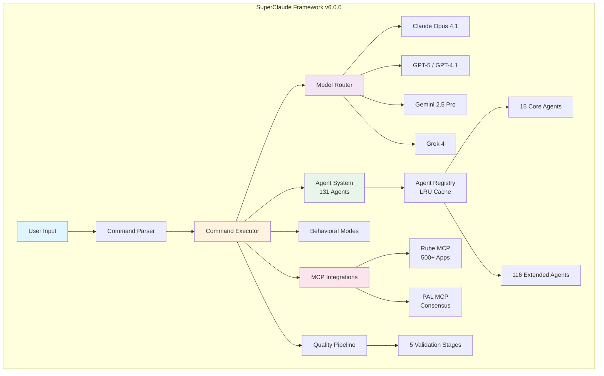

---

## Architecture

### High-Level System Architecture

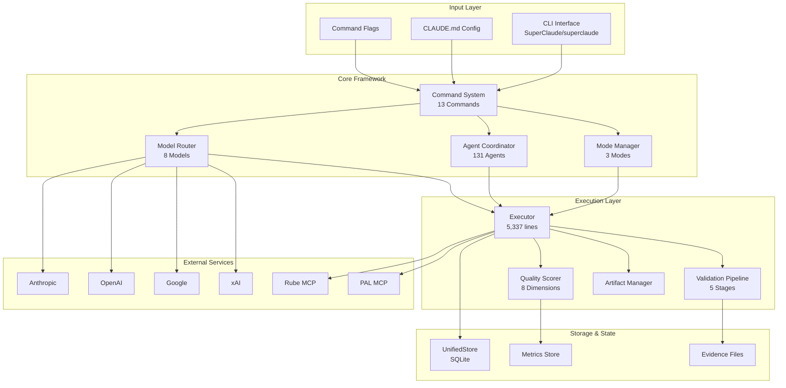

### Request Flow

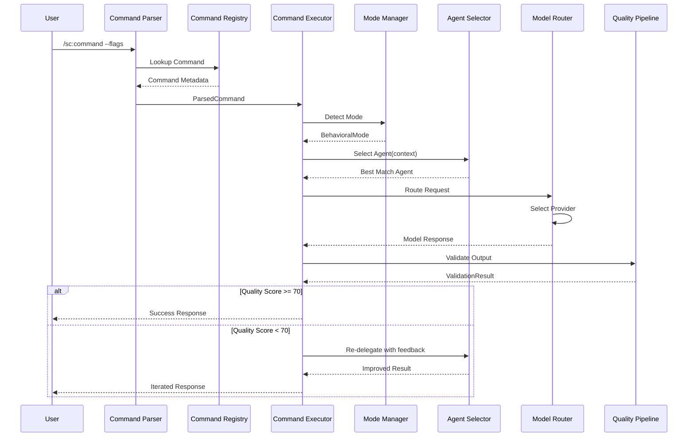

---

## Core Components

### Agent System

SuperClaude features a sophisticated agent system with **131 specialized agents** organized into 10 categories.

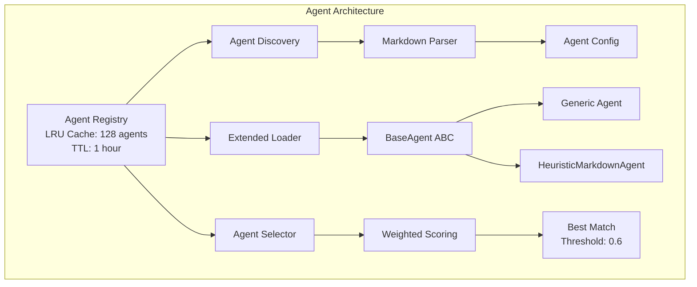

#### Agent Selection Algorithm

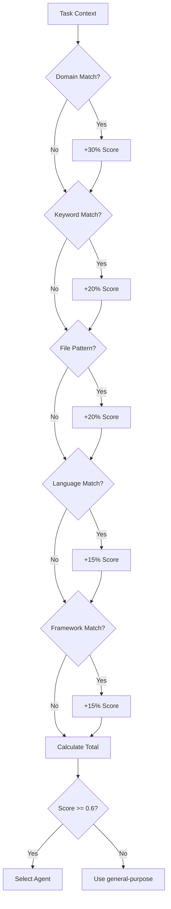

#### Agent Categories (131 Total)

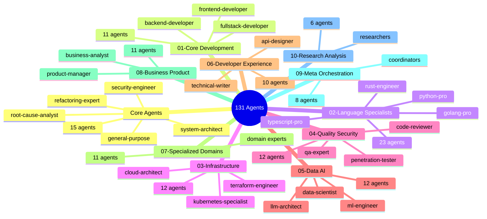

#### Agent Coordination Strategies

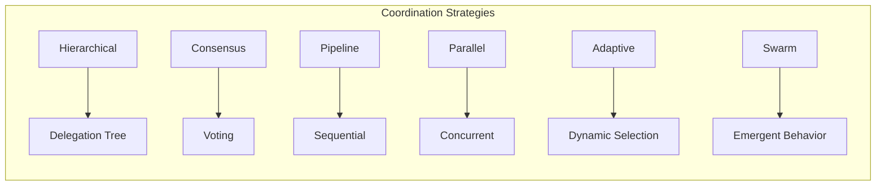

| Strategy | Description | Use Case |
|----------|-------------|----------|
| **Hierarchical** | Top-down task delegation | Complex multi-step tasks |
| **Consensus** | Multi-agent voting | Critical decisions |
| **Pipeline** | Sequential processing | Data transformation |
| **Parallel** | Concurrent execution | Independent subtasks |
| **Adaptive** | Dynamic strategy selection | Uncertain requirements |
| **Swarm** | Emergent coordination | Large-scale analysis |

---

### Command System

13 commands available via `/sc:` syntax:

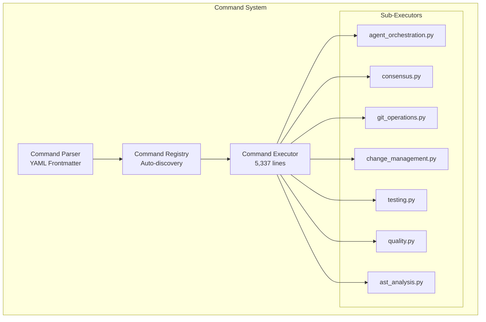

| Command | Purpose | Key Flags |
|---------|---------|-----------|
| `/sc:analyze` | Code analysis, quality assessment | `--deep`, `--agent` |
| `/sc:implement` | Feature/code implementation | `--persona`, `--loop` |
| `/sc:test` | Test execution with coverage | `--coverage`, `--watch` |
| `/sc:design` | Architecture and system design | `--diagram`, `--adr` |
| `/sc:document` | Documentation generation | `--api`, `--readme` |
| `/sc:brainstorm` | Creative ideation | `--divergent`, `--converge` |
| `/sc:build` | Project building and compilation | `--target`, `--optimize` |
| `/sc:estimate` | Effort and resource estimation | `--breakdown`, `--risk` |
| `/sc:explain` | Code/concept explanation | `--depth`, `--audience` |
| `/sc:improve` | Code enhancement | `--refactor`, `--optimize` |
| `/sc:workflow` | Multi-step workflow management | `--steps`, `--parallel` |
| `/sc:git` | Git operations | `--commit`, `--pr` |
| `/sc:index` | Search and indexing | `--rebuild`, `--query` |

---

### Model Router

The Model Router intelligently distributes requests across multiple AI providers.

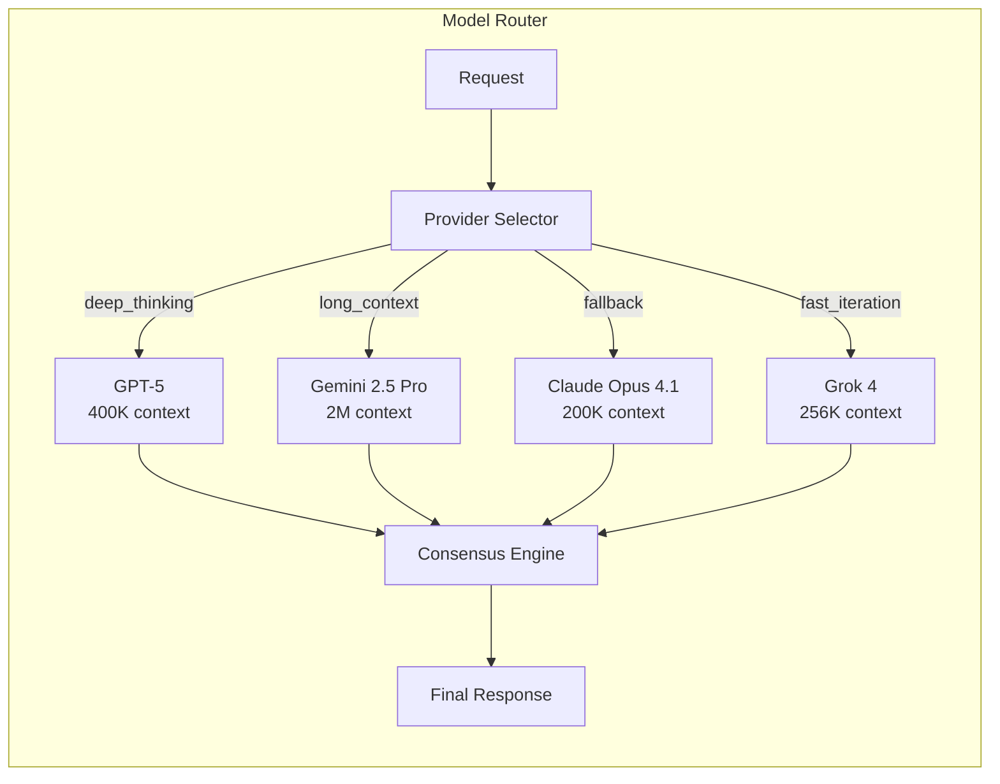

#### Supported Models

| Provider | Model | Context Window | Features | Priority |
|----------|-------|----------------|----------|----------|
| **OpenAI** | GPT-5 | 400K tokens | Thinking, Vision | 1 |
| **OpenAI** | GPT-4.1 | 1M tokens | Large context | 3 |
| **OpenAI** | GPT-4o | 128K tokens | Fast, Cost-effective | 4 |
| **OpenAI** | GPT-4o-mini | 128K tokens | Quick tasks | 5 |
| **Google** | Gemini 2.5 Pro | **2M tokens** | Thinking, Vision | 1 |
| **Anthropic** | Claude Opus 4.1 | 200K tokens | Fallback, Validation | 2 |
| **xAI** | Grok 4 | 256K tokens | Thinking, Fast | 2 |
| **xAI** | Grok Code Fast | 128K tokens | Quick iteration | 3 |

#### Routing Strategies

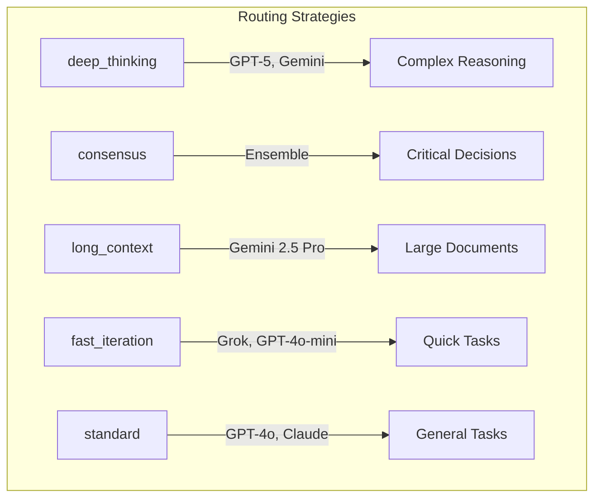

---

### MCP Integrations

SuperClaude integrates with Model Context Protocol (MCP) servers via Claude Code's native tools.

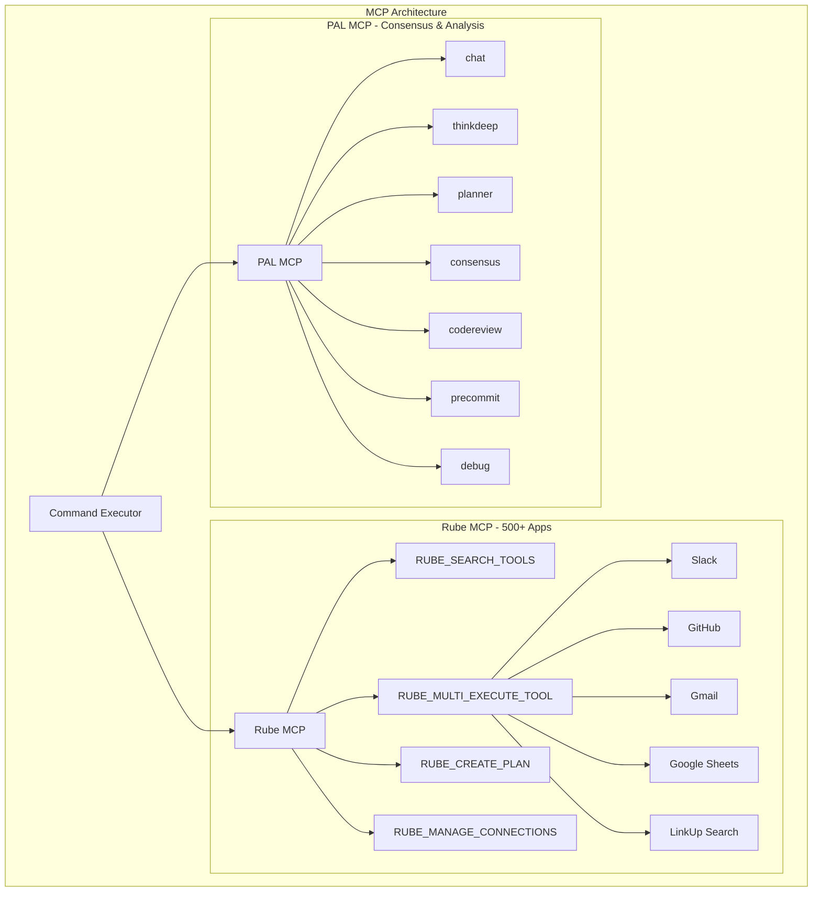

#### Rube MCP Tools

| Tool | Purpose |
|------|---------|
| `RUBE_SEARCH_TOOLS` | Discover available app integrations |
| `RUBE_MULTI_EXECUTE_TOOL` | Execute up to 50 tools in parallel |
| `RUBE_CREATE_PLAN` | Create workflow execution plans |
| `RUBE_MANAGE_CONNECTIONS` | Manage OAuth/API connections |
| `RUBE_REMOTE_WORKBENCH` | Execute Python in sandbox |
| `RUBE_CREATE_UPDATE_RECIPE` | Create reusable automation recipes |

#### PAL MCP Tools

| Tool | Purpose |
|------|---------|
| `mcp__pal__chat` | Collaborative thinking with external models |
| `mcp__pal__thinkdeep` | Multi-stage investigation and reasoning |
| `mcp__pal__planner` | Sequential planning with revision |
| `mcp__pal__consensus` | Multi-model consensus building |
| `mcp__pal__codereview` | Systematic code review with expert validation |
| `mcp__pal__precommit` | Git change validation |
| `mcp__pal__debug` | Systematic debugging and root cause analysis |

---

### Behavioral Modes

SuperClaude supports three behavioral modes that change how the framework operates.

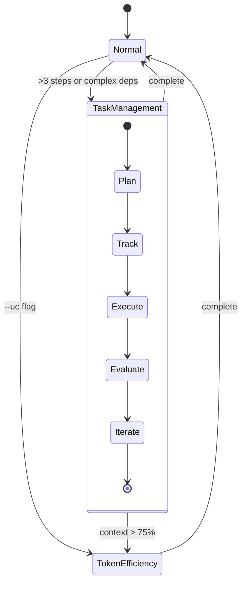

| Mode | Trigger | Features | Use Case |
|------|---------|----------|----------|
| **Normal** | default | Balanced verbosity, standard flow | Day-to-day development |
| **Task Management** | >3 steps, complex deps | TodoWrite tracking, hierarchical breakdown, UnifiedStore persistence | Multi-step operations |
| **Token Efficiency** | `--uc` flag | Compressed symbols, minimal verbosity, context optimization | Context/cost constraints |

#### Token Efficiency Symbols

```
Status:  ✅ Done  ❌ Failed  ⚠️ Warning  🔄 Progress  ⏳ Pending
Domain:  ⚡ Perf  🔍 Analysis  🛡️ Security  📦 Deploy  🏗️ Arch
Logic:   → Leads to  ⇒ Transforms  ∴ Therefore  » Sequence
```

**Example:**
```
Standard: "The authentication system has a security vulnerability"
Token Efficient: "auth.js:45 → 🛡️ sec risk in user val()"
```

---

### Quality Pipeline

The validation pipeline enforces layered quality checks with short-circuit behavior.

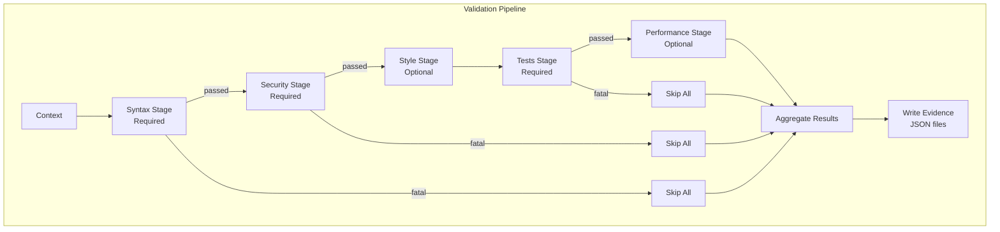

#### Quality Scoring (8 Dimensions)

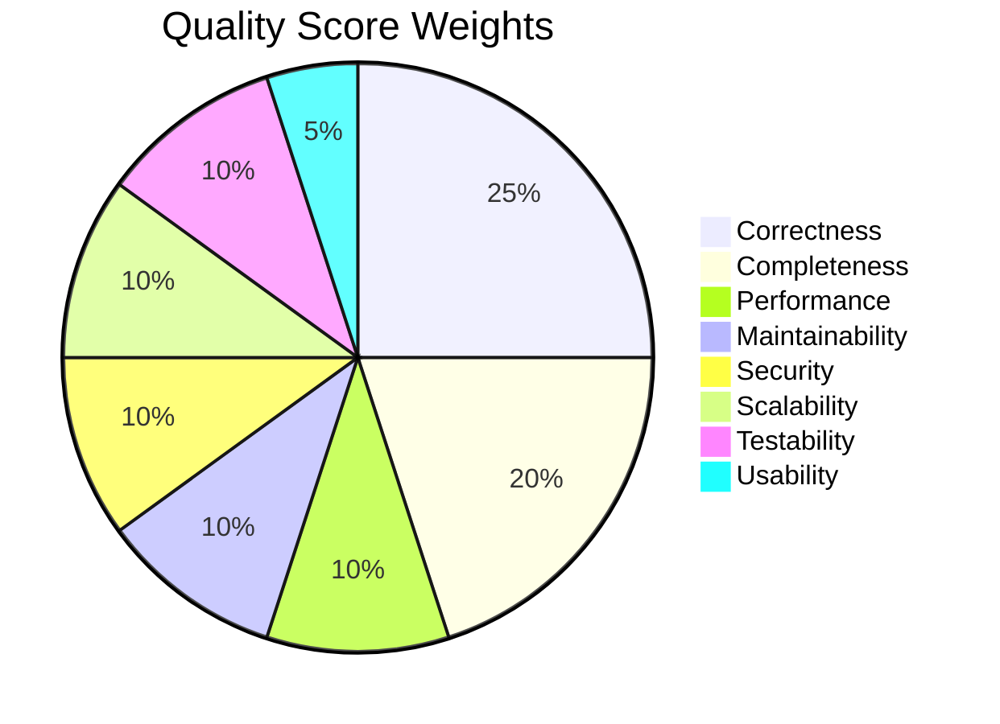

| Dimension | Weight | Metrics |
|-----------|--------|---------|
| **Correctness** | 25% | Tests pass, no runtime errors, output validation |
| **Completeness** | 20% | Feature coverage, edge cases, documentation |
| **Performance** | 10% | Time/space complexity, resource usage |
| **Maintainability** | 10% | Readability, modularity, naming |
| **Security** | 10% | Input validation, authentication, data protection |
| **Scalability** | 10% | Architecture, database design, caching |
| **Testability** | 10% | Unit tests, integration tests, test quality |
| **Usability** | 5% | UI consistency, error messages, accessibility |

#### Auto-Actions

| Score Range | Action |
|-------------|--------|
| < 50 | Delegate to quality-engineer, escalate |
| 50-69 | Iterate with feedback (max 5 iterations) |
| 70-89 | Accept with improvement suggestions |
| 90+ | Auto-approve, fast-track |

---

## Installation

### Requirements

- Python 3.10+
- pip or poetry

### Install from Source

```bash
# Clone the repository
git clone https://github.com/SuperClaude-Org/SuperClaude_Framework.git
cd SuperClaude

# Create virtual environment
python -m venv .venv
source .venv/bin/activate  # Linux/macOS
# or: .venv\Scripts\activate  # Windows

# Install in development mode
pip install -e .[dev]

# Verify installation
SuperClaude --help
```

### Environment Variables

```bash
# Required API Keys
export ANTHROPIC_API_KEY="your-key"
export OPENAI_API_KEY="your-key"
export GOOGLE_API_KEY="your-key"
export XAI_API_KEY="your-key"

# Optional Configuration
export SUPERCLAUDE_OFFLINE_MODE="1"  # Disable network for testing
export SC_NETWORK_MODE="online"       # or "offline"
```

---

## Quick Start

### Basic Usage with Claude Code

```bash
# Start Claude Code
claude

# Use SuperClaude commands
/sc:analyze --deep src/auth.py
/sc:implement --agent=backend-developer "Add user authentication"
/sc:test --coverage tests/
/sc:design --diagram "microservices architecture"
```

### Programmatic Usage

```python
from SuperClaude.Commands.command_executor import CommandExecutor
from SuperClaude.Agents.registry import AgentRegistry

# Initialize
registry = AgentRegistry()
executor = CommandExecutor()

# Execute command
result = await executor.execute("/sc:analyze --agent=root-cause-analyst src/bug.py")

if result.success:
    print(f"Analysis complete: {result.output}")
    print(f"Quality score: {result.quality_score}")
else:
    print(f"Errors: {result.errors}")
```

---

## Configuration

### CLAUDE.md Integration

SuperClaude integrates with Claude Code via `CLAUDE.md` configuration files:

```markdown
# ~/.claude/CLAUDE.md (Global)

# SuperClaude Entry Point
@AGENTS.md
@CLAUDE_CORE.md
@FLAGS.md
@PRINCIPLES.md
@TOOLS.md

# Behavioral Modes
@MODE_Normal.md
@MODE_Task_Management.md
@MODE_Token_Efficiency.md

# MCP Documentation
@MCP_Rube.md
@MCP_Pal.md
@MCP_LinkUp.md
```

### Configuration Files (YAML)

| File | Purpose |
|------|---------|
| `agents.yaml` | Agent system config, selection algorithm |
| `models.yaml` | Model routing, provider settings |
| `quality.yaml` | Quality scoring, thresholds, gates |
| `mcp.yaml` | MCP server references |
| `consensus_policies.yaml` | Multi-model consensus rules |

---

## CI/CD Pipeline

SuperClaude uses GitHub Actions for continuous integration and deployment.

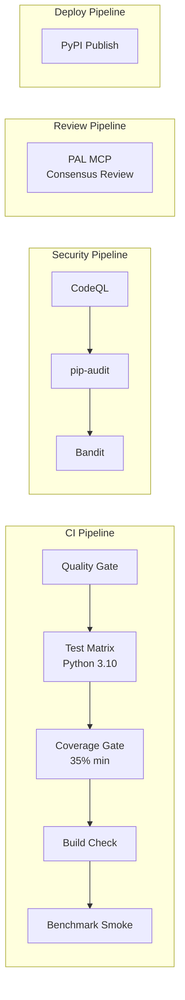

| Workflow | Trigger | Checks |
|----------|---------|--------|
| **CI** | Push/PR | Ruff lint, Ruff format, MyPy, Tests (Python 3.10), Coverage (35%), Build |
| **Security** | Push/PR + Weekly | CodeQL, pip-audit, Bandit |
| **AI Review** | PR opened | PAL MCP Consensus Code Review (multi-model) |
| **Publish** | Release | Build, version check, PyPI upload |
| **README Quality** | README changes | Structure, links, translation sync |

---

## Project Structure

```
SuperClaude/
├── SuperClaude/
│   ├── Agents/
│   │   ├── Extended/              # 116 extended agents
│   │   │   ├── 01-core-development/
│   │   │   ├── 02-language-specialists/
│   │   │   ├── 03-infrastructure/
│   │   │   ├── 04-quality-security/
│   │   │   ├── 05-data-ai/
│   │   │   ├── 06-developer-experience/
│   │   │   ├── 07-specialized-domains/
│   │   │   ├── 08-business-product/
│   │   │   ├── 09-meta-orchestration/
│   │   │   └── 10-research-analysis/
│   │   ├── base.py                # BaseAgent ABC
│   │   ├── registry.py            # Agent discovery & catalog
│   │   ├── extended_loader.py     # LRU caching loader
│   │   ├── selector.py            # Intelligent selection
│   │   └── cli.py                 # Agent CLI interface
│   │
│   ├── APIClients/
│   │   ├── anthropic_client.py    # Claude API
│   │   ├── openai_client.py       # GPT API
│   │   ├── google_client.py       # Gemini API
│   │   ├── xai_client.py          # Grok API
│   │   └── http_utils.py          # Shared HTTP utilities
│   │
│   ├── Commands/
│   │   ├── command_executor.py    # Main executor (5,337 lines)
│   │   ├── executor/              # Sub-executors
│   │   │   ├── agent_orchestration.py
│   │   │   ├── consensus.py
│   │   │   ├── git_operations.py
│   │   │   ├── testing.py
│   │   │   └── quality.py
│   │   ├── parser.py              # Command parsing
│   │   └── registry.py            # Command catalog
│   │
│   ├── Config/                    # YAML configurations
│   ├── Core/                      # Core markdown docs
│   ├── MCP/                       # MCP documentation
│   ├── ModelRouter/
│   │   ├── router.py              # Intelligent routing
│   │   ├── models.py              # Model definitions
│   │   └── consensus.py           # Consensus strategies
│   │
│   ├── Modes/
│   │   ├── MODE_Normal.md
│   │   ├── MODE_Task_Management.md
│   │   └── MODE_Token_Efficiency.md
│   │
│   └── Quality/
│       ├── validation_pipeline.py
│       └── quality_scorer.py      # 8-dimension scoring
│
├── setup/                         # Installation system
│   ├── cli/                       # CLI setup
│   ├── core/                      # Core installer
│   ├── components/                # Modular components
│   ├── services/                  # Configuration services
│   └── utils/                     # Security, logging, UI
│
├── tests/                         # 42 test files
├── Docs/                          # User & developer guides
├── examples/                      # Integration demos
├── scripts/                       # Build scripts
├── benchmarks/                    # Performance tests
├── .github/workflows/             # CI/CD pipelines
├── pyproject.toml                 # Package config
└── README.md                      # This file
```

---

## Contributing

### Development Setup

```bash
# Clone and setup
git clone https://github.com/SuperClaude-Org/SuperClaude_Framework.git
cd SuperClaude
python -m venv .venv
source .venv/bin/activate
pip install -e .[dev]

# Run tests
PYTEST_DISABLE_PLUGIN_AUTOLOAD=1 pytest -m "not slow" tests/

# Run linting
ruff check .
ruff format --check .
mypy SuperClaude --ignore-missing-imports
```

### Adding New Agents

1. Create markdown file in appropriate `Extended/` category
2. Define agent metadata: id, name, triggers, domains, languages
3. Run agent discovery to verify registration
4. Add tests for agent selection

### Commit Guidelines

- Use concise, imperative subjects
- Reference issues/specs in body
- Include test results for significant changes
- Co-authored-by: Claude for AI-assisted commits

---

## License

MIT License - see [LICENSE](LICENSE) for details.

---

## Acknowledgments

- **Anthropic** for Claude and Claude Code
- **OpenAI** for GPT-5 API
- **Google** for Gemini API
- **xAI** for Grok API
- **Composio** for Rube MCP
- **PAL MCP** for consensus tools

---

<p align="center">
  <strong>SuperClaude v6.0.0-alpha</strong><br/>
  Intelligent AI Orchestration for Claude Code<br/>
  <em>131 Agents • 13 Commands • 8 Models • 3 Modes</em>
</p>
