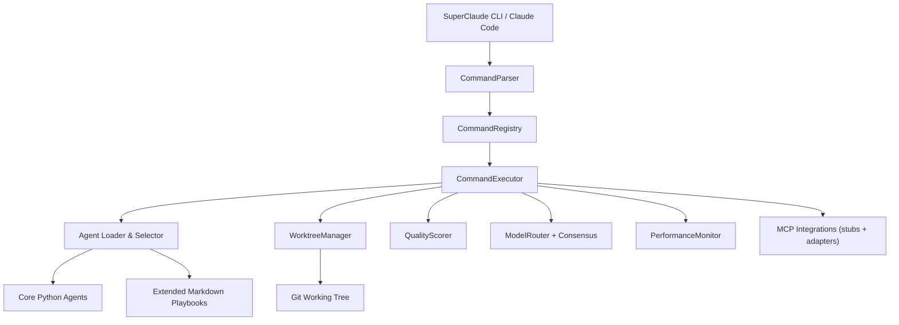
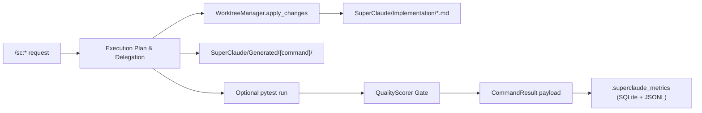

# SuperClaude Framework v6.0.0-alpha
**Alpha multi-agent orchestration for Claude Code (offline-first)**

[](https://github.com/SuperClaude-Org/SuperClaude_Framework)
[](https://www.python.org/)
[](LICENSE)
[]()

> **Alpha notice:** This repository ships the offline-first build that Claude Code uses
> for `/sc:*` commands. Most “multi-model” features run through deterministic stubs unless
> you provide real API keys.

## Status Snapshot
- Offline orchestration stack with reproducible artifacts, tests, and telemetry.
- 22 `/sc:` command playbooks routed through an async executor with agent delegation.
- CLI installer (under `setup/`) manages context files, MCP registrations (Zen/Rube/Browser), and upgrades.
- Consensus guardrails now load per-command quorum policies from `SuperClaude/Config/consensus_policies.yaml`
  and record deterministic multi-model votes even in offline mode.
- Requires-evidence guardrails integrate semantic Python validation, retrieval-grounded agent context, and
  structured telemetry so plan-only regressions become visible in CI dashboards. Safe-apply snapshots let
  `/sc:implement --safe-apply` stash synthesized stubs under `.superclaude_metrics/safe_apply/` while
  auto-triggered quality loops chase real diffs.
- CodeRabbit/GitHub MCP hooks are fully retired; blended scoring now uses `quality.yaml` component weights (60/25/15 by default) and native guardrails only. `--loop` requests automatically layer in `--zen-review` so GPT-5 (or deterministic offline facsimiles) critiques each iteration via the local Zen MCP.
- `/sc:implement --fast-codex` activates a lean Codex implementer persona for low-risk edits while
  telemetry and guardrails record the `fast-codex` execution mode and enforce fallbacks for consensus or
  security-sensitive runs.
- Automatic pytest runs triggered by `/sc:implement` or other commands no longer re-run the
  trailing `/sc:test` step when the auto-run already passed, reducing redundant suites.
- Passing `--cleanup` to `/sc:implement` purges stale auto-generated stubs older than seven days,
  keeping `SuperClaude/Implementation/Auto/` lean without touching in-progress work.
- Extended Markdown personas are promoted to lightweight Python subclasses at load time, giving
  the entire 131-agent roster first-class execution support alongside the 15 bespoke strategists.
- When tests are triggered from within a pytest session (e.g., during CI), the executor emits a
  synthetic artifact instead of re-entering pytest, keeping evidence trails intact without hanging
  the suite.

## What Works Today
- Command pipeline (`CommandParser` → `CommandRegistry` → `CommandExecutor`) generates
  execution summaries, change plans, and consensus payloads for every request.
- Worktree guardrails capture git diffs, optional pytest runs, and store evidence under
  `SuperClaude/Implementation` and `SuperClaude/Generated`.
- 15 core Python agents plus 116 extended personas now execute through Python classes generated
  from their Markdown playbooks, all loaded on demand with caching, matching, and delegation via
  `AgentLoader` and `ExtendedAgentLoader`; high-traffic personas such as `security-engineer`
  and `technical-writer` now layer strategist heuristics atop their legacy analysis engines.
- The auto-implementation pipeline synthesises change-plan stubs (Python, TypeScript, Markdown,
  etc.) in `SuperClaude/Implementation/Auto/`, so `/sc:implement` yields concrete repository diffs
  even when only high-level guidance is available. When run with `--safe-apply`, those stubs are
  checkpointed to `.superclaude_metrics/safe_apply/<session>/<timestamp>/` for manual inspection
  while the guardrails continue to reject plan-only results.
- Consensus enforcement now honours per-command quorum/majority policies and serialises
  vote metadata (models, reasoning, agreements) into the command result for downstream tooling.
- Offline runs use deterministic ensemble heuristics so consensus is reproducible while still
  flagging disagreement scenarios.
- Python semantic validation leverages `_PythonSemanticAnalyzer` to catch missing imports and
  unresolved symbols before a `requires_evidence` command can succeed.
- `RepoRetriever` supplies agents with on-disk context, and retrieval telemetry records how often
  grounding data is attached to change plans.
- Test orchestration skips redundant `/sc:test` invocations when an auto-run already produced
  passing evidence, keeping command chains snappy inside the IDE and in CI.
- `QualityScorer` enforces eight scoring dimensions and can loop up to five times when
  a `requires_evidence` command returns without acceptable quality, automatically initiating a
  remediation loop whenever `--safe-apply` leaves the repository untouched.
- `PerformanceMonitor` records metrics to `.superclaude_metrics/metrics.db` (SQLite) and
  JSONL sinks so executions can be audited offline. Structured `hallucination.guardrail` events feed
  dashboards and CI guards.
- Agent usage telemetry persists to `.superclaude_metrics/agent_usage.json`, enabling the
  generated markdown report (`scripts/report_agent_usage.py`) to spotlight the most active personas.
- Plan-only outcomes append structured rows to `.superclaude_metrics/plan_only.jsonl`, capturing
  withheld stubs, safe-apply snapshot paths, and auto-triggered quality loops for CI dashboards.
- CI guardrails can call `scripts/check_hallucination_metrics.py` to fail builds when plan-only
  rates exceed the configured threshold.
- Targeted regression tests (`tests/test_hallucination_guardrails.py`) cover consensus policies,
  semantic validation, retrieval hits, and telemetry emission.

## Current Limitations
- Consensus, model routing, and MCP servers default to heuristic stubs unless you export
  `OPENAI_API_KEY`, `ANTHROPIC_API_KEY`, `GOOGLE_API_KEY`, or `XAI_API_KEY`.
- Auto-generated change plans still synthesize stub guidance under `SuperClaude/Implementation/Auto/`,
  and even with `--safe-apply` staging those stubs in `.superclaude_metrics/safe_apply/` the guardrails
  keep them as plan-only evidence—`/sc:implement` fails the `requires_evidence` gate until a human
  applies real repository changes.
- Framework documentation lookups run from the repository’s curated knowledge base; the former
  Deepwiki MCP connector has been removed from this offline bundle.
- Extended personas now share heuristic wrappers with static validation and strategist
  escalation; the highest-traffic personas (e.g., `fullstack-developer`, `security-engineer`,
  `technical-writer`) ship with full strategist heuristics—complex domains may still need
  follow-up until more upgrades land.
- Roadmap features (live deployments, performance tuning, remote MCP servers) are not tied
  into the executor yet.
- Browser MCP integration is opt-in; enable it in `SuperClaude/Config/mcp.yaml` or pass
  `--browser` when invoking `/sc:test` to run lightweight visual/accessibility checks. The
  local Claude CLI must have the Browser MCP server registered (`claude mcp add …`).
- Test suite targets unit and smoke scenarios; no end-to-end coverage for Claude Code IDE
  integrations is included.

## Architecture





The executor is deterministic: even without network access it produces structured output,
artifacts, and telemetry for every command. Supplying API keys switches model execution from
heuristics to real provider clients.

## Component Overview

### Command Pipeline
- `SuperClaude/Commands/parser.py` extracts `/sc:*` invocations and flags.
- `SuperClaude/Commands/registry.py` discovers 22 Markdown playbooks with YAML front matter.
- `SuperClaude/Commands/executor.py` orchestrates agent selection, change plans, consensus,
  optional pytest runs, quality scoring, and metric emission.

#### Fast Codex Mode
- `--fast-codex` trims `/sc:implement` down to the `codex-implementer` persona for quick diffs.
- Requires the Codex CLI (`codex exec`) to be installed or referenced via
  `SUPERCLAUDE_CODEX_CLI`; the command fails fast if the binary is unavailable.
- Guardrails stay active: `requires_evidence`, consensus checks, and MCP activation still run.
- Telemetry surfaces `commands.fast_codex.*` metrics and the command result includes
  `execution_mode: fast-codex` alongside the usual artifacts.
- When `--safe`, `--consensus`, or missing Codex agent prerequisites appear, the executor
  automatically falls back to the standard multi-persona cohort.

### Agent System
- 15 core Python agents live in `SuperClaude/Agents/core/` (one class per domain).
- 116 extended Markdown playbooks sit under `SuperClaude/Agents/Extended/01-..10-`.
- `AgentLoader` and `ExtendedAgentLoader` provide LRU caching, TTL eviction, and category
  matching; `AgentSelector` ranks agents by keyword/domain similarity.

| Category | Files | Notes |
|----------|-------|-------|
| 01-core-development | 11 | Full-stack & orchestrator personas |
| 02-language-specialists | 23 | Typed Markdown guides per language |
| 03-infrastructure | 12 | DevOps, SRE, and cloud specialists |
| 04-quality-security | 12 | QA, security, and accessibility |
| 05-data-ai | 12 | ML, analytics, and data engineering |
| 06-developer-experience | 10 | DX, tooling, and refactoring |
| 07-specialized-domains | 11 | IoT, gaming, embedded, blockchain |
| 08-business-product | 11 | Product, PM, and strategy roles |
| 09-meta-orchestration | 8 | Multi-agent coordinators |
| 10-research-analysis | 6 | Research, finance, cost analysis |

### Model Routing & Consensus
- `SuperClaude/ModelRouter/router.py` ranks eight models by task type, token budget, and
  availability.
- `SuperClaude/ModelRouter/facade.py` registers provider executors when credentials exist and
  otherwise uses deterministic heuristics. Offline mode produces deterministic votes that respect
  the configured quorum rules.
- `SuperClaude/Config/consensus_policies.yaml` defines per-command vote types (majority/quorum)
  and minimum agreement thresholds consumed by `_ensure_consensus`.
- Consensus payloads include per-model votes, synthesized decisions, vote type, quorum size, and
  offline flags so downstream tools understand how the decision was reached.

### Quality & Worktree Guardrails
- `SuperClaude/Core/worktree_manager.py` writes change plans into the repo (main tree or
  separate worktrees) and can generate state snapshots.
- `SuperClaude/Quality/quality_scorer.py` grades correctness, completeness, maintainability,
  security, performance, scalability, testability, and usability with configurable weights.
- Commands tagged `requires_evidence` fail if no diff is detected; fallback evidence lives in
  `SuperClaude/Implementation/*.md`.
- Semantic validation hooks (`_python_semantic_issues`) run automatically during guardrail checks
  and are exposed via `scripts/semantic_validate.py` for manual linting or CI usage.

#### Agentic Loop (`--loop` + `--zen-review`)
- Passing `--loop` (or requesting auto-loop remediation) activates `QualityScorer.agentic_loop`,
  which evaluates the current output, derives improvement goals, and iteratively invokes the
  remediation agents (`quality-engineer`, `refactoring-expert`, `general-purpose`).
- Each iteration applies change plans through the worktree manager, re-runs the requested tests,
  and records diff snapshots/metadata inside `context.results` so downstream evidence and telemetry
  stay aligned.
- The executor now captures those diffs and automatically toggles `--zen-review`, sending the final
  iteration payloads through `ZenIntegration.review_code`. When API keys exist, GPT-5 (via the
  ModelRouter facade) produces structured findings; otherwise deterministic offline heuristics keep
  the run reproducible. The review summary, issues, and agreement score are attached to the command
  result under `zen_reviews`.

```mermaid
flowchart TD
    A[/Parse /sc:* command + flags/] --> B{Loop flag enabled?}
    B -->|No| Z[Skip agentic loop]
    B -->|Yes| C[QualityScorer evaluates output]
    C --> D{Score ≥ threshold?}
    D -->|Yes| L[Persist assessment & finish]
    D -->|No| E[Derive improvements + remediation hints]
    E --> F[Run remediation agents + apply change plan]
    F --> G[Execute targeted tests / capture evidence]
    G --> H{Iterations left and Δscore ≥ minimum?}
    H -->|Yes| C
    H -->|No| I[Snapshot diffs & iteration history]
    I --> J[Queue diffs for zen-review]
    J --> K[Zen review (ModelRouter facade)]
    K --> L[Attach assessment + zen findings to result]
```

### Monitoring & Telemetry
- `SuperClaude/Monitoring/performance_monitor.py` records timers, counters, and resource usage.
- Default sinks write to `.superclaude_metrics/metrics.db` (SQLite) and
  `.superclaude_metrics/events.jsonl`.
- Guardrail events are logged under the `hallucination.guardrail` topic, enabling dashboards such
  as `Docs/monitoring/hallucination_dashboard.json` and CI enforcement via
  `scripts/check_hallucination_metrics.py`.
- CLI helpers and dedicated tests assert that metrics fire for plan-only vs. executed paths and
  that consensus failures are counted.

### MCP Integrations

| Integration | Path | Status |
|-------------|------|--------|
| Zen | `SuperClaude/MCP/zen_integration.py` | Local consensus + `review_code` bridge that supervises `--zen`, `--consensus`, and `--zen-review` flows |
| Rube | `SuperClaude/MCP/rube_integration.py` | Automation hub for external SaaS workflows (dry-run safe when no API key) |
| Browser | `SuperClaude/MCP/MCP_Browser.md` | Installer auto-runs `claude mcp add -s user -- browser npx @browsermcp/mcp@latest` |

Zen still defaults to a **local, offline-safe facade**—no public zen-mcp-server calls are required.
When API keys for OpenAI/Anthropic/etc. are present, `ModelRouterFacade` drives those live models;
otherwise deterministic heuristics respond so consensus remains reproducible. The triggers defined in
`SuperClaude/Config/mcp.yaml` (`--zen`, `--consensus`, `--thinkdeep`, `--zen-review`) match the
Markdown playbooks. Every `--loop` request now implicitly toggles `--zen-review`, which captures the
loop diff payloads and asks the Zen integration’s new `review_code` helper (GPT-5 by default) to grade
changes before the executor finalizes results.

All other legacy MCP adapters (Serena, MorphLLM, Context7, Sequential Thinking, Playwright, Fetch,
Filesystem, etc.) have been retired and no longer ship with the framework. Deepwiki has been
replaced by an internal knowledge base sourced from repository documentation. **Rube** now ships
enabled by default and automatically falls back to dry-run mode whenever outbound traffic is
disallowed. The installer now registers Browser (`claude mcp add -s user -- browser npx
@browsermcp/mcp@latest`), Rube (`claude mcp add -s user --transport http rube https://rube.app/mcp`),
and Zen MCP (local checkout). Provide overrides only if you want to
customise the defaults:

```bash
export ZEN_MCP_COMMAND=/home/tony/Desktop/zen-mcp-server/.zen_venv/bin/python
export ZEN_MCP_ARGS="/home/tony/Desktop/zen-mcp-server/server.py"
# Optional runtime variables (only needed for live automation)
export SC_RUBE_API_KEY=<composio_token>
```

If the overrides are omitted, the fallback paths above are used for Zen, and the installer simply
notes when the Rube API key is absent. Dry-run mode works without credentials, so you can finish the
install entirely offline.

The Browser integration calls `claude mcp call browser …` under the hood. Ensure the Claude CLI is
on your `PATH` and that the Browser server is registered before running `/sc:test --browser` or the
browser-focused pytest suite.

#### Using Rube MCP

1. Provide credentials via `SC_RUBE_API_KEY=<composio_token>` or the `api_key` field under `servers.rube` in `SuperClaude/Config/mcp.yaml`.
2. Allow outbound traffic by switching to an online network mode (for example `export SC_NETWORK_MODE=online`). With the default offline mode, Rube logs dry-run payloads instead of contacting external services.
3. Optionally force dry-run even when online with `export SC_RUBE_MODE=dry-run`.
4. Run automation-aware commands (`/sc:task`, `/sc:workflow`, `/sc:spawn`, `/sc:improve`, `/sc:business-panel`). The executor records Rube operations in `executed_operations` and surfaces any errors in the command result.

> ℹ️ Dry-run mode logs the intended automation payload without leaving the machine—ideal for local development and CI.

### CLI Tooling
- Entry points `SuperClaude` / `superclaude` execute `SuperClaude/__main__.py`.
- `setup/cli/commands/` provides `install`, `update`, `uninstall`, `backup`, `clean`, `agent`.
- Components live in `setup/core/` and `setup/services/`; installs target `~/.claude/`.
- `scripts/report_agent_usage.py` emits a usage dashboard; see `Docs/User-Guide/maintenance.md`
  for stub cleanup and telemetry workflows.

## Command Catalog
The Markdown playbooks shipped under `SuperClaude/Commands/*.md` inform Claude Code how to
behave. Key groups:

- Workflow: `/sc:implement`, `/sc:workflow`, `/sc:task`, `/sc:spawn`, `/sc:build`, `/sc:git`.
- Analysis: `/sc:analyze`, `/sc:troubleshoot`, `/sc:estimate`, `/sc:explain`, `/sc:index`.
- Quality: `/sc:test`, `/sc:improve`, `/sc:cleanup`, `/sc:reflect`.
- Context & tools: `/sc:load`, `/sc:save`, `/sc:brainstorm`, `/sc:design`, `/sc:document`,
  `/sc:select-tool`, `/sc:business-panel`.

## Agent Inventory
- 15 core agent classes: `general-purpose`, `root-cause-analyst`, `refactoring-expert`,
  `technical-writer`, `performance-engineer`, `system-architect`, `backend-architect`,
  `frontend-architect`, `python-expert`, `security-engineer`, `devops-architect`,
  `quality-engineer`, `requirements-analyst`, `learning-guide`, `socratic-mentor`.
- 116 extended Markdown playbooks grouped into ten categories (counts above).
- `SuperClaude/Agents/business-panel-experts.md` defines personas used by `/sc:business-panel`.

## Setup

### Prerequisites
- Python 3.8+ and pip (or pipx), Git, and optional pyenv (disable rehash in read-only envs).
- Network access required only if you plan to reach external model APIs.

### Install (editable mode)
```bash
git clone https://github.com/SuperClaude-Org/SuperClaude_Framework.git
cd SuperClaude_Framework
python -m venv .venv
source .venv/bin/activate  # Windows: .venv\Scripts\activate
pip install -e .[dev]
SuperClaude --help
SuperClaude --version  # Should print 6.0.0-alpha
```

### CLI Quick Check
```bash
SuperClaude install --list-components
SuperClaude agent list
SuperClaude agent run "diagnose failing tests" --delegate --json
```
> If a global `SuperClaude` binary still reports 4.x, remove `~/.local/bin/SuperClaude` (or call
> `./.venv/bin/SuperClaude`) and rerun `hash -r` so your shell picks up the repo build.

### Claude Code Usage
Copy the generated context files into your Claude Code environment (the installer writes to
`~/.claude/` by default), then invoke `/sc:*` commands inside the IDE.

### Memory Profiles
- `SuperClaude install` now defaults to a **minimal** memory bundle that keeps the essential
  safety rules (`RULES_*`), quick-start guides, and concise workflow/operations summaries. This
  trims the default Claude Code context by skipping large reference manuals such as
  `AGENTS_EXTENDED.md` and the business-panel playbooks.
- Install the full guidance bundle when you need the complete documentation:
  `SuperClaude install --memory-profile full`.
- You can reinstall at any time to switch profiles; the installer rewrites `~/.claude/*.md`
  accordingly.

## Running Tests
```bash
source .venv/bin/activate
export PYENV_DISABLE_REHASH=1  # Required in sandboxed environments
PYTEST_DISABLE_PLUGIN_AUTOLOAD=1 pytest -m "not slow" tests/
PYTEST_DISABLE_PLUGIN_AUTOLOAD=1 pytest tests/test_commands.py -k implement
PYTEST_DISABLE_PLUGIN_AUTOLOAD=1 pytest tests/test_model_router.py

# Browser MCP tests require pytest-asyncio
PYTEST_DISABLE_PLUGIN_AUTOLOAD=1 pytest -p pytest_asyncio tests/test_browser_mcp.py
```

Install `pytest-asyncio` inside the virtualenv if it is not already available:

```bash
.venv/bin/pip install pytest-asyncio
```

Benchmarks live under `benchmarks/` (`python benchmarks/run_benchmarks.py --suite smoke`).

### Memory Footprint Audit
Use the helper script to estimate the token footprint of the installed memory files:

```bash
PYTEST_DISABLE_PLUGIN_AUTOLOAD=1 .venv/bin/python scripts/report_memory_tokens.py --install-dir ~/.claude
```

The script walks the target directory, prints per-file token estimates, and reports the total
usage so you can confirm the chosen profile keeps the context within budget.

## Directory Highlights
```
SuperClaude_Framework/
├── SuperClaude/
│   ├── Agents/                # Core + extended agents
│   ├── Commands/              # Markdown playbooks + executor pipeline
│   ├── Config/                # YAML configuration (models, agents, quality, MCP)
│   ├── Core/worktree_manager.py
│   ├── ModelRouter/           # Router, consensus, provider facades
│   ├── Quality/quality_scorer.py
│   ├── Monitoring/            # Metrics sinks
│   └── MCP/                   # MCP adapters (Zen, Rube, Browser)
├── setup/                     # CLI installer framework
├── tests/                     # Pytest suite (unit + smoke)
└── Docs/                      # User, API, and developer guides
```

## Observability Artifacts
- Command evidence: `SuperClaude/Implementation/*.md`.
- Command summaries and diff logs: `SuperClaude/Generated/<command>/`.
- Metrics: `.superclaude_metrics/metrics.db` (SQLite) and `metrics.jsonl`.
- UnifiedStore database: `~/.claude/unified_store.db` (migrated from `serena_memory.json`).

## Contributing
- Follow Conventional Commit messages (`type(scope): subject`).
- Reference specs or tasks in commit bodies when applicable.
- See [CONTRIBUTING.md](CONTRIBUTING.md) and open PRs against main with passing tests.

## License
Released under the [MIT License](LICENSE).
