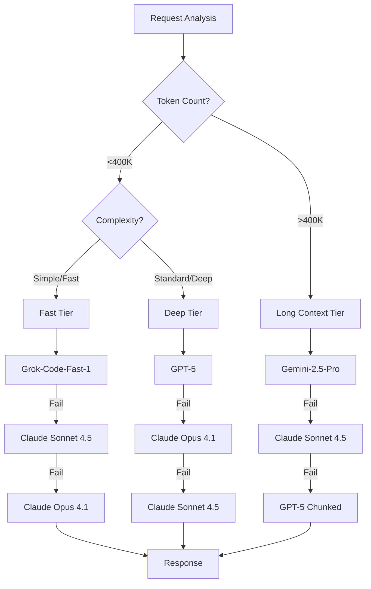
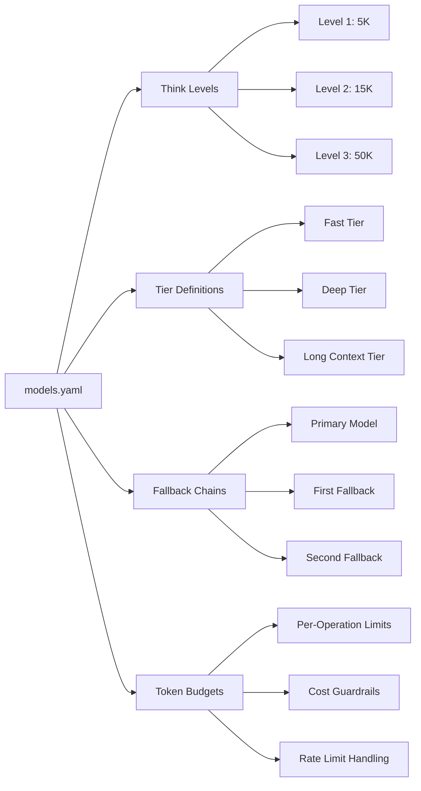
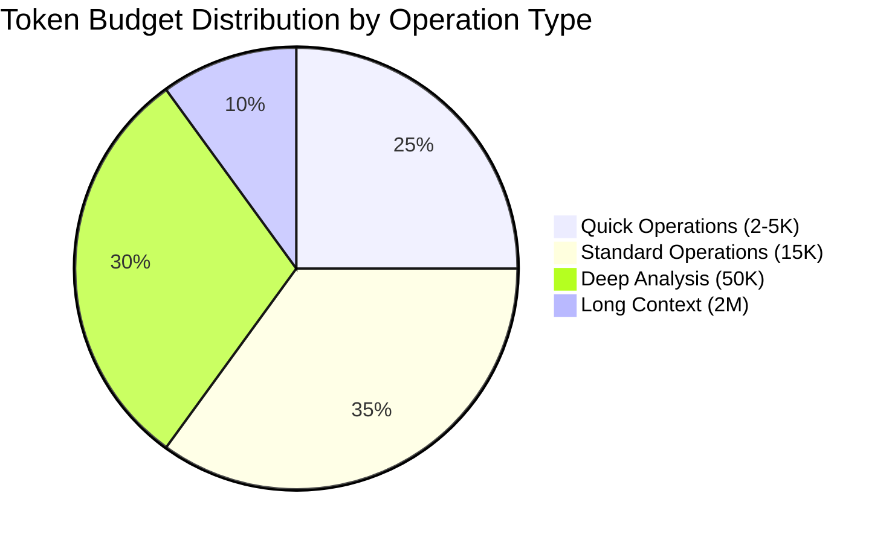
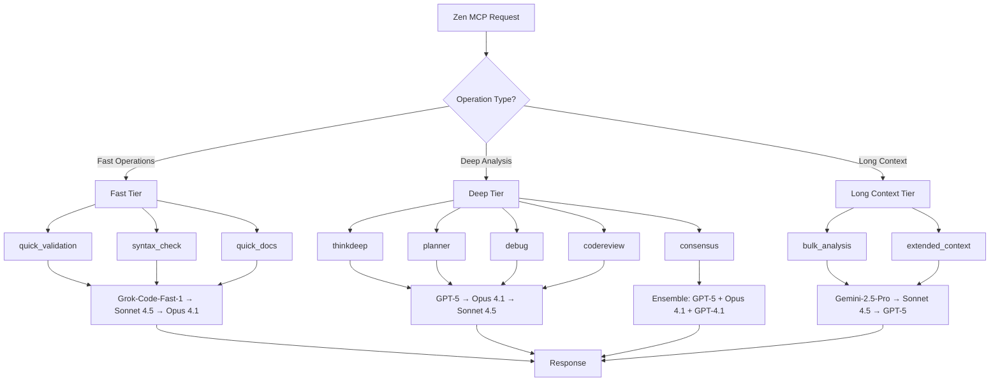
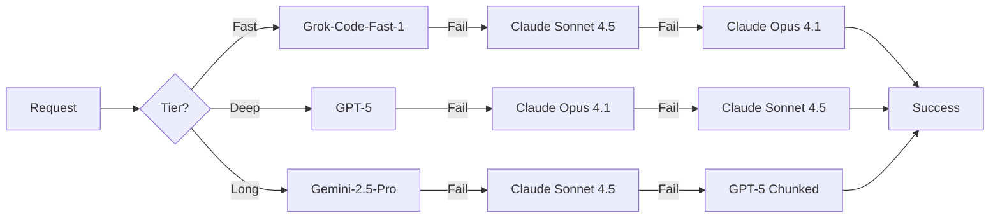

# SuperClaude Framework

<div align="center">


**🚀 AI-Enhanced Development Framework for Claude Code**

*Intelligent Agents • Dynamic Loading • Quality-Driven Iteration • Token Optimized*

</div>

---

## 📑 Table of Contents

- [Overview](#-overview)
- [What's New](#-whats-new-in-500)
- [Quick Start](#-quick-start)
- [Architecture](#-architecture)
- [Core Components](#-core-components)
- [Installation](#-installation)
- [Agent System](#-agent-system)
- [MCP Servers](#-mcp-servers)
- [Behavioral Modes](#-behavioral-modes)
- [Command Reference](#-command-reference)
- [Agentic Loop](#-agentic-loop)
- [Flags & Options](#-flags--options)
- [Usage Examples](#-usage-examples)
- [Performance](#-performance--optimization)
- [Model Configuration](#-model-configuration-system)
- [Zen MCP Multi-Model](#-zen-mcp-multi-model-orchestration)
- [Development Guide](#-development-guide)
- [Troubleshooting](#-troubleshooting)
- [Contributing](#-contributing)
- [Support](#-support)

---

## 🎯 Overview

SuperClaude is a comprehensive AI-enhanced development framework designed specifically for Claude Code, featuring intelligent component loading, automatic update checking, and a powerful agentic loop system for quality-driven development.

### Key Capabilities

- **🤖 14 Core Agents + 100+ Extended Agents** - Specialized domain experts for every development need
- **🎭 5 Behavioral Modes** - Intelligent workflow adaptation based on task context
- **🛠️ 7 MCP Server Integrations** - Advanced capabilities including multi-model orchestration
- **💻 21 Slash Commands** - Comprehensive workflow coverage with `/sc:` namespace
- **🔄 Agentic Loop Pattern** - Automatic quality-driven iteration (0-100 scoring)
- **⚡ 67% Token Reduction** - Optimized from 30K to 10K tokens through conditional loading
- **📦 Multi-Platform Support** - PyPI, pipx, npm, and yarn installation methods

---

## ✨ What's New in 5.1.0

### 🚀 Enhanced Model Routing with Claude Sonnet 4.5
- **Universal Fallback Integration** - Claude Sonnet 4.5 added to all tier fallback chains for improved reliability
- **Three-Tier Architecture** - Deep (GPT-5 → Opus 4.1 → Sonnet 4.5), Fast (Grok-Code-Fast-1 → Sonnet 4.5 → Opus 4.1), Long Context (Gemini-2.5-Pro → Sonnet 4.5 → GPT-5)
- **Intelligent Routing** - Context-aware model selection based on token count, complexity, and operation type
- **Enhanced Fallback Resilience** - Multi-level fallback ensures operations complete even with API availability issues

### ⚡ Fast-Tier Operations with Grok-Code-Fast-1
- **quick_validation** (5K tokens) - Rapid validation and sanity checks for code changes
- **syntax_check** (2K tokens) - Lightning-fast syntax verification and linting
- **quick_docs** (5K tokens) - Fast documentation generation and updates
- **Performance Optimized** - Sub-second response times for routine operations
- **Cost Efficient** - Lower token usage for simple tasks without sacrificing quality

### 🧠 Advanced Multi-Model Orchestration
- **Tool-Specific Model Preferences** - Each Zen tool (thinkdeep, consensus, planner, debug, codereview, precommit) has optimized model routing
- **Long Context Automation** - Automatic Gemini-2.5-pro activation for bulk analysis (>400K tokens or >50 files)
- **Ensemble Intelligence** - Consensus operations coordinate multiple models (GPT-5 + Claude Opus 4.1 + GPT-4.1) with quorum validation
- **Extended Token Budgets** - 50K tokens for deep thinking operations, 30K per model for consensus
- **Flexible Overrides** - Environment variables and CLI flags for model forcing, exclusion, and budget control

### 📊 Architecture Visualization
- **Mermaid Diagrams** - Visual flowcharts for model routing, tier selection, and token budget allocation
- **Decision Path Documentation** - Clear visualization of how the framework selects optimal models
- **Performance Metrics** - Token usage and response time comparisons across tiers

### 📚 Comprehensive Documentation Updates
- **Extended Agents Guide** - New 100+ agent documentation at `Docs/User-Guide/EXTENDED_AGENTS_GUIDE.md`
- **Model Configuration Reference** - Complete `models.yaml` documentation with task-specific routing
- **Setup Automation** - Enhanced scripts for Zen API key configuration and integration testing
- **Best Practices** - Model selection guidelines and performance optimization strategies

---

## 🚀 Quick Start

### 2-Minute Installation

```bash
# Method 1: From PyPI (Recommended)
pip install SuperClaude
SuperClaude install

# Method 2: From Source
git clone https://github.com/SuperClaude-Org/SuperClaude_Framework.git
cd SuperClaude_Framework
pip install -e ".[dev]"
SuperClaude install
```

### Verify Installation

```bash
# Check version
SuperClaude --version  # Should show 5.0.0

# In Claude Code, test commands
--brainstorm           # Activates brainstorming mode
--delegate             # Auto-selects best agent
/sc:analyze            # Analysis command available
```

### Essential First Commands

| Task | Command |
|------|---------|
| Explore ideas | `--brainstorm` |
| Complex task | `--task-manage` |
| Find code | `--delegate` |
| Deep analysis | `--think 3` |
| Save tokens | `--uc` |

---

## 🏗️ Architecture

### Component Architecture

```
┌─────────────────────────────────────────────────────┐
│                   SuperClaude Core                   │
│                    (~3KB baseline)                   │
├─────────────────────────────────────────────────────┤
│                  Conditional Loading                 │
│         Components load only when triggered          │
├──────────┬──────────┬──────────┬──────────┬────────┤
│  Agents  │   MCP    │  Modes   │ Commands │ Flags  │
│   (14)   │   (6)    │   (5)    │   (21)   │  (8)   │
├──────────┴──────────┴──────────┴──────────┴────────┤
│                  Agentic Loop Engine                 │
│         Quality Scoring & Auto-Iteration             │
└─────────────────────────────────────────────────────┘
```

### Loading Strategy

| Component | Trigger | Token Cost |
|-----------|---------|------------|
| Baseline | Always | ~3,000 |
| Agents | `--delegate` or `Task()` | +1,500 |
| MCP Servers | Server usage | +500 each |
| Modes | Flag usage | +300 each |
| Full Framework | All features | ~15,000 |

---

## 📦 Core Components

### Framework Structure

```
SuperClaude_Framework/
├── SuperClaude/                # Python package
│   ├── Agents/                 # 14 core + 100+ extended agents
│   ├── Commands/               # 21 slash commands
│   ├── Core/                   # Framework essentials
│   ├── MCP/                    # Server configurations
│   └── Modes/                  # Behavioral modes
├── setup/                      # Installation system
│   ├── cli/                    # Command-line interface
│   ├── components/             # Component installers
│   └── utils/                  # Utilities & updater
├── Docs/                       # Documentation
└── ~/.claude/                  # Installed location
    ├── CLAUDE.md               # Entry point
    ├── CLAUDE_MINIMAL.md       # Core components
    ├── commands/sc/            # Command files
    └── *.md                    # Component files
```

---

## 🤖 Agent System

### 14 Core Specialized Agents

| Agent | Domain | Use Case |
|-------|--------|----------|
| **general-purpose** | Multi-domain | Unknown scope, exploration |
| **backend-architect** | Server Architecture | APIs, databases, scalability |
| **frontend-architect** | UI/UX Development | Components, accessibility |
| **python-expert** | Python Development | Advanced patterns, best practices |
| **security-engineer** | Security | Vulnerability assessment, OWASP |
| **performance-engineer** | Optimization | Bottlenecks, profiling |
| **quality-engineer** | Testing & QA | Coverage, edge cases |
| **devops-architect** | Infrastructure | CI/CD, deployment |
| **refactoring-expert** | Code Quality | Technical debt, cleanup |
| **root-cause-analyst** | Debugging | Error investigation |
| **requirements-analyst** | Planning | PRD analysis, scope |
| **technical-writer** | Documentation | API docs, guides |
| **learning-guide** | Education | Tutorials, mentoring |
| **socratic-mentor** | Teaching | Interactive learning |

### Extended Agent Categories (100+ Agents)

1. **Core Development** - UI, mobile, microservices, GraphQL
2. **Language Specialists** - Python, JS, Rust, Go, etc.
3. **Infrastructure** - Cloud, Kubernetes, Terraform
4. **Quality & Security** - Testing, auditing, compliance
5. **Data & AI** - ML, data engineering, LLM architecture
6. **Developer Experience** - Tooling, CLI, refactoring
7. **Specialized Domains** - Blockchain, IoT, FinTech
8. **Business & Product** - PM, technical writing, UX
9. **Meta-Orchestration** - Multi-agent coordination
10. **Research & Analysis** - Market research, competitive analysis

### Using Agents

```bash
# Auto-select best agent
--delegate

# Specific agent selection
Task(refactoring-expert)

# Multiple agents in parallel
--delegate --concurrency 3
```

---

## 🛠️ MCP Servers

### Available Servers

| Server | Purpose | When to Use |
|--------|---------|-------------|
| **filesystem** | Secure file operations | File management, I/O operations |
| **fetch** | Web content retrieval | Documentation, API data |
| **deepwiki** | Framework documentation | Library patterns, best practices |
| **sequential** | Complex reasoning | Multi-step analysis, debugging |
| **playwright** | Browser automation | E2E testing, UI validation |
| **serena** | Semantic analysis | Code understanding, memory |
| **zen** | Multi-model orchestration | Consensus decisions, production validation |

### MCP Configuration

```bash
# Enable specific server
--tools sequential

# Multiple servers
--tools "sequential,playwright"

# Zen MCP multi-model orchestration
--zen                    # Enable multi-model coordination
--consensus              # Multi-model consensus decisions
--zen-review             # Production validation with multiple models
--thinkdeep              # Deep multi-angle analysis

# All servers
--all-mcp

# Disable MCP
--no-mcp
```

---

## 🎭 Behavioral Modes

### 5 Intelligent Modes

| Mode | Flag | Purpose | Triggers |
|------|------|---------|----------|
| **Brainstorming** | `--brainstorm` | Collaborative discovery | Vague requests, exploration |
| **Task Management** | `--task-manage` | Multi-step coordination | >3 steps, complex scope |
| **Token Efficiency** | `--uc` | Context optimization | High usage, large operations |
| **Introspection** | `--introspect` | Self-analysis | Error recovery, reflection |
| **Orchestration** | Auto | Tool optimization | Multi-tool operations |

### Mode Examples

```bash
# Explore requirements
--brainstorm

# Complex project management
--task-manage --delegate

# Compressed output
--uc --loop

# Deep self-analysis
--introspect --think 3
```

---

## 💻 Command Reference

### 21 Slash Commands

#### Core Development
- `/sc:analyze` - Code analysis and review
- `/sc:build` - Build and compile operations
- `/sc:implement` - Feature implementation
- `/sc:refactor` - Code improvement
- `/sc:test` - Testing and validation

#### Documentation & Design
- `/sc:document` - Generate documentation
- `/sc:explain` - Code explanation
- `/sc:design` - Architecture design
- `/sc:estimate` - Time/effort estimation

#### Workflow Management
- `/sc:task` - Task management
- `/sc:spawn` - Parallel execution
- `/sc:brainstorm` - Interactive discovery
- `/sc:load` - Session loading
- `/sc:save` - Session saving

#### Quality & Maintenance
- `/sc:cleanup` - Code cleanup
- `/sc:improve` - Enhancement
- `/sc:troubleshoot` - Problem solving
- `/sc:git` - Version control

#### Utilities
- `/sc:index` - Code indexing
- `/sc:select-tool` - Tool selection
- `/sc:reflect` - Self-reflection

---

## 🔄 Agentic Loop

### Quality-Driven Iteration Pattern

The Agentic Loop implements automatic quality improvement through three-agent architecture:

```
┌──────────────┐     ┌──────────────┐     ┌──────────────┐
│ Orchestrator │────▶│  Specialist  │────▶│  Evaluator   │
│   (Atlas)    │     │  (Mercury)   │     │   (Apollo)   │
└──────────────┘     └──────────────┘     └──────────────┘
       │                                           │
       │                                           │
       └───────────── Iterate if <70 ─────────────┘
```

### Quality Scoring

| Score | Action | Description |
|-------|--------|-------------|
| **90-100** | ✅ Accept | Production-ready |
| **70-89** | ⚠️ Review | Acceptable with notes |
| **<70** | 🔄 Auto-retry | Automatic iteration |

### Using the Loop

```bash
# Basic iteration
--loop                    # Iterate until ≥70

# Custom threshold
--loop --quality 90       # Iterate until ≥90

# Limited iterations
--loop --iterations 5     # Max 5 attempts
```

### Quality Dimensions
- **Correctness** (40%) - Solves the problem
- **Completeness** (30%) - All requirements met
- **Code Quality** (20%) - Best practices
- **Performance** (10%) - Efficiency

---

## 🚩 Flags & Options

### Essential Flags

| Flag | Purpose | Usage |
|------|---------|-------|
| `--brainstorm` | Explore requirements | Vague requests |
| `--task-manage` | Track multi-step work | Complex tasks |
| `--think [1-3]` | Analysis depth | 1=quick, 3=deep |
| `--delegate` | Auto-select agent | Unknown scope |
| `--loop` | Quality iteration | Improvements |
| `--safe-mode` | Production safety | Critical ops |
| `--uc` | Token efficiency | Save context |
| `--tools [name]` | Enable MCP | Specific tools |
| `--zen` | Multi-model orchestration | Complex decisions |
| `--consensus` | Multi-model agreement | Critical choices |
| `--zen-review` | Production validation | Deployment safety |
| `--thinkdeep` | Multi-angle analysis | Complex problems |

### Advanced Options

```bash
# Parallel execution
--concurrency 3

# Analysis depth
--think-hard         # Deep analysis (~10K tokens)
--ultrathink         # Maximum depth (~32K tokens)

# Validation
--validate           # Pre-execution checks
--test               # Run tests after

# Update control
--auto-update        # Automatic updates
--no-update-check    # Skip update checks
```

---

## 📚 Usage Examples

### Common Workflows

#### New Feature Development
```bash
# Complete feature workflow
--brainstorm                # Explore requirements
--task-manage              # Plan implementation
--delegate                 # Find existing code
--test                     # Validate everything
```

#### Debug Complex Issue
```bash
# Deep debugging
--think 3 --delegate       # Analyze and investigate
--loop                     # Iterate until fixed
--test                     # Verify solution
```

#### Refactor Legacy Code
```bash
# Safe refactoring
--delegate                 # Use refactoring-expert
--safe-mode               # Maximum safety
--loop --quality 85       # High quality threshold
```

#### UI Component Creation
```bash
# Modern UI development
--tools fetch            # Or use /ui command
--delegate               # Frontend-architect
--test                   # Validate accessibility
```

#### Critical Decision Making
```bash
# Multi-model consensus for important choices
--consensus              # Get agreement from multiple models
--think 3                # Deep analysis first
--zen-review             # Production-grade validation
```

#### Production Deployment Validation
```bash
# Comprehensive production safety checks
--zen-review             # Multi-model validation
--safe-mode              # Maximum safety protocols
--test                   # Run all tests
```

### Power Combinations with GPT-5

```bash
# Maximum GPT-5 analysis with delegation (50K tokens + intelligent routing)
--think 3 --delegate --loop

# Production-grade validation with GPT-5 and multi-model consensus
--zen-review --consensus --think 3 --safe-mode

# Long context analysis (auto-switches to Gemini-2.5-pro for >400K tokens)
--thinkdeep --bulk-analysis --extended-context

# Strategic planning with GPT-5 depth and task management
--plan --think 3 --task-manage --brainstorm

# Critical debugging with GPT-5 and multi-model perspectives
--thinkdeep --consensus --debug --think 3

# Complete feature development with GPT-5 reasoning
--brainstorm --plan --think 3 --task-manage --zen-review

# Architecture decisions with multi-model consensus led by GPT-5
--consensus --think 3 --zen --introspect

# Production deployment with comprehensive GPT-5 validation
--zen-review --safe-mode --test --think 3 --consensus

# Complex system analysis with context-aware routing
--thinkdeep --think 3 --bulk-analysis  # Uses GPT-5 or Gemini based on size

# Meta-cognitive debugging approach with GPT-5
--introspect --think 3 --thinkdeep --delegate
```

---

## ⚡ Performance & Optimization

### Token Usage Optimization

| Scenario | Before | After | Reduction |
|----------|--------|-------|-----------|
| Baseline | 30,000 | 3,000 | 90% |
| With flags | 30,000 | 8,000 | 73% |
| Full framework | 30,000 | 15,000 | 50% |

### Loading Performance

- **Startup**: 67% faster initialization
- **Memory**: 67% reduction in baseline usage
- **Context**: More room for actual work
- **Efficiency**: True conditional loading

### Resource Zones

- **🟢 Green (0-75%)** - Full capabilities
- **🟡 Yellow (75-85%)** - Efficiency mode
- **🔴 Red (85%+)** - Essential only

---

## 🎯 Model Configuration System

### Overview

The SuperClaude Framework features a centralized model configuration system (`models.yaml`) that intelligently routes requests to the optimal AI model based on task complexity, token requirements, and context size. Version 5.1.0 introduces enhanced fallback chains with Claude Sonnet 4.5 and new fast-tier operations powered by Grok-Code-Fast-1.

### Model Routing Architecture



### Three-Tier Model System

#### 🚀 Fast Tier - Speed Optimized
**Primary Chain**: Grok-Code-Fast-1 → Claude Sonnet 4.5 → Claude Opus 4.1

- **quick_validation** (5K tokens) - Rapid code validation and sanity checks
- **syntax_check** (2K tokens) - Lightning-fast syntax verification
- **quick_docs** (5K tokens) - Fast documentation generation
- **Response Time**: <2 seconds average
- **Use Cases**: Routine operations, simple validation, quick iterations

#### 🧠 Deep Tier - Reasoning Optimized
**Primary Chain**: GPT-5 → Claude Opus 4.1 → Claude Sonnet 4.5

- **thinkdeep** (50K tokens) - Multi-angle systematic analysis
- **consensus** (30K per model) - Multi-model validation
- **planner** (50K tokens) - Strategic planning
- **debug** (50K tokens) - Root cause analysis
- **codereview** (50K tokens) - Comprehensive quality review
- **Use Cases**: Complex reasoning, architecture decisions, critical analysis

#### 📚 Long Context Tier - Scale Optimized
**Primary Chain**: Gemini-2.5-Pro → Claude Sonnet 4.5 → GPT-5 (chunked)

- **Token Budget**: Up to 2M tokens
- **Automatic Triggers**: >50 files, >400K tokens, `--bulk-analysis`, `--extended-context`
- **Use Cases**: Bulk file analysis, large codebase review, extended documentation

### Configuration Architecture



The `models.yaml` file at `SuperClaude/Core/models.yaml` defines:
- **Think Levels (1-3)**: Analysis depth with corresponding token budgets (5K, 15K, 50K)
- **Tier Definitions**: Fast, Deep, and Long Context tier configurations
- **Fallback Chains**: Multi-level resilience with Claude Sonnet 4.5 integration
- **Task-Specific Routing**: Dedicated model preferences for specialized operations
- **Cost Guardrails**: Token limits, budget caps, and rate limit handling
- **Context Thresholds**: Automatic model switching based on operation size

### Think Level Intelligence

| Level | Token Budget | Tier | Preferred Chain | Best For |
|-------|--------------|------|-----------------|----------|
| **Level 1** | 2K-5K | Fast | Grok-Code-Fast-1 → Sonnet 4.5 → Opus 4.1 | Quick analysis, syntax checks, simple validation |
| **Level 2** | 15K | Deep | GPT-5 → Opus 4.1 → Sonnet 4.5 | Standard complexity, moderate reasoning |
| **Level 3** | 50K | Deep | GPT-5 → Opus 4.1 → Sonnet 4.5 | Complex reasoning, strategic planning, critical analysis |

### Token Budget Allocation



### Task-Specific Model Routing

The framework automatically selects optimal models for specialized tasks:

| Task Type | Tier | Preferred Model | Fallback Chain | Token Budget | Description |
|-----------|------|----------------|----------------|--------------|-------------|
| **quick_validation** | Fast | Grok-Code-Fast-1 | Sonnet 4.5 → Opus 4.1 | 5K | Rapid code validation and sanity checks |
| **syntax_check** | Fast | Grok-Code-Fast-1 | Sonnet 4.5 → Opus 4.1 | 2K | Lightning-fast syntax verification |
| **quick_docs** | Fast | Grok-Code-Fast-1 | Sonnet 4.5 → Opus 4.1 | 5K | Fast documentation generation |
| **introspection** | Deep | GPT-5 | Opus 4.1 → Sonnet 4.5 | 50K | Meta-cognitive analysis and reasoning optimization |
| **planning** | Deep | GPT-5 | Opus 4.1 → Sonnet 4.5 | 50K | Strategic multi-step planning |
| **thinkdeep** | Deep | GPT-5 | Opus 4.1 → Sonnet 4.5 | 50K | Systematic investigation via Zen MCP |
| **debug** | Deep | GPT-5 | Opus 4.1 → Sonnet 4.5 | 50K | Root cause analysis and debugging |
| **consensus** | Deep | Ensemble | [GPT-5, Opus 4.1, GPT-4.1] | 30K each | Multi-model validation (quorum: 2) |
| **codereview** | Deep | GPT-5 | Opus 4.1 → Sonnet 4.5 | 50K | Comprehensive code quality analysis |
| **long_context_ingestion** | Long | Gemini-2.5-pro | Sonnet 4.5 → GPT-5 (chunked) | 2M | Bulk operations >400K tokens |
| **default** | Standard | gpt-4o | Opus 4.1 → Sonnet 4.5 | 15K | Standard operations |

### Supported Models

| Provider | Models | Context | API Key Required | Best For | Response Time |
|----------|--------|---------|------------------|----------|---------------|
| **OpenAI** | GPT-5, GPT-4.1, GPT-4o | 400K-1M | `OPENAI_API_KEY` | **Deep reasoning, planning** | 3-5s |
| **Google** | Gemini-2.5-pro | 2M | `GEMINI_API_KEY` | **Long context operations** | 4-6s |
| **Anthropic** | Claude Opus 4.1, Sonnet 4.5 | 200K | `ANTHROPIC_API_KEY` | **Universal fallback, balanced operations** | 2-4s |
| **X.AI** | Grok-Code-Fast-1 | Varies | `GROK_API_KEY` | **Fast operations, quick validation** | <2s |
| **OpenRouter** | Multiple models | Varies | `OPENROUTER_API_KEY` | Model diversity | Varies |

### Quick Setup for GPT-5

```bash
# 1. Install SuperClaude Framework (if not already done)
pip install SuperClaude
SuperClaude install

# 2. Set up API keys for multi-model support
./scripts/setup_zen_api_keys.sh

# 3. Test GPT-5 integration
./scripts/test_zen_integration.sh

# 4. Restart Claude Desktop for changes to take effect

# 5. Test GPT-5 specific commands in Claude Code
--think 3 "Deep analysis request"
--thinkdeep "Multi-angle investigation"
--zen-review "Production readiness check"
```

### API Key Priority for GPT-5 Operations

**Essential for GPT-5 (Required)**:
```bash
export OPENAI_API_KEY="your-openai-key"    # For GPT-5 access
```

**Critical for Long Context (>400K tokens)**:
```bash
export GEMINI_API_KEY="your-gemini-key"    # For Gemini-2.5-pro (2M context)
```

**Recommended for Full Capabilities**:
```bash
export ANTHROPIC_API_KEY="your-anthropic-key"  # For Claude Opus 4.1 fallback
export GROK_API_KEY="your-grok-key"            # For enhanced consensus
export OPENROUTER_API_KEY="your-openrouter-key" # For model diversity
```

### Automated Setup (Recommended)

```bash
# Interactive setup with guided configuration
./scripts/setup_zen_api_keys.sh
```

The script will:
- Check existing API key configuration
- Provide links to obtain missing keys
- Configure environment variables automatically
- Update shell profiles (.bashrc, .zshrc, .profile)
- Validate Zen MCP integration

### Fast-Tier Operations (NEW in 5.1.0)

The Fast Tier powered by Grok-Code-Fast-1 provides sub-second responses for routine operations:

```bash
# Quick validation (5K tokens, <2s response)
mcp__zen__quick_validation "Validate authentication middleware changes"

# Syntax check (2K tokens, <1s response)
mcp__zen__syntax_check "Check this TypeScript code for syntax errors"

# Quick documentation (5K tokens, <2s response)
mcp__zen__quick_docs "Generate API documentation for user endpoints"

# Combined fast operations
--think 1 --quick  # Auto-selects fast tier for rapid iteration
```

**Performance Comparison**:
| Operation | Fast Tier (Grok) | Deep Tier (GPT-5) | Time Saved |
|-----------|------------------|-------------------|------------|
| Syntax Check | 0.8s | 3.2s | 75% |
| Quick Validation | 1.5s | 4.0s | 62% |
| Quick Docs | 1.8s | 4.5s | 60% |

### GPT-5 Usage Patterns

#### Deep Thinking with GPT-5 (50K Token Budget)
```bash
# Automatic GPT-5 selection for complex analysis
--think 3 "Analyze the performance bottlenecks in this distributed system"

# Multi-angle investigation using GPT-5
--thinkdeep "Why does our authentication flow fail intermittently?"

# Strategic planning with GPT-5's reasoning capabilities
--plan --think 3 "Design a scalable microservices architecture"

# Meta-cognitive analysis for debugging approaches
--introspect --think 3 "Evaluate my debugging methodology for this issue"
```

#### Multi-Model Consensus with GPT-5 Leadership
```bash
# Critical decision making with GPT-5, Opus 4.1, and GPT-4.1
--consensus --think 3 "Should we migrate from PostgreSQL to NoSQL?"

# Architecture reviews with multi-model validation
--consensus "Evaluate this distributed caching strategy"

# Production readiness with GPT-5 validation
--zen-review --think 3 "Review deployment safety for this release"
```

#### Long Context Operations (Auto-switches to Gemini-2.5-pro)
```bash
# Bulk file analysis (>400K tokens triggers Gemini-2.5-pro)
--thinkdeep --bulk-analysis "Analyze entire codebase architecture"

# Extended documentation processing
--zen-review --extended-context "Review all documentation for consistency"

# Large codebase refactoring analysis
--consensus --bulk-analysis src/ docs/ tests/ "Plan refactoring strategy"
```

#### Production Validation with GPT-5
```bash
# Comprehensive deployment validation
--zen-review --safe-mode --think 3

# Critical system changes with multi-model consensus
--consensus --zen-review --think 3 "Validate database migration plan"

# Complex debugging with GPT-5 depth
--thinkdeep --debug --think 3 "Investigate system performance degradation"
```

### Configuration Overrides

The framework supports flexible configuration through environment variables and CLI flags:

#### Environment Variables
```bash
# Force specific model globally
export SC_FORCE_MODEL=gpt-5

# Disable specific models (force fallback)
export SC_DISABLE_GPT5=true

# Override token budget limits
export SC_MAX_TOKENS=50000

# Set default think level (1-3)
export SC_DEFAULT_THINK_LEVEL=3
```

#### CLI Flags
```bash
# Force model for current session
--model gpt-5

# Exclude specific models from selection
--deny-model gpt-4o --deny-model gpt-4o-mini

# Override token budget for operation
--tokens 50000

# Set think level (1=quick, 2=standard, 3=deep)
--think 3
```

#### Custom Model Configuration

Edit `~/.claude/SuperClaude/Core/models.yaml` to customize routing:

```yaml
tasks:
  thinkdeep:
    tier: deep
    preferred: gpt-5
    fallbacks: [claude-opus-4.1]
    token_budget: 50000

  consensus:
    ensemble: [gpt-5, claude-opus-4.1, gpt-4.1]
    quorum: 2
    token_budget_per_model: 30000

limits:
  max_cost_usd_per_run: 3.00
  max_tokens_per_run: 50000
  default_fallback: claude-opus-4.1
```

### Integration Validation

Comprehensive testing of your GPT-5 setup:

```bash
# Run the integration test script
./scripts/test_zen_integration.sh
```

**Expected Test Results**:
- ✅ Configuration files present (`~/.claude/settings.json`, Claude Desktop config)
- ✅ API keys configured (minimum: `OPENAI_API_KEY` for GPT-5, `GEMINI_API_KEY` for long context)
- ✅ Zen MCP server installed and configured
- ✅ SuperClaude Framework integration active
- ✅ Model routing configuration valid

### GPT-5 Specific Troubleshooting

| Issue | Symptoms | Solution |
|-------|----------|----------|
| **GPT-5 not activating** | Using `--think 3` but getting Claude responses | Check `OPENAI_API_KEY`, verify with `echo $OPENAI_API_KEY` |
| **API key invalid** | "Authentication failed" errors | Verify key at https://platform.openai.com/api-keys |
| **Token limit exceeded** | Requests cut short or failing | Check account billing and usage limits |
| **Fallback to Opus 4.1** | Expected GPT-5 but getting Claude | Check rate limits, verify `SC_DISABLE_GPT5` not set |
| **Long context not using Gemini** | Large operations using wrong model | Verify `GEMINI_API_KEY`, check token count threshold |
| **Consensus not working** | Single model responses to `--consensus` | Check multiple API keys configured |

### Model Selection Best Practices

#### When to Use Each Model

**Grok-Code-Fast-1 (Speed - NEW)**:
- Quick validation and sanity checks (<2s response)
- Syntax verification and linting
- Fast documentation updates
- Rapid iteration and prototyping
- Simple code formatting
- Use: `--think 1`, `mcp__zen__quick_validation`, `mcp__zen__syntax_check`, `mcp__zen__quick_docs`

**GPT-5 (Deep Reasoning)**:
- Complex architectural decisions
- Strategic planning and design
- Root cause analysis for difficult bugs
- Meta-cognitive introspection
- Code review requiring deep understanding
- Use: `--think 3` or task-specific flags

**Gemini-2.5-pro (Long Context)**:
- Bulk file analysis (>50 files)
- Large codebase reviews (>400K tokens)
- Extended documentation processing
- Multi-file refactoring analysis
- Use: `--bulk-analysis` or `--extended-context`

**Claude Opus 4.1 (Balanced)**:
- Reliable fallback for all operations
- Standard code implementation
- Documentation generation
- General development tasks
- Use: Default or fallback when GPT-5 unavailable

**Claude Sonnet 4.5 (Universal Fallback - NEW)**:
- Secondary fallback across all tiers
- Balanced performance and quality
- Cost-effective alternative
- Reliable availability
- Use: Automatic fallback in all chains

#### Performance Monitoring
```bash
# Check model availability and status
mcp__zen__listmodels

# Verify current configuration
cat ~/.claude/SuperClaude/Core/models.yaml

# Check environment overrides
echo "Force model: $SC_FORCE_MODEL"
echo "GPT-5 disabled: $SC_DISABLE_GPT5"
echo "Max tokens: $SC_MAX_TOKENS"
echo "Think level: $SC_DEFAULT_THINK_LEVEL"
```

---

## 🎯 Zen MCP Multi-Model Orchestration

### Overview

The Zen MCP server provides intelligent multi-model orchestration capabilities, enabling consensus-based decision making, deep multi-angle analysis, and production-grade validation. Version 5.1.0 introduces enhanced fallback chains with Claude Sonnet 4.5 and new fast-tier operations powered by Grok-Code-Fast-1.

### Model Tier Selection Flow



### Zen MCP Tools

| Tool | Tier | Purpose | Preferred Model | Fallback Chain | Token Budget | Usage |
|------|------|---------|----------------|----------------|--------------|-------|
| **quick_validation** | Fast | Rapid validation | Grok-Code-Fast-1 | Sonnet 4.5 → Opus 4.1 | 5K | `mcp__zen__quick_validation` |
| **syntax_check** | Fast | Syntax verification | Grok-Code-Fast-1 | Sonnet 4.5 → Opus 4.1 | 2K | `mcp__zen__syntax_check` |
| **quick_docs** | Fast | Fast documentation | Grok-Code-Fast-1 | Sonnet 4.5 → Opus 4.1 | 5K | `mcp__zen__quick_docs` |
| **thinkdeep** | Deep | Multi-angle analysis | GPT-5 | Opus 4.1 → Sonnet 4.5 | 50K | `--thinkdeep` or `mcp__zen__thinkdeep` |
| **consensus** | Deep | Multi-model agreement | Ensemble | [GPT-5, Opus 4.1, GPT-4.1] | 30K each | `--consensus` |
| **planner** | Deep | Strategic planning | GPT-5 | Opus 4.1 → Sonnet 4.5 | 50K | `--plan` |
| **debug** | Deep | Root cause analysis | GPT-5 | Opus 4.1 → Sonnet 4.5 | 50K | `--debug` |
| **codereview** | Deep | Code quality analysis | GPT-5 | Opus 4.1 → Sonnet 4.5 | 50K | `--zen-review` |
| **precommit** | Deep | Pre-commit validation | GPT-5 | Opus 4.1 → Sonnet 4.5 | 50K | `--precommit` |
| **challenge** | Deep | Critical thinking | GPT-5 | Opus 4.1 → Sonnet 4.5 | Variable | Auto-triggered |

### Consensus Operations

Multi-model consensus requires agreement from at least 2 models in the ensemble:

```bash
# Standard consensus (3 models)
--consensus "Should we migrate to microservices architecture?"

# Consensus with deep thinking
--consensus --think 3 "Evaluate database sharding strategy"

# Production decision validation
--consensus --zen-review "Approve deployment plan"
```

**Ensemble Composition**:
- **Primary**: GPT-5 (50K token deep reasoning)
- **Validator**: Claude Opus 4.1 (balanced verification)
- **Arbiter**: GPT-4.1 (additional perspective)

**Quorum**: Minimum 2 models must agree for consensus

### Deep Analysis with Thinkdeep

Multi-angle systematic investigation combining hypothesis generation, testing, and validation:

```bash
# Standard thinkdeep analysis
--thinkdeep "Why is authentication failing intermittently?"

# Extended context analysis (auto-switches to Gemini-2.5-pro if >400K tokens)
--thinkdeep --bulk-analysis "Analyze entire codebase for performance issues"

# Combined with delegation
--thinkdeep --delegate "Investigate complex memory leak"
```

### Long Context Handling

When operations exceed 400K tokens or involve >50 files, the framework automatically switches to Gemini-2.5-pro:

```bash
# Triggers Gemini-2.5-pro for 2M context window
--thinkdeep --bulk-analysis src/ docs/ tests/

# Explicit long context mode
--consensus --extended-context "Review all documentation"

# Large codebase analysis
--zen-review --bulk-analysis "Comprehensive security audit"
```

### Enhanced Fallback Strategy (v5.1.0)

Each tier has an optimized fallback chain with Claude Sonnet 4.5 integration:



**Fallback Levels**:
1. **Primary Model**: Tier-specific preferred model (Grok/GPT-5/Gemini)
2. **First Fallback**: Claude Opus 4.1 or Sonnet 4.5 (tier-dependent)
3. **Second Fallback**: Claude Sonnet 4.5 (universal fallback)
4. **Degradation**: Single model mode if ensemble unavailable
5. **Emergency**: Chunking or simplified approach

**Availability Checking**:
- TTL-based backoff: 60 seconds for failed models
- Rate limit detection: Auto-switch on 429 errors
- Cost monitoring: Fallback when approaching budget limits
- Multi-provider resilience: Different providers per tier for maximum uptime

### Integration Examples

```bash
# Fast validation for quick iterations (NEW)
mcp__zen__quick_validation "Validate recent auth changes"
mcp__zen__syntax_check "Check TypeScript syntax across components/"

# Critical architecture decision with deep analysis
--consensus --think 3 --plan "Design event-driven architecture"

# Production deployment validation with multiple models
--zen-review --safe-mode --test --think 3

# Complex debugging with multi-angle analysis
--thinkdeep --debug --think 3 --introspect

# Comprehensive code review with consensus
--zen-review --consensus --think 3

# Strategic planning with validation
--plan --think 3 --consensus --task-manage

# Fast documentation updates (NEW)
mcp__zen__quick_docs "Generate API docs for new user endpoints"

# Multi-tier workflow: Fast check → Deep analysis → Consensus
mcp__zen__syntax_check "src/**/*.ts" && \
--think 3 --delegate && \
--consensus "Approve architecture changes"
```

---

## 🔧 Installation

### Requirements

- Python 3.8+
- Claude Code Desktop
- Internet connection for MCP servers

### Installation Methods

#### PyPI (Recommended)
```bash
pip install SuperClaude
SuperClaude install
```

#### From Source
```bash
git clone https://github.com/SuperClaude-Org/SuperClaude_Framework.git
cd SuperClaude_Framework
pip install -e ".[dev]"
SuperClaude install
```

#### Installation Profiles

```bash
# Quick installation (essentials only)
SuperClaude install --profile quick

# Developer installation (all features)
SuperClaude install --profile dev

# Custom components
SuperClaude install --components core,agents,mcp

# Preview installation
SuperClaude install --dry-run
```

### Update Management

```bash
# Check for updates
SuperClaude update --check

# Interactive update
SuperClaude update

# Automatic update
SuperClaude update --auto-update

# Backup before update
SuperClaude update --backup
```

### Environment Variables

```bash
# Enable automatic updates
export SUPERCLAUDE_AUTO_UPDATE=true

# Skip update checks
export SUPERCLAUDE_NO_UPDATE_CHECK=true
```

---

## 👨‍💻 Development Guide

### Creating Custom Agents

```markdown
# custom-agent.md
Agent: custom-specialist
Domain: Your Domain
Expertise: Specific skills

## Capabilities
- Capability 1
- Capability 2

## Tools
- Preferred tools
```

### Adding Custom Commands

```markdown
# ~/.claude/commands/sc/custom.md
Command: /sc:custom
Purpose: Your command purpose

## Usage
/sc:custom [options]

## Examples
/sc:custom --flag value
```

### Custom Behavioral Modes

```markdown
# MODE_Custom.md
# Custom Mode

## Activation Triggers
- Specific keywords
- Flag: --custom

## Behavioral Changes
- Changed behavior 1
- Changed behavior 2
```

### Framework Extension

```python
# Custom component installer
from setup.components import BaseComponent

class CustomComponent(BaseComponent):
    def install(self):
        # Installation logic
        pass
```

---

## 🔍 Troubleshooting

### Common Issues

| Issue | Solution |
|-------|----------|
| `SuperClaude command not found` | Run `pip install -e ".[dev]"` again |
| Framework not loading | Check `ls ~/.claude/*.md` |
| Commands not working | Verify `/sc:` commands in `~/.claude/commands/sc/` |
| Update checks failing | Check internet and PyPI access |
| MCP servers not working | Run `SuperClaude install --components mcp` |
| **GPT-5 not responding** | **Verify `OPENAI_API_KEY` set and valid** |
| **`--think 3` using Claude instead of GPT-5** | **Check API key and restart Claude Desktop** |
| **Long context not using Gemini-2.5-pro** | **Verify `GEMINI_API_KEY` configured** |
| Zen MCP not working | Run `./scripts/setup_zen_api_keys.sh` and restart Claude Desktop |
| Multi-model flags not recognized | Check Zen MCP installation with `./scripts/test_zen_integration.sh` |
| **Consensus returning single model** | **Ensure multiple API keys configured (OpenAI + Anthropic minimum)** |

### Diagnostic Commands

```bash
# Check installation
SuperClaude install --check

# Verify components
SuperClaude --version

# Test framework (in Claude Code)
--brainstorm
--delegate
/sc:analyze

# Test GPT-5 specific functionality
--think 3 "Test GPT-5 integration"
--thinkdeep "Verify multi-angle analysis"
--zen-review "Test production validation"

# Check API keys configuration
echo "OpenAI (GPT-5): $OPENAI_API_KEY"
echo "Gemini (Long Context): $GEMINI_API_KEY"
echo "Anthropic (Fallback): $ANTHROPIC_API_KEY"

# Check MCP servers
SuperClaude install --check-mcp

# Test Zen MCP integration with GPT-5
./scripts/test_zen_integration.sh

# Verify model routing configuration
ls ~/.claude/SuperClaude/Core/models.yaml
cat ~/.claude/SuperClaude/Core/models.yaml | grep -A 5 "gpt-5"
```

### Performance Issues

```bash
# High token usage
--uc                    # Enable compression
--safe-mode            # Conservative mode

# Slow responses
--no-mcp              # Disable MCP servers
--concurrency 1       # Reduce parallelism
```

---

## 🤝 Contributing

We welcome contributions! See [CONTRIBUTING.md](CONTRIBUTING.md) for guidelines.

### Development Setup

```bash
# Clone repository
git clone https://github.com/SuperClaude-Org/SuperClaude_Framework.git
cd SuperClaude_Framework

# Install in development mode
pip install -e ".[dev]"

# Run tests
pytest tests/

# Check code quality
ruff check .
black --check .
```

### Areas for Contribution

- 🤖 New specialized agents
- 🛠️ MCP server integrations
- 📚 Documentation improvements
- 🐛 Bug fixes and optimizations
- 🌍 Internationalization
- 🧪 Test coverage

---

## 💬 Support

### Getting Help

- **Documentation**: `Docs/` directory
- **Issues**: [GitHub Issues](https://github.com/SuperClaude-Org/SuperClaude_Framework/issues)
- **Discussions**: [GitHub Discussions](https://github.com/SuperClaude-Org/SuperClaude_Framework/discussions)
- **Quick Help**: Use `--brainstorm` in Claude Code

### Resources

- [Installation Guide](Docs/Getting-Started/installation.md)
- [User Guide](Docs/User-Guide/README.md)
- [Developer Guide](Docs/Developer-Guide/README.md)
- [API Reference](Docs/Reference/README.md)
- [Examples Cookbook](Docs/Reference/examples-cookbook.md)

---

## 📊 Project Information

### Statistics

- **Current Version**: 5.1.0 (October 2025)
- **License**: MIT
- **Language**: Python 3.8+
- **Installation Time**: < 2 minutes
- **Memory Usage**: ~3KB baseline (67% reduction achieved)
- **Token Optimization**: 67% reduction (30K → 10K baseline)
- **Model Integration**: Three-tier intelligent routing with enhanced fallback chains
- **Supported Models**: GPT-5, Gemini-2.5-pro, Claude Opus 4.1, Claude Sonnet 4.5, GPT-4.1, Grok-Code-Fast-1
- **Model Tiers**: Fast (Grok), Deep (GPT-5), Long Context (Gemini-2.5-Pro)
- **Fast Operations**: 3 new operations (quick_validation, syntax_check, quick_docs)
- **Response Times**: <2s (Fast), 3-5s (Deep), 4-6s (Long Context)
- **Commits**: 600+
- **Agents**: 14 core + 100+ extended
- **Commands**: 21 specialized
- **MCP Servers**: 7 integrated (including enhanced Zen multi-model orchestration)
- **Think Levels**: 3 tiers (2-5K Fast, 15K Standard, 50K Deep)

### Maintainers

- **Anton Knoery** ([@NomenAK](https://github.com/NomenAK)) - Lead Developer
- **Mithun Gowda B** ([@mithun50](https://github.com/mithun50)) - Core Contributor

### Links

- **Repository**: [GitHub](https://github.com/SuperClaude-Org/SuperClaude_Framework)
- **PyPI Package**: [SuperClaude](https://pypi.org/project/SuperClaude/)
- **Documentation**: [Docs](https://github.com/SuperClaude-Org/SuperClaude_Framework/tree/main/Docs)
- **Changelog**: [CHANGELOG.md](CHANGELOG.md)

### Acknowledgments

- **Claude Code Team** - Amazing development environment
- **Anthropic** - Claude AI capabilities
- **MCP Community** - Server integrations
- **Open Source Contributors** - Ideas and feedback
- **21st.dev** - UI component patterns

---

<div align="center">

**SuperClaude Framework v5.1.0**

*AI-Enhanced Development for Claude Code*

*Powered by Three-Tier Model Routing • Dynamic Loading • Quality-Driven Iteration*

**Copyright © 2025 SuperClaude-Org • MIT License**

Made with ❤️ for developers

</div>