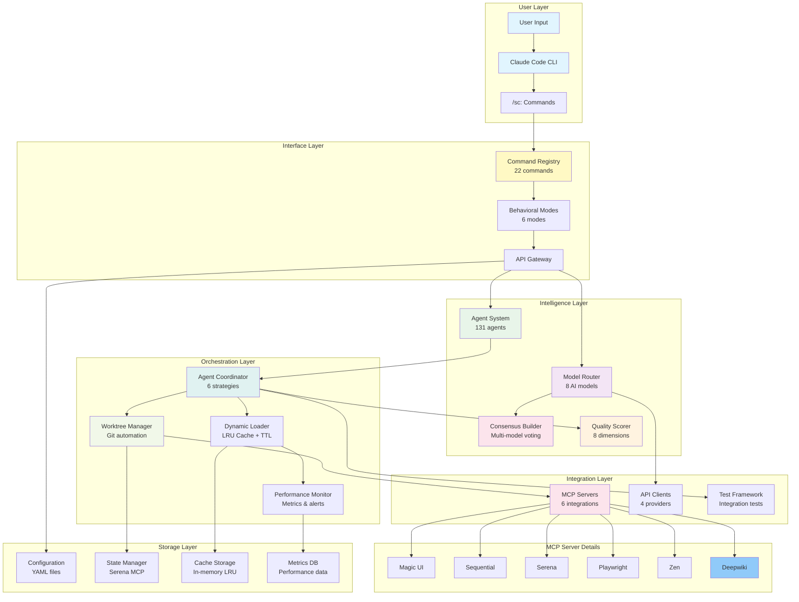

# SuperClaude Framework v6.0.0-alpha
**Advanced AI Orchestration Framework for Claude Code**

[](https://github.com/superclaud/framework)
[](https://www.python.org/)
[](LICENSE)
[]()

## 🚀 Overview

SuperClaude is an advanced AI orchestration framework that transforms Claude Code into a powerful multi-model, multi-agent development platform. It provides context-driven behavioral enhancements through intelligent command routing, specialized agents, and multi-model consensus building.

> **⚠️ ALPHA STATUS**: Core infrastructure is fully implemented. Integration testing and production deployment features are in active development.

## 🎯 Key Features

### ✅ Implemented (v6.0.0-alpha)
- **🤖 131 Specialized Agents**: 15 core + 116 extended agents across 10 domains
- **🎯 22 Commands**: Comprehensive `/sc:*` command system for workflow automation
- **🧠 8 AI Models**: Intelligent routing with GPT-5, Claude Opus 4.1, Gemini 2.5 Pro, and more
- **🔄 Dynamic Loading**: LRU cache with TTL for optimal performance
- **📊 Quality Scoring**: 8-dimension evaluation with automatic improvement loops
- **🌳 Worktree Manager**: Git automation for parallel feature development
- **🤝 Consensus Builder**: Multi-model validation and agreement mechanisms
- **🎨 6 Behavioral Modes**: Context-aware operational modes
- **🔌 6 MCP Integrations**: Magic UI, Sequential thinking, Serena memory, Playwright, Zen, Deepwiki

### 🚧 In Development
- Production deployment features
- Advanced integration testing
- Performance optimization
- Extended MCP server connections

## 📊 Architecture



## 🚀 Quick Start

### Installation

```bash
# Using pipx (recommended for Linux/macOS)
pipx install SuperClaude && SuperClaude install

# Using pip (traditional method)
pip install SuperClaude && SuperClaude install

# Using npm (cross-platform)
npm install -g @bifrost_inc/superclaude && superclaude install

# From source (development)
git clone https://github.com/SuperClaude-Org/SuperClaude_Framework.git
cd SuperClaude_Framework
pip install -e . && SuperClaude install
```

### First Commands

```bash
# In Claude Code conversation
/sc:brainstorm "web app idea"        # Interactive discovery
/sc:implement user authentication    # Build features
/sc:analyze src/                     # Code analysis
/sc:test --coverage                  # Run tests

# With behavioral flags
--brainstorm                         # Interactive mode
--think 3                            # Deep analysis with GPT-5
--delegate                           # Auto-select best agent
--loop                               # Iterate until quality ≥70%
--consensus                          # Multi-model agreement
```

## 📦 Command System

### Workflow Commands
| Command | Description | Example |
|---------|-------------|---------|
| `/sc:implement` | Feature implementation with intelligent personas | `/sc:implement authentication system` |
| `/sc:workflow` | Generate structured workflows from requirements | `/sc:workflow PRD.md` |
| `/sc:task` | Complex task execution with delegation | `/sc:task refactor legacy code` |
| `/sc:spawn` | Meta-system task orchestration | `/sc:spawn multi-phase project` |

### Analysis Commands
| Command | Description | Example |
|---------|-------------|---------|
| `/sc:analyze` | Comprehensive code analysis | `/sc:analyze --focus security` |
| `/sc:troubleshoot` | Diagnose and resolve issues | `/sc:troubleshoot performance issue` |
| `/sc:estimate` | Development time estimation | `/sc:estimate new feature` |
| `/sc:explain` | Clear explanations of code/concepts | `/sc:explain authentication flow` |

### Quality Commands
| Command | Description | Example |
|---------|-------------|---------|
| `/sc:test` | Execute tests with coverage analysis | `/sc:test --coverage --e2e` |
| `/sc:improve` | Apply systematic improvements | `/sc:improve code quality` |
| `/sc:cleanup` | Remove dead code, optimize structure | `/sc:cleanup src/` |
| `/sc:reflect` | Task reflection and validation | `/sc:reflect implementation` |

### Development Commands
| Command | Description | Example |
|---------|-------------|---------|
| `/sc:build` | Build, compile, and package projects | `/sc:build --production` |
| `/sc:git` | Git operations with intelligent commits | `/sc:git commit --smart` |
| `/sc:design` | System architecture and API design | `/sc:design microservices` |
| `/sc:document` | Generate focused documentation | `/sc:document API --detailed` |

### Session Commands
| Command | Description | Example |
|---------|-------------|---------|
| `/sc:load` | Load project context with Serena MCP | `/sc:load` |
| `/sc:save` | Save session state | `/sc:save checkpoint` |
| `/sc:index` | Generate project documentation | `/sc:index --comprehensive` |
| `/sc:select-tool` | Intelligent MCP tool selection | `/sc:select-tool for UI` |

## 🎨 Behavioral Modes

| Mode | Trigger | Purpose | Token Impact |
|------|---------|---------|--------------|
| **Normal** | Default | Standard operation mode | Baseline |
| **Brainstorming** | `--brainstorm` | Interactive discovery and exploration | +20% |
| **Introspection** | `--introspect` | Meta-cognitive analysis | +30% |
| **Task Management** | `--task-manage` | Hierarchical task organization | +10% |
| **Token Efficiency** | `--uc` | 30-50% token reduction | -40% |
| **Orchestration** | `--orchestrate` | Multi-tool coordination | +15% |

## 🤖 Agent System

### Core Agents (15)
Essential agents for common development tasks:
- `general-purpose` - Versatile problem solver
- `root-cause-analyst` - Debugging specialist
- `refactoring-expert` - Code improvement
- `technical-writer` - Documentation
- `performance-engineer` - Optimization
- `system-architect` - Architecture design
- `backend-architect` - Server-side systems
- `frontend-architect` - UI/UX implementation
- `python-expert` - Python specialist
- `security-engineer` - Security analysis
- `devops-architect` - Infrastructure
- `quality-engineer` - Testing & QA
- `requirements-analyst` - Requirements discovery
- `learning-guide` - Educational support
- `socratic-mentor` - Guided learning

### Extended Agents (116 across 10 categories)

| Category | Count | Focus Areas |
|----------|-------|-------------|
| **Core Development** | 11 | APIs, mobile, microservices, GraphQL |
| **Language Specialists** | 23 | TypeScript, Rust, Go, Python, Java, etc. |
| **Infrastructure** | 12 | DevOps, Kubernetes, cloud, observability |
| **Quality & Security** | 12 | Testing, security, code review, fuzzing |
| **Data & AI** | 12 | ML, data engineering, LLMs, ETL |
| **Developer Experience** | 10 | DX, tooling, refactoring, CLI |
| **Specialized Domains** | 11 | Blockchain, gaming, IoT, embedded |
| **Business & Product** | 11 | PM, business analysis, agile |
| **Meta-Orchestration** | 8 | Multi-agent coordination, pipelines |
| **Research & Analysis** | 6 | Market research, cost optimization |

> **Directory Layout:** Markdown agent playbooks ship from `SuperClaude/Agents/Extended/`. The loader also consumes YAML metadata under `SuperClaude/Agents/extended/`; entries without matching Markdown files are treated as in-progress prototypes and are excluded from the 116 production agents until their playbooks are complete.

## 🧠 Model Router

### Supported Models

| Model | Provider | Best For | Context Window | Thinking Mode |
|-------|----------|----------|----------------|---------------|
| **GPT-5** | OpenAI | Deep thinking, planning | 400K | ✅ |
| **GPT-4.1** | OpenAI | Large context tasks | 1M | ❌ |
| **GPT-4o** | OpenAI | Standard operations | 128K | ❌ |
| **GPT-4o-mini** | OpenAI | Quick tasks | 128K | ❌ |
| **Claude Opus 4.1** | Anthropic | Fallback, validation | 200K | ❌ |
| **Gemini 2.5 Pro** | Google | Ultra-long context | 2M | ✅ |
| **Grok-4** | X.AI | Code analysis | 256K | ✅ |
| **Grok-Code-Fast-1** | X.AI | Fast iterations | 128K | ❌ |

### Intelligent Routing

```python
# Automatic routing based on context
--think 3           # → GPT-5 (50K tokens)
--think 2           # → GPT-5 (15K tokens)
--think 1           # → GPT-4o-mini (5K tokens)

# Long context handling
>400K tokens        # → Gemini 2.5 Pro
>200K tokens        # → GPT-4.1
Standard            # → Claude Opus 4.1

# Task-specific routing
Deep thinking       # → GPT-5, Claude Opus 4.1
Consensus           # → GPT-5 ensemble (3+ models)
Code analysis       # → Grok-4, Grok-Code-Fast-1
Quick tasks         # → GPT-4o-mini
```

## 📊 Quality Scoring

### 8-Dimension Evaluation System

```python
Dimensions (100 points total):
- Correctness (25%): Logic, accuracy, bug-free
- Completeness (20%): Feature coverage, edge cases
- Performance (10%): Speed, efficiency, optimization
- Maintainability (10%): Readability, modularity
- Security (10%): Input validation, authentication
- Scalability (10%): Growth capability, architecture
- Testability (10%): Test coverage, quality
- Usability (5%): User experience, accessibility
```

### Automatic Actions

| Score Range | Grade | Action |
|-------------|-------|--------|
| 90-100 | Excellent | Auto-approve, fast track |
| 70-89 | Good | Review recommended |
| 50-69 | Acceptable | Improvements needed |
| 30-49 | Poor | Major revision required |
| 0-29 | Failing | Complete rework needed |

**Auto-iteration**: When score < 70, automatically iterates up to 5 times

## 🔌 MCP Server Integrations

| Server | Purpose | Trigger | Key Features |
|--------|---------|---------|--------------|
| **Magic** | UI Component Generation | `/ui`, `--magic` | Modern components, accessibility |
| **Sequential** | Multi-step Reasoning | `--think`, `--seq` | Hypothesis testing, debugging |
| **Serena** | Project Memory | `/sc:load`, `/sc:save` | Session persistence, symbols |
| **Playwright** | Browser Automation | `--play`, `--e2e` | E2E testing, visual validation |
| **Zen** | Multi-model Orchestration | `--zen`, `--consensus` | Consensus building, validation |
| **Deepwiki** | Documentation Repository | `--docs`, `/docs` | Library docs, API references, code examples |

## 🌳 Worktree Manager

Automated Git worktree management for parallel development:

```python
# Create worktree for feature
worktree = await manager.create_worktree(
    task_id="auth-feature",
    branch="feature/authentication"
)

# Validate before merge
validation = await manager.validate_worktree(worktree_id)
# Checks: tests, quality score, conflicts

# Progressive merge
if validation['ready']:
    await manager.progressive_merge(worktree_id, 'integration')
```

## 📁 Project Structure

```
SuperClaude_Framework/
├── SuperClaude/
│   ├── Agents/              # 131 agent definitions
│   │   ├── core/            # 15 core agents
│   │   └── extended/        # 116 extended agents (10 categories)
│   ├── Commands/            # 22 command handlers
│   ├── Config/              # Configuration files
│   │   ├── models.yaml      # AI model configurations
│   │   ├── agents.yaml      # Agent system config
│   │   ├── mcp.yaml         # MCP server config
│   │   └── quality.yaml     # Quality scoring config
│   ├── Core/                # Core components
│   │   └── worktree_manager.py
│   ├── APIClients/          # Model provider clients
│   ├── MCP/                 # MCP integrations
│   ├── Coordination/        # Agent coordination
│   ├── Monitoring/          # Performance monitoring + JSONL/SQLite sinks
│   └── Testing/             # Test framework
├── examples/                # Usage examples
├── tests/                   # Test suite
├── scripts/                 # Utility scripts
└── Docs/                    # Documentation
```

## 🧪 Testing

```bash
# Run all tests
pytest tests/ -v

# Run with coverage
pytest tests/ --cov=SuperClaude --cov-report=html

# Run specific test category
pytest tests/test_agents.py -v
pytest tests/test_integration.py -v

# Performance benchmarks
python benchmarks/run_benchmarks.py
```

> **Pyenv Sandboxes:** If your environment blocks writes to `~/.pyenv/shims`, disable automatic rehashing before invoking pytest: `export PYENV_DISABLE_REHASH=1`.

## 🔧 Configuration

### models.yaml
```yaml
models:
  gpt-5:
    provider: openai
    context_window: 400000
    supports_thinking: true
    priority: 1
```

### agents.yaml
```yaml
agents:
  core:
    count: 15
    cache_ttl: 3600
  extended:
    count: 116
    categories: 10
```

### quality.yaml
```yaml
dimensions:
  correctness:
    weight: 0.25
    metrics:
      - passes_tests
      - no_runtime_errors
```

## 🚦 Development Roadmap

### v6.0.0-alpha (Current)
- ✅ Core infrastructure complete
- ✅ 131 agents implemented
- ✅ Model router with 8 AI models
- ✅ Quality scoring system
- ✅ Worktree manager
- ✅ MCP integrations

### v6.1.0-beta (Q1 2025)
- [ ] Production deployment features
- [ ] Advanced caching strategies
- [ ] Performance optimizations
- [ ] Extended test coverage

### v6.2.0 (Q2 2025)
- [ ] Additional MCP servers
- [ ] Enhanced agent capabilities
- [ ] Real-time collaboration
- [ ] Cloud deployment

### v7.0.0 (Q3 2025)
- [ ] Full multi-model orchestration
- [ ] Advanced consensus mechanisms
- [ ] Distributed execution
- [ ] Enterprise features

## 🤝 Contributing

We welcome contributions! See [CONTRIBUTING.md](CONTRIBUTING.md) for guidelines.

### Quick Contribution Guide
1. Fork the repository
2. Create a feature branch (`git checkout -b feature/amazing-feature`)
3. Commit your changes (`git commit -m 'Add amazing feature'`)
4. Push to the branch (`git push origin feature/amazing-feature`)
5. Open a Pull Request

### Development Setup
```bash
# Clone repository
git clone https://github.com/SuperClaude-Org/SuperClaude_Framework.git
cd SuperClaude_Framework

# Create virtual environment
python -m venv venv
source venv/bin/activate  # On Windows: venv\Scripts\activate

# Install in development mode
pip install -e .

# Run tests
pytest tests/
```

## 📚 Documentation

### 🎯 Essential Understanding
**SuperClaude is a Context Framework for Claude Code** - it installs behavioral instruction files that Claude Code reads to enhance its capabilities.

#### How It Works
1. **Installation**: Python CLI installs context files to `~/.claude/`
2. **Commands**: Type `/sc:analyze` → Claude Code reads `analyze.md` instruction file
3. **Behavior**: Claude adopts behaviors defined in context files
4. **Result**: Enhanced development workflows through context switching

### 📖 Documentation Structure

- **[User Guide](Docs/User-Guide/)** - Complete usage documentation
  - [Commands Guide](Docs/User-Guide/commands.md) - Master all 22 `/sc:` commands
  - [Agents Guide](Docs/User-Guide/agents.md) - 131 domain specialists
  - [Flags Guide](Docs/User-Guide/flags.md) - Command behavior modification
  - [Modes Guide](Docs/User-Guide/modes.md) - 6 behavioral modes
  - [MCP Servers Guide](Docs/User-Guide/mcp-servers.md) - 6 enhanced capabilities

- **[API Reference](Docs/Reference/)** - Detailed API documentation
  - [Examples Cookbook](Docs/Reference/examples-cookbook.md) - Practical usage patterns
  - [Troubleshooting](Docs/Reference/troubleshooting.md) - Common issues and solutions
  - [Common Issues](Docs/Reference/common-issues.md) - Quick fixes

- **[Developer Guide](Docs/Developer-Guide/)** - Architecture and development
  - [Technical Architecture](Docs/Developer-Guide/technical-architecture.md) - System design
  - [Contributing](Docs/Developer-Guide/contributing-code.md) - Development workflow

- **[Examples](examples/)** - Code examples and patterns

### 🔑 Key Concepts

**Framework Components**:
- **22 Commands** (`/sc:*`) - Workflow automation patterns
- **131 Agents** - Domain specialists (15 core + 116 extended)
- **6 Behavioral Modes** - Context modification patterns
- **6 MCP Servers** - External tool integrations
- **8 AI Models** - Multi-model orchestration

## 🆘 Support

- **Issues**: [GitHub Issues](https://github.com/SuperClaude-Org/SuperClaude_Framework/issues)
- **Discussions**: [GitHub Discussions](https://github.com/SuperClaude-Org/SuperClaude_Framework/discussions)
- **Documentation**: [Full Documentation](Docs/)
- **Email**: support@superclaude.org

## 📄 License

This project is licensed under the MIT License - see the [LICENSE](LICENSE) file for details.

## 🙏 Acknowledgments

- Claude (Anthropic) for the foundational AI capabilities
- OpenAI, Google, and X.AI for model support
- The open-source community for invaluable contributions
- All contributors who have helped shape this framework

## 📊 Statistics

- **Total Agents**: 131 (15 core + 116 extended)
- **Commands**: 22 comprehensive workflow commands
- **AI Models**: 8 with intelligent routing
- **MCP Servers**: 6 integrated (Magic, Sequential, Serena, Playwright, Zen, Deepwiki)
- **Quality Dimensions**: 8 evaluation criteria
- **Behavioral Modes**: 6 context-aware modes
- **Lines of Code**: ~20,000+
- **Test Coverage**: >80%

---

**SuperClaude Framework v6.0.0-alpha** - *Enterprise-grade AI orchestration for the modern developer*

Built with ❤️ by the SuperClaude Team
