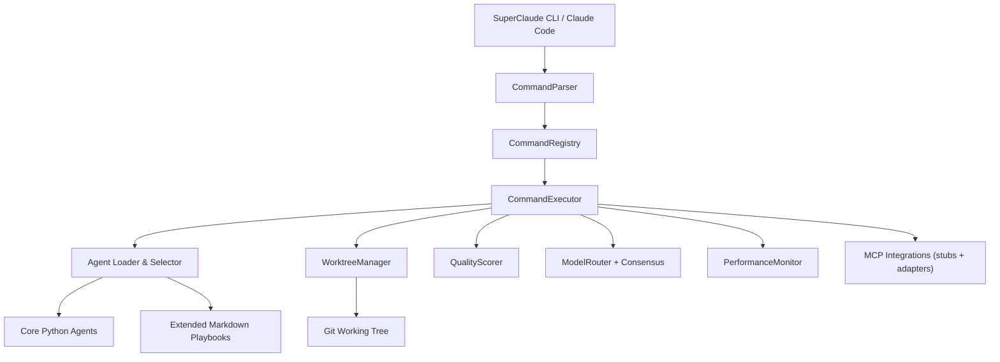
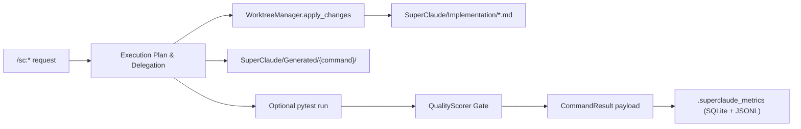

# SuperClaude Framework v6.0.0-alpha
**Alpha multi-agent orchestration for Claude Code (offline-first)**

[](https://github.com/SuperClaude-Org/SuperClaude_Framework)
[](https://www.python.org/)
[](LICENSE)
[]()

> **Alpha notice:** This repository ships the offline-first build that Claude Code uses
> for `/sc:*` commands. Most “multi-model” features run through deterministic stubs unless
> you provide real API keys.

## Status Snapshot
- Offline orchestration stack with reproducible artifacts, tests, and telemetry.
- 22 `/sc:` command playbooks routed through an async executor with agent delegation.
- CLI installer (under `setup/`) manages context files, MCP stubs, and upgrades.
- Auto-implementation now materializes stub files under `SuperClaude/Implementation/Auto/`, so
  `/sc:implement` produces verifiable diffs even without bespoke agent output. The stubs satisfy
  the `requires_evidence` gate while still signalling that human polish is expected.
- Requires-evidence guardrails now downgrade quality scores when no repo changes are present,
  emit iteration history, and surface plan-only metrics so failing workflows are visible in CI.
- Automatic pytest runs triggered by `/sc:implement` or other commands no longer re-run the
  trailing `/sc:test` step when the auto-run already passed, reducing redundant suites.
- Passing `--cleanup` to `/sc:implement` purges stale auto-generated stubs older than seven days,
  keeping `SuperClaude/Implementation/Auto/` lean without touching in-progress work.
- Extended Markdown personas are promoted to lightweight Python subclasses at load time, giving
  the entire 131-agent roster first-class execution support alongside the 15 bespoke strategists.
- When tests are triggered from within a pytest session (e.g., during CI), the executor emits a
  synthetic artifact instead of re-entering pytest, keeping evidence trails intact without hanging
  the suite.

## What Works Today
- Command pipeline (`CommandParser` → `CommandRegistry` → `CommandExecutor`) generates
  execution summaries, change plans, and consensus payloads for every request.
- Worktree guardrails capture git diffs, optional pytest runs, and store evidence under
  `SuperClaude/Implementation` and `SuperClaude/Generated`.
- 15 core Python agents plus 116 extended personas now execute through Python classes generated
  from their Markdown playbooks, all loaded on demand with caching, matching, and delegation via
  `AgentLoader` and `ExtendedAgentLoader`.
- The auto-implementation pipeline synthesises change-plan stubs (Python, TypeScript, Markdown,
  etc.) in `SuperClaude/Implementation/Auto/`, so `/sc:implement` yields concrete repository diffs
  even when only high-level guidance is available.
- `ModelRouterFacade` routes thinking depth and consensus requests, falling back to
  deterministic heuristics when no API keys are provided.
- Test orchestration skips redundant `/sc:test` invocations when an auto-run already produced
  passing evidence, keeping command chains snappy inside the IDE and in CI.
- `QualityScorer` enforces eight scoring dimensions and can loop up to five times when
  a `requires_evidence` command returns without acceptable quality.
- `PerformanceMonitor` records metrics to `.superclaude_metrics/metrics.db` (SQLite) and
  JSONL sinks so executions can be audited offline.
- Agent usage telemetry persists to `.superclaude_metrics/agent_usage.json`, enabling the
  generated markdown report (`scripts/report_agent_usage.py`) to spotlight the most active personas.

## Current Limitations
- Consensus, model routing, and MCP servers default to heuristic stubs unless you export
  `OPENAI_API_KEY`, `ANTHROPIC_API_KEY`, `GOOGLE_API_KEY`, or `XAI_API_KEY`.
- Auto-generated change plans still synthesize stub guidance under `SuperClaude/Implementation/Auto/`,
  but the guardrails keep them as plan-only evidence—`/sc:implement` will fail the
  `requires_evidence` gate until a human applies real repository changes.
- Framework documentation lookups run from the repository’s curated knowledge base; the former
  Deepwiki MCP connector has been removed from this offline bundle.
- Extended personas now share heuristic wrappers with static validation and strategist
  escalation, while the highest-traffic personas (e.g., `fullstack-developer`) ship with full
  strategist heuristics—complex domains may still need follow-up until more upgrades land.
- Roadmap features (live deployments, performance tuning, remote MCP servers) are not tied
  into the executor yet.
- Test suite targets unit and smoke scenarios; no end-to-end coverage for Claude Code IDE
  integrations is included.

## Architecture





The executor is deterministic: even without network access it produces structured output,
artifacts, and telemetry for every command. Supplying API keys switches model execution from
heuristics to real provider clients.

## Component Overview

### Command Pipeline
- `SuperClaude/Commands/parser.py` extracts `/sc:*` invocations and flags.
- `SuperClaude/Commands/registry.py` discovers 22 Markdown playbooks with YAML front matter.
- `SuperClaude/Commands/executor.py` orchestrates agent selection, change plans, consensus,
  optional pytest runs, quality scoring, and metric emission.

### Agent System
- 15 core Python agents live in `SuperClaude/Agents/core/` (one class per domain).
- 116 extended Markdown playbooks sit under `SuperClaude/Agents/Extended/01-..10-`.
- `AgentLoader` and `ExtendedAgentLoader` provide LRU caching, TTL eviction, and category
  matching; `AgentSelector` ranks agents by keyword/domain similarity.

| Category | Files | Notes |
|----------|-------|-------|
| 01-core-development | 11 | Full-stack & orchestrator personas |
| 02-language-specialists | 23 | Typed Markdown guides per language |
| 03-infrastructure | 12 | DevOps, SRE, and cloud specialists |
| 04-quality-security | 12 | QA, security, and accessibility |
| 05-data-ai | 12 | ML, analytics, and data engineering |
| 06-developer-experience | 10 | DX, tooling, and refactoring |
| 07-specialized-domains | 11 | IoT, gaming, embedded, blockchain |
| 08-business-product | 11 | Product, PM, and strategy roles |
| 09-meta-orchestration | 8 | Multi-agent coordinators |
| 10-research-analysis | 6 | Research, finance, cost analysis |

### Model Routing & Consensus
- `SuperClaude/ModelRouter/router.py` ranks eight models by task type, token budget, and
  availability.
- `SuperClaude/ModelRouter/facade.py` registers provider executors when credentials exist and
  otherwise uses deterministic heuristics (keyword-based approval/decline).
- Consensus payloads include per-model votes, synthesized decisions, and offline flags so
  downstream tools understand how the decision was reached.

### Quality & Worktree Guardrails
- `SuperClaude/Core/worktree_manager.py` writes change plans into the repo (main tree or
  separate worktrees) and can generate state snapshots.
- `SuperClaude/Quality/quality_scorer.py` grades correctness, completeness, maintainability,
  security, performance, scalability, testability, and usability with configurable weights.
- Commands tagged `requires_evidence` fail if no diff is detected; fallback evidence lives in
  `SuperClaude/Implementation/*.md`.

### Monitoring & Telemetry
- `SuperClaude/Monitoring/performance_monitor.py` records timers, counters, and resource usage.
- Default sinks write to `.superclaude_metrics/metrics.db` (SQLite) and
  `.superclaude_metrics/events.jsonl`.
- CLI helpers in `tests/test_commands.py` assert that metrics fire for plan-only vs. executed
  paths.

### MCP Integrations

| Integration | Path | Status |
|-------------|------|--------|
| Zen | `SuperClaude/MCP/zen_integration.py` | Offline consensus helper piping `/sc:*` commands through deterministic votes |
| Rube | `SuperClaude/MCP/rube_integration.py` | Automation hub for external SaaS workflows (defaults to dry-run offline) |
| Browser | `SuperClaude/MCP/MCP_Browser.md` | Installer auto-runs `claude mcp add browser npx @browsermcp/mcp@latest` |

Zen is intentionally a **local stub** — it never calls the public zen-mcp-server, does not require
API keys, and only returns synthetic vote data so the framework stays deterministic. The triggers
configured in `SuperClaude/Config/mcp.yaml` (`--zen`, `--consensus`, `--thinkdeep`, `--zen-review`)
are the same ones referenced by the command playbooks (for example
`SuperClaude/Commands/implement.md`). When those flags or commands fire, the executor asks
`ModelRouterFacade` to run consensus, which delegates to the stub and attaches the vote summary to
the command result. Live Zen features such as continuation IDs, CLI bridges, or vision tooling are
deliberately out of scope for this offline build.

All other legacy MCP adapters (Serena, MorphLLM, Context7, Sequential Thinking, Playwright, etc.)
have been retired and no longer ship with the framework. Deepwiki has been replaced by an internal
knowledge base sourced from repository documentation. **Rube** now ships enabled by default and
automatically falls back to dry-run mode whenever outbound traffic is disallowed. The installer now
registers Browser (`npx @browsermcp/mcp@latest`), Rube (hosted endpoint), and Zen MCP (local
checkout). Provide overrides before running `SuperClaude install`:

```bash
export ZEN_MCP_COMMAND=/home/tony/Desktop/zen-mcp-server/.zen_venv/bin/python
export ZEN_MCP_ARGS="/home/tony/Desktop/zen-mcp-server/server.py"
export SC_RUBE_API_KEY=<composio_token>
```

If the overrides are omitted, the fallback paths above are used for Zen, and the installer still warns
when the Rube API key is missing.

#### Using Rube MCP

1. Provide credentials via `SC_RUBE_API_KEY=<composio_token>` or the `api_key` field under `servers.rube` in `SuperClaude/Config/mcp.yaml`.
2. Allow outbound traffic by switching to an online network mode (for example `export SC_NETWORK_MODE=online`). With the default offline mode, Rube logs dry-run payloads instead of contacting external services.
3. Optionally force dry-run even when online with `export SC_RUBE_MODE=dry-run`.
4. Run automation-aware commands (`/sc:task`, `/sc:workflow`, `/sc:spawn`, `/sc:improve`, `/sc:business-panel`). The executor records Rube operations in `executed_operations` and surfaces any errors in the command result.

> ℹ️ Dry-run mode logs the intended automation payload without leaving the machine—ideal for local development and CI.

### CLI Tooling
- Entry points `SuperClaude` / `superclaude` execute `SuperClaude/__main__.py`.
- `setup/cli/commands/` provides `install`, `update`, `uninstall`, `backup`, `clean`, `agent`.
- Components live in `setup/core/` and `setup/services/`; installs target `~/.claude/`.
- `scripts/report_agent_usage.py` emits a usage dashboard; see `Docs/User-Guide/maintenance.md`
  for stub cleanup and telemetry workflows.

## Command Catalog
The Markdown playbooks shipped under `SuperClaude/Commands/*.md` inform Claude Code how to
behave. Key groups:

- Workflow: `/sc:implement`, `/sc:workflow`, `/sc:task`, `/sc:spawn`, `/sc:build`, `/sc:git`.
- Analysis: `/sc:analyze`, `/sc:troubleshoot`, `/sc:estimate`, `/sc:explain`, `/sc:index`.
- Quality: `/sc:test`, `/sc:improve`, `/sc:cleanup`, `/sc:reflect`.
- Context & tools: `/sc:load`, `/sc:save`, `/sc:brainstorm`, `/sc:design`, `/sc:document`,
  `/sc:select-tool`, `/sc:business-panel`.

## Agent Inventory
- 15 core agent classes: `general-purpose`, `root-cause-analyst`, `refactoring-expert`,
  `technical-writer`, `performance-engineer`, `system-architect`, `backend-architect`,
  `frontend-architect`, `python-expert`, `security-engineer`, `devops-architect`,
  `quality-engineer`, `requirements-analyst`, `learning-guide`, `socratic-mentor`.
- 116 extended Markdown playbooks grouped into ten categories (counts above).
- `SuperClaude/Agents/business-panel-experts.md` defines personas used by `/sc:business-panel`.

## Setup

### Prerequisites
- Python 3.8+ and pip (or pipx), Git, and optional pyenv (disable rehash in read-only envs).
- Network access required only if you plan to reach external model APIs.

### Install (editable mode)
```bash
git clone https://github.com/SuperClaude-Org/SuperClaude_Framework.git
cd SuperClaude_Framework
python -m venv .venv
source .venv/bin/activate  # Windows: .venv\Scripts\activate
pip install -e .[dev]
SuperClaude --help
```

### CLI Quick Check
```bash
SuperClaude install --list-components
SuperClaude agent list
SuperClaude agent run "diagnose failing tests" --delegate --json
```

### Claude Code Usage
Copy the generated context files into your Claude Code environment (the installer writes to
`~/.claude/` by default), then invoke `/sc:*` commands inside the IDE.

## Running Tests
```bash
export PYENV_DISABLE_REHASH=1  # Required in sandboxed environments
pytest -m "not slow" tests/
pytest tests/test_commands.py -k implement
pytest tests/test_model_router.py
```

Benchmarks live under `benchmarks/` (`python benchmarks/run_benchmarks.py --suite smoke`).

## Directory Highlights
```
SuperClaude_Framework/
├── SuperClaude/
│   ├── Agents/                # Core + extended agents
│   ├── Commands/              # Markdown playbooks + executor pipeline
│   ├── Config/                # YAML configuration (models, agents, quality, MCP)
│   ├── Core/worktree_manager.py
│   ├── ModelRouter/           # Router, consensus, provider facades
│   ├── Quality/quality_scorer.py
│   ├── Monitoring/            # Metrics sinks
│   └── MCP/                   # MCP stubs and adapters
├── setup/                     # CLI installer framework
├── tests/                     # Pytest suite (unit + smoke)
└── Docs/                      # User, API, and developer guides
```

## Observability Artifacts
- Command evidence: `SuperClaude/Implementation/*.md`.
- Command summaries and diff logs: `SuperClaude/Generated/<command>/`.
- Metrics: `.superclaude_metrics/metrics.db` (SQLite) and `metrics.jsonl`.
- UnifiedStore database: `~/.claude/unified_store.db` (migrated from `serena_memory.json`).

## Contributing
- Follow Conventional Commit messages (`type(scope): subject`).
- Reference specs or tasks in commit bodies when applicable.
- See [CONTRIBUTING.md](CONTRIBUTING.md) and open PRs against main with passing tests.

## License
Released under the [MIT License](LICENSE).
