# SuperClaude Framework

**An intelligent AI orchestration framework for Claude Code that provides multi-model consensus, specialized agents, behavioral modes, and quality-driven execution.**

SuperClaude transforms Claude Code into a powerful development platform with 100+ specialized agents, multi-provider AI routing, MCP server integration, and sophisticated quality validation pipelines.

---

## Table of Contents

- [Overview](#overview)
- [Architecture](#architecture)
- [Core Components](#core-components)
  - [Model Router](#model-router)
  - [Agent System](#agent-system)
  - [Command Executor](#command-executor)
  - [MCP Integrations](#mcp-integrations)
  - [Behavioral Modes](#behavioral-modes)
  - [Quality Pipeline](#quality-pipeline)
- [Installation](#installation)
- [Quick Start](#quick-start)
- [Configuration](#configuration)
- [Agents Catalog](#agents-catalog)
- [Flags Reference](#flags-reference)
- [API Reference](#api-reference)
- [Contributing](#contributing)

---

## Overview

SuperClaude is a sophisticated AI orchestration framework that enhances Claude Code with:

- **Multi-Model Consensus**: Route requests to GPT-5, Gemini 2.5 Pro, Claude, xAI Grok, and more
- **100+ Specialized Agents**: From backend architects to security auditors
- **Behavioral Modes**: Normal, Task Management, Token Efficiency, Orchestration
- **Quality Validation**: Multi-stage pipelines with syntax, security, and performance checks
- **MCP Server Integration**: Rube (web/app automation), Zen (consensus), LinkUp (web search)


---

## Architecture

### High-Level System Architecture


### Request Flow


---

## Core Components

### Model Router

The Model Router intelligently distributes requests across multiple AI providers based on task requirements, model capabilities, and consensus strategies.


#### Supported Models

| Provider | Models | Context Window | Features |
|----------|--------|----------------|----------|
| **Anthropic** | Claude Opus 4.5, Claude Sonnet 4.5 | 200K tokens | Extended thinking, tool use |
| **OpenAI** | GPT-5, GPT-5 Codex, o3 | 128K-200K tokens | Reasoning, code generation |
| **Google** | Gemini 2.5 Pro | **2M tokens** | Long context, multimodal |
| **xAI** | Grok 3, Grok 3 Mini | 131K tokens | Real-time knowledge |

#### Consensus Strategies


| Strategy | Description | Use Case |
|----------|-------------|----------|
| **Majority** | >50% agreement required | General tasks |
| **Unanimous** | 100% agreement required | Critical decisions |
| **Quorum** | Configurable threshold | Balanced consensus |
| **Weighted** | Model weights applied | Expert-based decisions |

#### Code Example

```python
from SuperClaude.ModelRouter.facade import ModelRouterFacade

# Initialize router
router = ModelRouterFacade()

# Run consensus across models
result = await router.run_consensus(
    prompt="Analyze the security implications of this code",
    models=["gpt-5", "gemini-2.5-pro", "claude-opus-4.5"],
    vote_type=VoteType.WEIGHTED,
    quorum_size=2
)

print(f"Consensus reached: {result['consensus_reached']}")
print(f"Agreement score: {result['agreement_score']}")
print(f"Final decision: {result['final_decision']}")
```

---

### Agent System

SuperClaude features a sophisticated agent system with 100+ specialized agents organized into categories.


#### Agent Selection Flow


#### Core Agents

| Agent | Category | Purpose |
|-------|----------|---------|
| `general-purpose` | General | Broad searches, unknown scope |
| `root-cause-analyst` | Debugging | Systematic debugging, error analysis |
| `refactoring-expert` | Quality | Code improvements, technical debt |
| `technical-writer` | Documentation | API docs, user guides |
| `performance-engineer` | Optimization | Bottleneck identification |
| `security-engineer` | Security | Vulnerability assessment |
| `system-architect` | Architecture | System design, scalability |
| `backend-architect` | Architecture | API design, database patterns |
| `frontend-architect` | Architecture | UI/UX, component architecture |
| `devops-architect` | Infrastructure | CI/CD, deployment strategies |

#### Extended Agent Categories


#### Agent Coordination


---

### Command Executor

The Command Executor orchestrates command execution with agent and MCP server integration.


#### Execution Pipeline


---

### MCP Integrations

SuperClaude integrates with Model Context Protocol (MCP) servers for extended capabilities.


#### Rube MCP (Native)

Rube MCP connects 500+ apps for seamless cross-app automation via Claude Code's native tools.

```
# Web search via LinkUp - use mcp__rube__RUBE_MULTI_EXECUTE_TOOL
Use mcp__rube__RUBE_MULTI_EXECUTE_TOOL with:
  tools: [{
    "tool_slug": "LINKUP_SEARCH",
    "arguments": {
      "query": "latest React 19 features",
      "depth": "deep",
      "output_type": "sourcedAnswer"
    }
  }]
  session_id: "<from RUBE_SEARCH_TOOLS>"
  memory: {}
```

#### PAL MCP (Native) - Formerly "Zen"

PAL MCP provides consensus orchestration and code review via Claude Code's native tools.

```
# Code review - use mcp__pal__codereview
Use mcp__pal__codereview with:
  step: "Review authentication module for security issues"
  step_number: 1
  total_steps: 2
  next_step_required: true
  findings: "Initial security scan..."
  relevant_files: ["/path/to/auth.py"]
  model: "gpt-5.2"

# Multi-model consensus - use mcp__pal__consensus
Use mcp__pal__consensus with:
  step: "Evaluate: Should we use REST or GraphQL?"
  step_number: 1
  total_steps: 3
  next_step_required: true
  findings: "Analyzing tradeoffs..."
  models: [{"model": "gpt-5.2", "stance": "for"}, {"model": "gemini-3-pro", "stance": "against"}]
```

---

### Behavioral Modes

SuperClaude supports multiple behavioral modes that change how the framework operates.


#### Mode Comparison

| Mode | Trigger | Verbosity | Use Case |
|------|---------|-----------|----------|
| **Normal** | default | Balanced | Day-to-day development |
| **Brainstorming** | `--brainstorm` | High | Collaborative discovery |
| **Introspection** | `--introspect` | High | Meta-cognitive analysis |
| **Task Management** | `--task-manage` | Structured | Multi-step operations |
| **Token Efficiency** | `--uc` | Minimal | Context/cost constraints |
| **Orchestration** | `--orchestrate` | Strategic | Tool coordination |

#### Token Efficiency Symbols

```mermaid
graph LR
    subgraph "Status Symbols"
        S1[✅ Completed]
        S2[❌ Failed]
        S3[⚠️ Warning]
        S4[🔄 In Progress]
        S5[⏳ Pending]
    end

    subgraph "Domain Symbols"
        D1[⚡ Performance]
        D2[🔍 Analysis]
        D3[🛡️ Security]
        D4[📦 Deployment]
        D5[🏗️ Architecture]
    end

    subgraph "Logic Symbols"
        L1[→ Leads to]
        L2[⇒ Transforms]
        L3[∴ Therefore]
        L4[∵ Because]
        L5[» Sequence]
    end
```



**Examples:**
```
Standard: "The authentication system has a security vulnerability"
Token Efficient: "auth.js:45 → 🛡️ sec risk in user val()"

Standard: "Build completed, now running tests, then deploying"
Token Efficient: "build ✅ » test 🔄 » deploy ⏳"
```

---

### Quality Pipeline

The validation pipeline enforces layered local quality checks with short-circuit behavior on fatal failures.


#### Validation Stages

| Stage | Required | Checks | Fatal On |
|-------|----------|--------|----------|
| **Syntax** | Yes | Parse errors, AST validation | Any syntax error |
| **Security** | Yes | Vulnerabilities, secrets | Critical/High severity |
| **Style** | No | Linting, formatting | Never (advisory) |
| **Tests** | Yes | Unit test results | Test failures |
| **Performance** | No | Latency, memory | Never (advisory) |

#### Quality Scoring

```python
quality_score = (
    correctness * 0.4 +    # Does it solve the problem?
    completeness * 0.3 +   # All requirements met?
    code_quality * 0.2 +   # Best practices followed?
    performance * 0.1      # Efficient implementation?
)

# Thresholds
if quality_score < 70:
    iterate_with_feedback()      # Auto-retry with improvements
elif quality_score < 90:
    accept_with_improvements()   # Accept with suggestions
else:
    accept_as_production_ready() # Full approval
```

---

## Installation

### Requirements

- Python 3.8+
- pip or poetry

### Install from Source

```bash
# Clone the repository
git clone https://github.com/your-org/SuperClaude.git
cd SuperClaude

# Create virtual environment
python -m venv .venv
source .venv/bin/activate  # Linux/macOS
# or: .venv\Scripts\activate  # Windows

# Install in development mode
pip install -e .[dev]

# Verify installation
SuperClaude --help
```

### Environment Variables

```bash
# Required API Keys
export ANTHROPIC_API_KEY="your-key"
export OPENAI_API_KEY="your-key"
export GOOGLE_API_KEY="your-key"
export XAI_API_KEY="your-key"

# Optional: Rube MCP
export SC_RUBE_API_KEY="your-rube-key"
export SC_RUBE_MODE="live"  # or "dry-run"
export SC_NETWORK_MODE="online"  # or "offline"
```

---

## Quick Start

### Basic Usage

```bash
# Run with Claude Code
claude

# Use SuperClaude commands
/sc:analyze --deep src/auth.py
/sc:refactor --quality-threshold=80 src/legacy/
/sc:security-audit --severity=critical
```

### Programmatic Usage

```python
from SuperClaude.Commands.executor import CommandExecutor
from SuperClaude.Commands.registry import CommandRegistry
from SuperClaude.Commands.parser import CommandParser

# Initialize
registry = CommandRegistry()
parser = CommandParser()
executor = CommandExecutor(registry, parser)

# Execute command
result = await executor.execute("/sc:analyze --agent=root-cause-analyst src/bug.py")

if result.success:
    print(f"Analysis complete: {result.output}")
    print(f"Quality score: {result.consensus.get('agreement_score', 0)}")
else:
    print(f"Errors: {result.errors}")
```

### Agent Selection

```python
from SuperClaude.Agents.selector import AgentSelector
from SuperClaude.Agents.registry import AgentRegistry

# Initialize
registry = AgentRegistry()
selector = AgentSelector(registry)

# Find best agent for task
best_agent, confidence = selector.find_best_match(
    context="Debug the authentication failure in login.py",
    category_hint="debugging"
)

print(f"Selected: {best_agent} (confidence: {confidence:.2f})")
# Output: Selected: root-cause-analyst (confidence: 0.85)

# Get top suggestions
suggestions = selector.get_agent_suggestions(
    "Optimize database query performance",
    top_n=3
)
# Output: [('performance-engineer', 0.82), ('database-administrator', 0.65), ...]
```

---

## Configuration

### CLAUDE.md Integration

SuperClaude integrates with Claude Code via `CLAUDE.md` configuration files:

```markdown
# ~/.claude/CLAUDE.md (Global)

# SuperClaude Entry Point
@SuperClaude/Core/CLAUDE_CORE.md
@SuperClaude/Core/FLAGS.md
@SuperClaude/Core/PRINCIPLES.md
@SuperClaude/Core/AGENTS.md
@SuperClaude/Core/TOOLS.md

# Behavioral Modes
@SuperClaude/Modes/MODE_Normal.md
@SuperClaude/Modes/MODE_Task_Management.md
@SuperClaude/Modes/MODE_Token_Efficiency.md

# MCP Documentation
@SuperClaude/Core/MCP_Rube.md
@SuperClaude/Core/MCP_Zen.md
```

### Project-Level Configuration

```markdown
# project/CLAUDE.md

@AGENTS.md  # Project-specific agent overrides

## Custom Instructions
- Use TypeScript for all new code
- Follow the existing patterns in src/
- Run tests before committing
```

---

## Agents Catalog

### By Category


### Core Development Agents

| Agent | Triggers | Focus |
|-------|----------|-------|
| `fullstack-developer` | fullstack, end-to-end | Complete application development |
| `frontend-developer` | frontend, react, vue | UI/UX implementation |
| `backend-developer` | backend, api, server | Server-side logic |
| `api-designer` | api design, rest, graphql | API architecture |
| `mobile-developer` | mobile, ios, android | Mobile applications |
| `microservices-architect` | microservices, distributed | Service architecture |

### Language Specialists

| Agent | Languages | Frameworks |
|-------|-----------|------------|
| `python-pro` | Python | Django, FastAPI, Flask |
| `typescript-pro` | TypeScript | Node.js, Deno |
| `rust-engineer` | Rust | Tokio, Actix |
| `golang-pro` | Go | Gin, Echo |
| `java-architect` | Java | Spring Boot |
| `react-specialist` | JavaScript/TypeScript | React, Next.js |
| `vue-expert` | JavaScript/TypeScript | Vue, Nuxt |

### Infrastructure Agents

| Agent | Focus | Tools |
|-------|-------|-------|
| `cloud-architect` | Multi-cloud design | AWS, GCP, Azure |
| `kubernetes-specialist` | Container orchestration | K8s, Helm |
| `terraform-engineer` | IaC | Terraform, Pulumi |
| `devops-engineer` | CI/CD | GitHub Actions, Jenkins |
| `sre-engineer` | Reliability | Prometheus, Grafana |

---

## Flags Reference

### Behavioral Flags

| Flag | Mode | Description |
|------|------|-------------|
| `--normal` | Normal | Default balanced mode |
| `--brainstorm` | Brainstorming | Collaborative discovery |
| `--introspect` | Introspection | Meta-cognitive analysis |
| `--task-manage` | Task Management | Hierarchical organization |
| `--uc` | Token Efficiency | Compressed communication |
| `--orchestrate` | Orchestration | Tool coordination |

### Execution Flags

| Flag | Values | Description |
|------|--------|-------------|
| `--agent` | agent-name | Force specific agent |
| `--think` | 1-5 | Thinking depth level |
| `--loop` | iterations | Enable quality iteration |
| `--consensus` | majority/unanimous | Consensus strategy |
| `--pal-review` | true/false | Enable GPT-5 code review |

### Quality Flags

| Flag | Values | Description |
|------|--------|-------------|
| `--quality-threshold` | 0-100 | Minimum quality score |
| `--severity` | critical/high/medium | Issue severity filter |
| `--skip-tests` | true/false | Skip test validation |

---

## API Reference

### CommandExecutor

```python
class CommandExecutor:
    """
    Orchestrates command execution with agent and MCP server integration.
    """

    async def execute(self, command_str: str) -> CommandResult:
        """Execute a command string."""

    def set_agent_loader(self, agent_loader: AgentLoader) -> None:
        """Set agent loader for command execution."""
```

### AgentRegistry

```python
class AgentRegistry:
    """
    Registry for discovering and managing SuperClaude agents.
    """

    def discover_agents(self, force: bool = False) -> int:
        """Discover all agents from markdown files."""

    def get_agent(self, name: str) -> Optional[BaseAgent]:
        """Get an agent instance by name."""

    def search_agents(self, query: str) -> List[str]:
        """Search for agents by keyword."""

    def get_statistics(self) -> Dict[str, Any]:
        """Get registry statistics."""
```

### ModelRouterFacade

```python
class ModelRouterFacade:
    """
    High-level façade for multi-model consensus routing.
    """

    async def run_consensus(
        self,
        prompt: str,
        models: Optional[List[str]] = None,
        vote_type: VoteType = VoteType.MAJORITY,
        quorum_size: int = 2,
        context: Optional[Dict[str, Any]] = None,
        think_level: int = 2
    ) -> Dict[str, Any]:
        """Run consensus across models."""
```

### ValidationPipeline

```python
class ValidationPipeline:
    """
    Multi-stage validation that short-circuits on fatal failures.
    """

    def run(self, context: Dict[str, Any]) -> List[ValidationStageResult]:
        """Run all validation stages."""
```

---

## Project Structure

```
SuperClaude/
├── SuperClaude/
│   ├── Agents/
│   │   ├── Extended/           # 100+ specialized agents
│   │   │   ├── 01-core-development/
│   │   │   ├── 02-language-specialists/
│   │   │   ├── 03-infrastructure/
│   │   │   ├── 04-quality-security/
│   │   │   ├── 05-data-ai/
│   │   │   ├── 06-developer-experience/
│   │   │   ├── 07-specialized-domains/
│   │   │   └── 08-business-product/
│   │   ├── base.py             # BaseAgent abstract class
│   │   ├── registry.py         # Agent discovery & catalog
│   │   ├── selector.py         # Intelligent agent selection
│   │   ├── coordination.py     # Multi-agent coordination
│   │   └── loader.py           # Agent instantiation
│   │
│   ├── APIClients/
│   │   ├── anthropic_client.py # Claude API
│   │   ├── openai_client.py    # GPT-5 API
│   │   ├── google_client.py    # Gemini API
│   │   └── xai_client.py       # Grok API
│   │
│   ├── Commands/
│   │   ├── executor.py         # Command orchestration
│   │   ├── parser.py           # Command parsing
│   │   └── registry.py         # Command catalog
│   │
│   ├── Core/
│   │   ├── CLAUDE_CORE.md      # Core framework docs
│   │   ├── FLAGS.md            # Flag reference
│   │   ├── PRINCIPLES.md       # Design principles
│   │   └── AGENTS.md           # Agent guidelines
│   │
│   ├── MCP/
│   │   ├── __init__.py        # Native MCP tools reference
│   │   ├── MCP_Rube.md        # Rube MCP documentation
│   │   ├── MCP_Zen.md         # PAL MCP documentation
│   │   └── MCP_LinkUp.md      # LinkUp search documentation
│   │
│   ├── ModelRouter/
│   │   ├── router.py           # Request routing
│   │   ├── consensus.py        # Consensus strategies
│   │   ├── models.py           # Model definitions
│   │   └── facade.py           # High-level API
│   │
│   ├── Modes/
│   │   ├── behavioral_manager.py
│   │   ├── MODE_Normal.md
│   │   ├── MODE_Task_Management.md
│   │   └── MODE_Token_Efficiency.md
│   │
│   └── Quality/
│       ├── validation_pipeline.py
│       └── quality_scorer.py
│
├── tests/                      # Test suites
├── examples/                   # Usage examples
├── scripts/                    # Build & utility scripts
├── pyproject.toml             # Package configuration
└── README.md                  # This file
```

---

## Contributing

### Development Setup

```bash
# Clone and setup
git clone https://github.com/your-org/SuperClaude.git
cd SuperClaude
python -m venv .venv
source .venv/bin/activate
pip install -e .[dev]

# Run tests
PYTEST_DISABLE_PLUGIN_AUTOLOAD=1 pytest -m "not slow" tests/

# Run linting
black SuperClaude/
flake8 SuperClaude/
mypy SuperClaude/
```

### Adding New Agents

1. Create markdown file in appropriate `Extended/` category
2. Define agent metadata, triggers, and behaviors
3. Run agent discovery to verify registration
4. Add tests for agent selection

### Commit Guidelines

- Use concise, imperative subjects
- Reference ADRs and specs in body
- Include test/benchmark results
- Note configuration changes

---

## License

[Your License Here]

---

## Acknowledgments

- Anthropic for Claude and Claude Code
- OpenAI for GPT-5 API
- Google for Gemini API
- xAI for Grok API
- Composio for Rube MCP

---

<p align="center">
  <strong>SuperClaude</strong> - Intelligent AI Orchestration for Claude Code
</p>
