# SuperClaude Framework

<p align="center">
  
  
  
  
  
</p>

**A config-first meta-framework for Claude Code that provides 130+ specialized agent personas, structured commands, and MCP integration guides.**

SuperClaude transforms Claude Code into a powerful development platform with specialized agent prompts that Claude Code loads and uses directly. The core interface is markdown and YAML configuration files, with optional Python orchestration for advanced workflows.

---

## Table of Contents

- [Overview](#overview)
- [Key Features](#key-features)
- [Architecture](#architecture)
- [Installation](#installation)
- [Quick Start](#quick-start)
- [Agent System](#agent-system)
- [Command System](#command-system)
- [MCP Integrations](#mcp-integrations)
- [Skills System](#skills-system)
- [Quality System](#quality-system)
- [Configuration](#configuration)
- [Directory Structure](#directory-structure)
- [Creating Custom Agents](#creating-custom-agents)
- [Contributing](#contributing)

---

## Overview

SuperClaude is a meta-prompt framework that enhances Claude Code with:

- **130+ Specialized Agents**: 16 core + 114 extended agents across 10 categories
- **127 Claude Skills**: Agent personas and command workflows in `.claude/skills/`
- **13 Structured Commands**: analyze, implement, test, design, document, and more
- **MCP Integration Guides**: PAL (11 tools for consensus, code review, debugging), Rube (500+ apps), LinkUp (web search)
- **Pure Config**: No Python runtime - Claude Code reads prompts directly
- **Easy Extension**: Add new agents by creating markdown files

---

## Key Features

### Config-First Architecture

SuperClaude v6.0.0 is a **config-first hybrid framework**:

- **Markdown Agent Personas**: Each agent is a self-contained markdown file
- **YAML Configuration**: Agent registry, command index, quality thresholds
- **Optional Python Orchestration**: Loop orchestration and quality gates for advanced workflows
- **Portable**: Works with any Claude Code instance
- **Extensible**: Add agents by creating markdown files

### Why Config-First?

| Benefit | Description |
|---------|-------------|
| **Simplicity** | Core interface is markdown/YAML files |
| **Portability** | Works with any Claude Code instance |
| **Extensibility** | Add agents by creating markdown files |
| **Maintainability** | Prompts are easy to refine and version |
| **Version Control** | Easy to diff and review prompt changes |
| **Optional Power** | Python orchestration available when needed |

### Specialized Agent System

130+ agents organized across 10 categories:

| Category | Count | Examples |
|----------|-------|----------|
| Core Development | 10 | API Designer, Backend Developer, Mobile Developer |
| Language Specialists | 23 | Python Pro, TypeScript Pro, Rust Engineer |
| Infrastructure | 12 | Cloud Architect, Kubernetes Specialist, SRE Engineer |
| Quality & Security | 12 | Code Reviewer, Security Auditor, Chaos Engineer |
| Data & AI | 12 | Data Scientist, ML Engineer, LLM Architect |
| Developer Experience | 10 | CLI Developer, DX Optimizer, Git Workflow Manager |
| Specialized Domains | 11 | Blockchain Developer, IoT Engineer, Game Developer |
| Business & Product | 10 | Product Manager, Scrum Master, UX Researcher |
| Meta Orchestration | 8 | Agent Organizer, Context Manager, Workflow Orchestrator |
| Research & Analysis | 6 | Data Researcher, Competitive Analyst, Trend Analyst |

### Command System

13 structured commands with consistent patterns:

```
/sc:analyze    - Static analysis and risk assessment
/sc:implement  - Feature implementation with quality gates
/sc:test       - Test generation and coverage analysis
/sc:design     - Architecture and system design
/sc:document   - Documentation generation
/sc:brainstorm - Creative ideation and exploration
/sc:explain    - Educational explanations
/sc:improve    - Code improvement and optimization
/sc:build      - Build system and compilation
/sc:git        - Git operations and workflows
/sc:workflow   - Multi-step task orchestration
/sc:estimate   - Effort estimation and planning
/sc:cicd-setup - CI/CD workflow and pre-commit generation
```

---

## Architecture

### How SuperClaude Works

```mermaid
flowchart TB
    subgraph User["🧑‍💻 User Layer"]
        REQ[User Request]
    end

    subgraph Runtime["⚡ Claude Code Runtime"]
        CLAUDE["CLAUDE.md<br/>Master System Prompt"]
        SELECT["Agent Selection<br/>Semantic Matching"]
        EXEC["Task Execution"]
    end

    subgraph Config["📁 Configuration Layer"]
        AGENTS[("agents/<br/>130+ Personas")]
        COMMANDS[("commands/<br/>13 Templates")]
        SKILLS[(".claude/skills/<br/>127 Skills")]
    end

    subgraph Quality["✅ Quality Gates"]
        SCORE["Quality Scoring<br/>8 Dimensions"]
        LOOP["Iterative Loop<br/>Max 5 Iterations"]
    end

    subgraph MCP["🔌 MCP Integrations"]
        PAL["PAL MCP<br/>11 Tools"]
        RUBE["Rube MCP<br/>500+ Apps"]
        LINKUP["LinkUp<br/>Web Search"]
    end

    REQ --> CLAUDE
    CLAUDE --> SELECT
    SELECT --> AGENTS
    SELECT --> COMMANDS
    SELECT --> EXEC
    EXEC --> SKILLS
    EXEC --> Quality
    SCORE --> LOOP
    EXEC <--> MCP

    style User fill:#e8f5e9
    style Runtime fill:#e3f2fd
    style Config fill:#fff3e0
    style Quality fill:#fce4ec
    style MCP fill:#f3e5f5
```



### File-Based Configuration

SuperClaude uses a simple file-based architecture:

1. **CLAUDE.md** - Master system prompt loaded by Claude Code
2. **agents/index.yaml** - Agent registry with triggers and categories
3. **agents/core/*.md** - Core agent persona prompts
4. **agents/extended/**/*.md** - Extended agent persona prompts
5. **commands/index.yaml** - Command registry
6. **commands/*.md** - Command templates
7. **config/*.yaml** - Configuration files
8. **mcp/*.md** - MCP integration guides

---

## Installation

### Option 1: Clone Repository

```bash
git clone https://github.com/SuperClaude-Org/SuperClaude_Framework.git
cd SuperClaude_Framework
```

### Option 2: Add as Git Submodule

```bash
git submodule add https://github.com/SuperClaude-Org/SuperClaude_Framework.git superclaud
```

### Setup Claude Code

Add to your project's `.claude/settings.json`:

```json
{
  "systemPromptFiles": ["superclaud/CLAUDE.md"]
}
```

Or copy `CLAUDE.md` to your project root.

---

## Quick Start

### 1. Basic Usage

Once configured, Claude Code automatically loads SuperClaude capabilities:

```
User: Help me debug this authentication issue
Claude: [Selects root-cause-analyst agent, applies debugging methodology]
```

### 2. Using Commands

```
User: /sc:analyze src/auth/
Claude: [Runs comprehensive static analysis, security review, quality assessment]
```

### 3. Specifying Agents

```
User: @python-expert Review this Flask application
Claude: [Uses Python expert persona with framework-specific knowledge]
```

### 4. Using MCP Tools

With PAL MCP configured:
```
User: Use PAL to review this code
Claude: [Invokes mcp__pal__codereview for multi-model code review]
```

---

## Agent System

### Core Agents (16)

High-priority generalists for common tasks:

| Agent | Triggers | Purpose |
|-------|----------|---------|
| general-purpose | help, assist, general | Versatile task handling |
| root-cause-analyst | debug, bug, error, crash | Deep debugging and investigation |
| refactoring-expert | refactor, clean, improve | Code quality improvement |
| technical-writer | document, docs, readme | Documentation generation |
| security-engineer | security, auth, vulnerability | Security analysis and hardening |
| performance-engineer | performance, optimize, slow | Performance optimization |
| quality-engineer | test, qa, coverage | Testing and quality assurance |
| python-expert | python, django, flask | Python development |
| system-architect | architecture, design, scalability | System design |
| backend-architect | backend, api, database | Backend systems |
| frontend-architect | frontend, ui, react | Frontend development |
| devops-architect | devops, ci/cd, kubernetes | Infrastructure automation |
| fullstack-developer | fullstack, end-to-end | Full-stack coordination |
| learning-guide | learn, teach, tutorial | Educational guidance |
| requirements-analyst | requirements, spec, user story | Requirements analysis |
| socratic-mentor | mentor, coach, why | Guided discovery learning |

### Extended Agents (114)

Specialized agents across 10 categories in `agents/extended/`:

- **01-core-development/** - API Designer, Mobile Developer, etc.
- **02-language-specialists/** - Language and framework experts
- **03-infrastructure/** - Cloud, Kubernetes, SRE specialists
- **04-quality-security/** - Testing, security, and compliance
- **05-data-ai/** - Data science and machine learning
- **06-developer-experience/** - Tooling and productivity
- **07-specialized-domains/** - Industry-specific specialists
- **08-business-product/** - Product and project management
- **09-meta-orchestration/** - Multi-agent coordination
- **10-research-analysis/** - Research and competitive analysis

### Agent Selection

Agents are selected using semantic matching with weighted priorities:

```mermaid
flowchart TD
    START["🎯 User Request"] --> PARSE["Parse Keywords & Context"]

    PARSE --> TRIGGER{"Trigger<br/>Match?"}
    TRIGGER -->|"✓ Yes"| CORE{"Core<br/>Agent?"}
    TRIGGER -->|"✗ No"| FILE{"File<br/>Context?"}

    CORE -->|"Yes"| USE_CORE["Load Core Agent<br/>(16 available)"]
    CORE -->|"No"| USE_EXT["Load Extended Agent<br/>(114 available)"]

    FILE -->|".py files"| PYTHON["🐍 Python Expert"]
    FILE -->|".ts/.js"| TS["📘 TypeScript Pro"]
    FILE -->|".go files"| GO["🔷 Golang Pro"]
    FILE -->|".rs files"| RUST["🦀 Rust Engineer"]
    FILE -->|"Other"| GENERAL["General Purpose"]

    USE_CORE --> EXEC["⚡ Execute Task"]
    USE_EXT --> EXEC
    PYTHON --> EXEC
    TS --> EXEC
    GO --> EXEC
    RUST --> EXEC
    GENERAL --> EXEC

    style START fill:#4caf50,color:#fff
    style EXEC fill:#2196f3,color:#fff
```



**Selection Weights:**

```yaml
selection:
  weights:
    trigger_match: 0.35      # Keyword triggers (highest priority)
    category_match: 0.25     # Category alignment
    description_match: 0.20  # Description relevance
    tool_match: 0.20         # Required tool availability
```

---

## Command System

Commands provide structured execution patterns. See `commands/index.yaml` for the full registry.

### Command Format

Each command is a markdown file with:

```markdown
---
name: implement
description: Feature implementation with quality gates
flags: [--loop, --tests, --docs]
---

# Implement Command

[Structured implementation methodology...]
```

### Command Execution Flow

```mermaid
sequenceDiagram
    participant U as 👤 User
    participant C as ⚡ Claude Code
    participant CMD as 📋 Command Template
    participant A as 🤖 Agent Persona
    participant Q as ✅ Quality Gate

    U->>C: /sc:implement feature --loop
    C->>CMD: Load implement.md template
    CMD->>A: Activate relevant personas

    rect rgb(230, 245, 255)
        note over A,Q: Iterative Improvement Loop (max 5)
        loop Quality Target: 70+
            A->>A: Execute implementation
            A->>Q: Assess quality score
            alt Score >= 70
                Q-->>A: ✓ Pass - Exit loop
            else Score < 70
                Q-->>A: ↻ Iterate with improvements
            end
        end
    end

    A->>C: Return with evidence
    C->>U: Implementation + quality report
```



### Available Commands

| Command | Description | Key Flags |
|---------|-------------|-----------|
| analyze | Static analysis and risk assessment | --security, --deep, --performance |
| implement | Feature implementation | --loop, --pal-review, --consensus |
| test | Test generation and coverage | --coverage, --unit, --integration |
| design | Architecture and system design | --adr, --diagram, --review |
| document | Documentation generation | --api, --readme, --changelog |
| brainstorm | Creative ideation | --divergent, --constraints |
| explain | Educational explanations | --verbose, --simple, --diagram |
| improve | Code improvement | --performance, --readability, --security |
| build | Build and compilation | --watch, --production, --docker |
| git | Git operations | --commit, --pr, --branch |
| workflow | Multi-step orchestration | --spec, --parallel |
| estimate | Effort estimation | --breakdown, --risks |
| cicd-setup | CI/CD workflow generation | --lang, --minimal, --full |

---

## MCP Integrations

SuperClaude integrates with powerful MCP servers for enhanced capabilities:

```mermaid
flowchart TB
    subgraph PAL["🧠 PAL MCP - 11 Collaborative Tools"]
        direction LR
        P1["chat"]
        P2["thinkdeep"]
        P3["planner"]
        P4["consensus"]
        P5["codereview"]
        P6["precommit"]
        P7["debug"]
        P8["challenge"]
        P9["apilookup"]
        P10["listmodels"]
        P11["clink"]
    end

    subgraph Rube["🔌 Rube MCP - 500+ App Integrations"]
        direction LR
        R1["SEARCH_TOOLS"]
        R2["MULTI_EXECUTE"]
        R3["CREATE_PLAN"]
        R4["MANAGE_CONNECTIONS"]
        R5["REMOTE_WORKBENCH"]
    end

    subgraph LinkUp["🔍 LinkUp - Web Search"]
        L1["Deep Web Search"]
        L2["Sourced Answers"]
    end

    TASK["SuperClaude Task"] --> PAL
    TASK --> Rube
    TASK --> LinkUp

    style PAL fill:#e3f2fd
    style Rube fill:#fce4ec
    style LinkUp fill:#e8f5e9
```



### PAL MCP (11 Tools)

Collaborative intelligence for code review, debugging, and multi-model consensus:

| Tool | Purpose |
|------|---------|
| `mcp__pal__chat` | General collaborative thinking with external models |
| `mcp__pal__thinkdeep` | Multi-stage investigation and hypothesis testing |
| `mcp__pal__planner` | Interactive sequential planning with revision |
| `mcp__pal__consensus` | Multi-model decision making through structured debate |
| `mcp__pal__codereview` | Systematic code review with expert validation |
| `mcp__pal__precommit` | Git change validation before committing |
| `mcp__pal__debug` | Systematic debugging and root cause analysis |
| `mcp__pal__challenge` | Critical thinking when statements are challenged |
| `mcp__pal__apilookup` | Current API/SDK documentation lookup |
| `mcp__pal__listmodels` | List available AI models and capabilities |
| `mcp__pal__clink` | Link to external AI CLIs (Gemini, Codex, etc.) |

### Rube MCP (Composio)

500+ app integrations for workflow automation:

| Category | Examples |
|----------|----------|
| **Development** | GitHub, GitLab, Bitbucket, Linear |
| **Communication** | Slack, Discord, Teams, Email |
| **Productivity** | Notion, Jira, Asana, Trello |
| **Google Workspace** | Gmail, Calendar, Drive, Sheets |
| **Microsoft** | Outlook, Teams, OneDrive |
| **AI Tools** | Various AI services and APIs |

### LinkUp Search

Web search capabilities for real-time information and research.

---

## Skills System

SuperClaude includes 127 Claude Code skills in `.claude/skills/`:


### Skill Types

| Type | Count | Purpose |
|------|-------|---------|
| Agent Skills (`agent-*`) | 114 | Specialized personas for different domains |
| Command Skills (`sc-*`) | 13 | Structured workflow implementations |

### Skill Architecture

Each skill follows a standard structure:

```
.claude/skills/agent-python-pro/
└── SKILL.md                 # AI-facing interface (what Claude reads)

.claude/skills/sc-implement/
├── SKILL.md                 # Command interface
└── scripts/                 # Optional tool implementations
    ├── run_tests.py         # Test execution tool
    └── evidence_gate.py     # Quality validation tool
```

**Important**: The Python scripts in `scripts/` are **tool implementations**, not skills themselves:
- `SKILL.md` = The interface Claude reads to understand when/how to invoke a tool
- `scripts/*.py` = Backend implementations executed by the host system

This follows standard agentic patterns. The config-first architecture means the AI-facing interface (`SKILL.md` files) is pure configuration, while optional Python orchestration handles complex workflows.

### Using Skills

Skills are invoked via:
1. **Semantic selection** - Claude automatically selects based on task context
2. **Direct reference** - `@agent-python-pro` or `/sc-implement`
3. **Skill tool** - `Skill("agent-python-pro")` for explicit invocation

---

## Quality System

SuperClaude uses an 8-dimension quality scoring system for iterative improvement:

```mermaid
flowchart LR
    subgraph Dimensions["📊 Quality Dimensions"]
        C["Correctness<br/>25%"]
        CO["Completeness<br/>20%"]
        P["Performance<br/>10%"]
        M["Maintainability<br/>10%"]
        S["Security<br/>10%"]
        SC["Scalability<br/>10%"]
        T["Testability<br/>10%"]
        U["Usability<br/>5%"]
    end

    subgraph Thresholds["🎯 Score Thresholds"]
        E["90+ Excellent<br/>Fast Track ✓"]
        G["70-89 Good<br/>Approved ✓"]
        A["50-69 Acceptable<br/>Iterate ↻"]
        F["0-49 Poor<br/>Escalate ⚠"]
    end

    Dimensions -->|"Weighted<br/>Average"| Thresholds

    style E fill:#4caf50,color:#fff
    style G fill:#8bc34a
    style A fill:#ffeb3b
    style F fill:#f44336,color:#fff
```



### Quality Dimensions

| Dimension | Weight | Description |
|-----------|--------|-------------|
| Correctness | 25% | Code works as intended, passes tests |
| Completeness | 20% | All requirements addressed, edge cases handled |
| Performance | 10% | Time/space complexity, resource efficiency |
| Maintainability | 10% | Readability, modularity, naming conventions |
| Security | 10% | Input validation, authentication, data protection |
| Scalability | 10% | Architectural patterns, growth capability |
| Testability | 10% | Unit/integration test coverage and quality |
| Usability | 5% | UI consistency, error messages, accessibility |

### Iterative Improvement

When `--loop` is enabled:

1. **Execute** - Run implementation
2. **Assess** - Calculate quality score
3. **Iterate** - If score < 70, improve and retry
4. **Maximum** - 5 iterations before escalation

---

## Configuration

### config/quality.yaml

Quality dimensions and scoring configuration:

```yaml
dimensions:
  correctness:
    weight: 0.25
    description: Code works as intended
  completeness:
    weight: 0.20
    description: All requirements addressed
  performance:
    weight: 0.10
    description: Efficiency and optimization
  # ... 5 more dimensions

scoring:
  thresholds:
    excellent: 90
    good: 70
    acceptable: 50
    poor: 30
```

### config/models.yaml

Model routing configuration:

```yaml
models:
  default: claude-sonnet
  reasoning: claude-opus
  fast: claude-haiku
```

### config/agents.yaml

Agent selection tuning:

```yaml
selection:
  minimum_score: 0.6
  confidence_threshold: 0.8
  max_candidates: 5
```

---

## Directory Structure

```
SuperClaude/
├── CLAUDE.md              # Master system prompt
├── .claude/
│   └── skills/            # 127 Claude Code skills
│       ├── agent-*/       # Agent persona skills
│       │   └── SKILL.md   # Skill definition
│       └── sc-*/          # Command skills
│           ├── SKILL.md   # Command interface
│           └── scripts/   # Optional tool implementations
├── agents/
│   ├── index.yaml         # Agent registry
│   ├── core/              # 16 core agent prompts
│   │   ├── root-cause-analyst.md
│   │   ├── refactoring-expert.md
│   │   └── ...
│   └── extended/          # 114 extended agents
│       ├── 01-core-development/
│       ├── 02-language-specialists/
│       └── ...
├── commands/
│   ├── index.yaml         # Command registry
│   ├── analyze.md
│   ├── implement.md
│   └── ...
├── config/
│   ├── quality.yaml
│   ├── models.yaml
│   └── agents.yaml
├── mcp/
│   ├── MCP_Pal.md
│   ├── MCP_Rube.md
│   └── MCP_LinkUp.md
└── archive/               # Archived Python SDK (v5)
```

---

## Creating Custom Agents

### Agent Prompt Format

Create a new agent in `agents/extended/[category]/`:

```markdown
---
name: my-custom-agent
description: Brief description of the agent's purpose
category: custom
triggers: [keyword1, keyword2, keyword3]
tools: [Read, Write, Edit, Bash, Grep, Glob]
---

# My Custom Agent

You are an expert in [domain] specializing in [specialty].

## Focus Areas

- Area 1
- Area 2
- Area 3

## Approach

1. **Step 1**: Description
2. **Step 2**: Description
3. **Step 3**: Description

## Best Practices

- Practice 1
- Practice 2

## Checklist

- [ ] Item 1
- [ ] Item 2
```

### Register the Agent

Add to `agents/index.yaml`:

```yaml
extended:
  custom-category:
    description: "Custom agents"
    agents:
      - name: my-custom-agent
        file: extended/custom-category/my-custom-agent.md
        triggers: [keyword1, keyword2]
```

---

## Contributing

Contributions welcome! Key areas:

1. **New Agents**: Add specialized agent personas
2. **Command Templates**: Improve command structures
3. **MCP Guides**: Add integration documentation
4. **Configuration**: Tune selection algorithms

See [CONTRIBUTING.md](CONTRIBUTING.md) for guidelines.

---

## License

MIT License - see [LICENSE](LICENSE) for details.

---

## Acknowledgments

- Claude Code team at Anthropic
- MCP server developers (PAL, Rube/Composio, LinkUp)
- All contributors to the SuperClaude framework

---

<p align="center">
  <strong>SuperClaude v6.0.0</strong><br>
  Pure prompts. Maximum power.
</p>
