# SuperClaude Framework

<p align="center">
  
  
  
  
  
</p>

**An intelligent AI orchestration framework for Claude Code that provides multi-model consensus, specialized agents, behavioral modes, and quality-driven execution with iterative improvement loops.**

SuperClaude transforms Claude Code into a powerful development platform with 130 specialized agents (16 core + 114 extended), Claude Agent SDK integration, multi-provider AI routing, MCP server integration, and sophisticated quality validation pipelines featuring deterministic safety grounding.

---

## Table of Contents

- [Overview](#overview)
- [Key Features](#key-features)
- [Architecture](#architecture)
  - [High-Level System Architecture](#high-level-system-architecture)
  - [Claude Agent SDK Integration](#claude-agent-sdk-integration)
  - [Request Flow](#request-flow)
- [The Agentic Loop (`--loop`)](#the-agentic-loop---loop)
  - [How It Works](#how-it-works)
  - [Termination Conditions](#termination-conditions)
  - [P0/P1 Safety Features](#p0p1-safety-features)
- [Core Components](#core-components)
  - [Agent System](#agent-system)
  - [Command System](#command-system)
  - [Model Router](#model-router)
  - [Quality Pipeline](#quality-pipeline)
  - [Worktree Isolation](#worktree-isolation)
- [MCP Integrations](#mcp-integrations)
  - [Rube MCP](#rube-mcp)
  - [PAL MCP](#pal-mcp)
  - [LinkUp Search](#linkup-search)
- [Behavioral Modes](#behavioral-modes)
- [Installation](#installation)
- [Quick Start](#quick-start)
- [Configuration](#configuration)
- [Environment Variables](#environment-variables)
- [Extensibility Guide](#extensibility-guide)
- [Troubleshooting](#troubleshooting)
- [CI/CD Pipeline](#cicd-pipeline)
- [Project Structure](#project-structure)
- [Contributing](#contributing)

---

## Overview

SuperClaude is a sophisticated AI orchestration framework that enhances Claude Code with:

- **130 Specialized Agents**: 16 core Python agents + 114 extended agents across 10 categories
- **Claude Agent SDK Integration**: Native SDK support with quality hooks and evidence collection
- **Multi-Model Consensus**: Route requests to GPT-5, Gemini 2.5 Pro, Claude, xAI Grok
- **13 Commands**: analyze, implement, test, design, document, and more
- **Agentic Loop**: Iterative improvement with PAL MCP code reviews (`--loop` flag)
- **Behavioral Modes**: Normal, Task Management, Token Efficiency
- **Quality Validation**: Multi-stage pipelines with deterministic safety grounding
- **MCP Integration**: Rube (500+ apps), PAL (consensus & code review), LinkUp (web search)

---

## Key Features

### Claude Agent SDK Integration

SuperClaude v6.0.0 introduces native Claude Agent SDK integration for programmatic execution:

```python
from SuperClaude.SDK import SuperClaudeSDKClient, AgentToSDKAdapter

# Create SDK client with SuperClaude capabilities
client = SuperClaudeSDKClient(
    registry=agent_registry,
    selector=agent_selector,
    quality_scorer=quality_scorer
)

# Execute with automatic agent selection
async for message in client.execute_with_agent(
    task="Fix the authentication bug in auth.py",
    context={"cwd": "/project", "requires_evidence": True}
):
    process_message(message)
```

**SDK Components:**
- `SuperClaudeSDKClient` - High-level execution API with agent orchestration
- `AgentToSDKAdapter` - Converts SuperClaude agents to SDK format
- `QualityHooks` - Evidence collection during execution
- `SDKMessage`, `SDKOptions`, `ExecutionResult` - Type-safe data structures

### Agentic Loop for Iterative Development

The `--loop` flag enables automatic iteration until quality thresholds are met:

```bash
/sc:implement --loop "Add user authentication"
```

Each iteration:
1. Executes the implementation
2. Runs PAL MCP code review (`mcp__pal__codereview`)
3. Evaluates quality across 9 dimensions
4. Re-delegates with feedback if score < threshold
5. Terminates on success, oscillation, or max iterations

### Deterministic Safety Grounding

Unlike pure LLM self-evaluation, SuperClaude grounds quality scores in **verifiable facts**:

- **Test failures** cap maximum score at 40-60%
- **Security vulnerabilities** cap score at 30%
- **Build failures** cap score at 45%
- **Clean signals** (tests pass, lint clean) add bonuses up to +25 points

This prevents the system from hallucinating success when real problems exist.

---

## Architecture

### High-Level System Architecture


### Claude Agent SDK Integration



```mermaid
flowchart LR
    subgraph UserLayer["Caller / CLI / Workflow"]
        U[Developer]
    end

    subgraph SdkModule["SuperClaude/SDK"]
        C["SuperClaudeSDKClient<br/>(high-level execution API)"]
        A["AgentToSDKAdapter<br/>(Agent → SDK format)"]
        T["Types<br/>SDKMessage<br/>SDKOptions<br/>ExecutionResult"]
        HQ["Quality Hooks<br/>(evidence collection)"]
    end

    subgraph AgentLayer["SuperClaude Agents"]
        Core["Core Agents (16)<br/>backend_architect<br/>general_purpose<br/>..."]
        Ext["Extended Agents (114)<br/>10 categories"]
    end

    subgraph LoopQuality["SuperClaude/Quality"]
        Loop["Agentic Loop<br/>(iterative improvement)"]
        Score["Quality Scoring<br/>(9 dims + caps/bonuses)"]
    end

    subgraph Telemetry["SuperClaude/Telemetry"]
        Evidence["Evidence Store"]
        Metrics["Metrics / Logs"]
    end

    U --> C
    C --> A
    A --> Core
    A --> Ext

    C --> HQ
    HQ --> Evidence
    Evidence --> Score
    Score --> Loop
    Loop --> C
```

### Request Flow


---

## The Agentic Loop (`--loop`)

The agentic loop is SuperClaude's core iterative improvement mechanism. When enabled via `--loop [n]`, the system automatically re-runs implementations until quality thresholds are met.

### How It Works

```mermaid
sequenceDiagram
    participant User
    participant Executor as Command Executor
    participant SDK as SDK Client
    participant PAL as PAL MCP<br/>(mcp__pal__codereview)
    participant Quality as Quality Scorer
    participant Signals as Deterministic Signals

    User->>Executor: /sc:implement --loop [n]

    Note over Executor: --loop enables<br/>PAL review automatically

    loop Iteration 1..n (max capped at HARD_MAX=5)
        Executor->>SDK: Execute agent pipeline
        SDK-->>Executor: Code changes + tests

        Executor->>PAL: mcp__pal__codereview(changed_files)
        PAL-->>Executor: Review findings

        Executor->>Quality: evaluate(output, context)
        Quality->>Signals: Apply test/lint/security signals
        Signals-->>Quality: Hard caps + bonuses
        Quality-->>Executor: QualityAssessment<br/>(score, band, improvements_needed)

        alt score >= 90 (QUALITY_MET)
            Executor-->>User: ✅ Success Response
        else score >= 75 AND iterations < max
            Note over Executor: Build feedback context:<br/>improvements_needed,<br/>PAL findings,<br/>current_score
            Executor->>SDK: Re-delegate with feedback
        else Oscillation/Stagnation detected
            Executor-->>User: ⚠️ Best result + warnings
        else Max iterations reached
            Executor-->>User: ⏹️ Best result + termination reason
        end
    end
```



### Termination Conditions

The agentic loop terminates when any of these conditions are met:

| Condition | Description | Trigger |
|-----------|-------------|---------|
| `QUALITY_MET` | Quality threshold achieved | Score >= 90 (production_ready) |
| `MAX_ITERATIONS` | Hard cap reached | Iterations >= HARD_MAX_ITERATIONS (5) |
| `INSUFFICIENT_IMPROVEMENT` | Progress stalled | Improvement < MIN_IMPROVEMENT (5.0) |
| `OSCILLATION` | Scores alternating | Pattern like [65, 72, 65, 71] detected |
| `STAGNATION` | Scores flat | All recent scores within 2.0 points |
| `TIMEOUT` | Wall-clock limit exceeded | Best-effort timeout exceeded |
| `ERROR` | Improver function failed | Exception during iteration |
| `HUMAN_ESCALATION` | Requires manual review | Complex issues needing human judgment |

### P0/P1 Safety Features

SuperClaude implements layered safety to prevent runaway loops and inflated scores:

#### P0 Safety: Hard Iteration Limits

```python
# From quality_scorer.py
MAX_ITERATIONS = 3          # Default iterations
HARD_MAX_ITERATIONS = 5     # Absolute ceiling, CANNOT be overridden
OSCILLATION_WINDOW = 3      # Scores checked for oscillation
STAGNATION_THRESHOLD = 2.0  # Minimum score difference
MIN_IMPROVEMENT = 5.0       # Minimum improvement to continue
```

**Key guarantee**: Even if you pass `max_iterations=100`, the loop caps at 5.

#### P1 Safety: Deterministic Signal Grounding

Unlike pure LLM self-evaluation, quality scores are grounded in verifiable facts:

```mermaid
flowchart TB
    subgraph "Deterministic Signal Pipeline"
        Base[Base LLM Score] --> Collect[Collect Signals]

        subgraph Signals["Deterministic Signals"]
            Tests["Tests<br/>(pass/fail %)"]
            Lint["Lint<br/>(clean/issues)"]
            Type["Type Check<br/>(pass/fail)"]
            Build["Build<br/>(pass/fail)"]
            Sec["Security Scan<br/>(critical/high)"]
        end

        Collect --> Signals
        Signals --> Check{Hard Failures?}

        Check -->|Security Critical| Cap30[Cap at 30%]
        Check -->|Tests >50% Failing| Cap40[Cap at 40%]
        Check -->|Build Errors| Cap45[Cap at 45%]
        Check -->|Tests >20% Failing| Cap50[Cap at 50%]
        Check -->|Security High| Cap65[Cap at 65%]
        Check -->|No Failures| Bonus[Apply Bonuses]

        subgraph BonusPoints["Bonus Points (max +25)"]
            B1["Coverage ≥ 80%: +10"]
            B2["Clean lint: +5"]
            B3["Type check pass: +5"]
            B4["All tests pass: +5"]
            B5["Security pass: +5"]
        end

        Bonus --> BonusPoints
        BonusPoints --> Final[Final Score]

        Cap30 --> Final
        Cap40 --> Final
        Cap45 --> Final
        Cap50 --> Final
        Cap65 --> Final
    end
```



---

## Core Components

### Agent System

SuperClaude features **130 specialized agents** organized into 16 core Python agents and 114 extended markdown agents across 10 categories:


#### Agent Selection Algorithm

Agents are selected using a weighted scoring algorithm:


#### Agent Coordination Strategies

| Strategy | Description | Use Case |
|----------|-------------|----------|
| **Hierarchical** | Top-down task delegation | Complex multi-step tasks |
| **Consensus** | Multi-agent voting via PAL MCP | Critical decisions |
| **Pipeline** | Sequential processing | Data transformation |
| **Parallel** | Concurrent execution | Independent subtasks |
| **Adaptive** | Dynamic strategy selection | Uncertain requirements |
| **Swarm** | Emergent coordination | Large-scale analysis |

### Command System

13 commands available via `/sc:` syntax:


| Command | Purpose | Key Flags |
|---------|---------|-----------|
| `/sc:analyze` | Code analysis, quality assessment | `--deep`, `--agent` |
| `/sc:implement` | Feature/code implementation | `--persona`, `--loop [n]` |
| `/sc:test` | Test execution with coverage | `--coverage`, `--watch` |
| `/sc:design` | Architecture and system design | `--diagram`, `--adr` |
| `/sc:document` | Documentation generation | `--api`, `--readme` |
| `/sc:brainstorm` | Creative ideation | `--divergent`, `--converge` |
| `/sc:build` | Project building and compilation | `--target`, `--optimize` |
| `/sc:estimate` | Effort and resource estimation | `--breakdown`, `--risk` |
| `/sc:explain` | Code/concept explanation | `--depth`, `--audience` |
| `/sc:improve` | Code enhancement | `--refactor`, `--optimize` |
| `/sc:workflow` | Multi-step workflow management | `--steps`, `--parallel` |
| `/sc:git` | Git operations | `--commit`, `--pr` |
| `/sc:index` | Search and indexing | `--rebuild`, `--query` |

### Model Router

The Model Router intelligently distributes requests across multiple AI providers:


#### Supported Models

| Provider | Model | Context | Features | Priority |
|----------|-------|---------|----------|----------|
| **OpenAI** | GPT-5 | 400K | Thinking, Vision | 1 |
| **OpenAI** | GPT-4.1 | 1M | Large context | 3 |
| **OpenAI** | GPT-4o | 128K | Fast, Cost-effective | 4 |
| **Google** | Gemini 2.5 Pro | **2M** | Thinking, Vision | 1 |
| **Anthropic** | Claude Opus 4.5 | 200K | Fallback, Validation | 2 |
| **xAI** | Grok 4 | 256K | Thinking, Fast | 2 |

### Quality Pipeline

The validation pipeline enforces layered quality checks with short-circuit behavior:


#### Quality Dimensions (9 Total)


| Dimension | Weight | Metrics |
|-----------|--------|---------|
| **Correctness** | 25% | Tests pass, no runtime errors, output validation |
| **Completeness** | 20% | Feature coverage, edge cases, documentation |
| **Performance** | 10% | Time/space complexity, resource usage |
| **Maintainability** | 10% | Readability, modularity, naming |
| **Security** | 10% | Input validation, authentication, data protection |
| **Scalability** | 10% | Architecture, database design, caching |
| **Testability** | 10% | Unit tests, integration tests, test quality |
| **PAL Review** | 10% | External code review via `mcp__pal__codereview` |
| **Usability** | 5% | UI consistency, error messages, accessibility |

#### Quality Thresholds & Actions

| Score Range | Band | Action |
|-------------|------|--------|
| 90-100 | `production_ready` | Auto-approve, fast-track |
| 75-89 | `needs_attention` | Accept with improvement suggestions |
| 50-74 | `iterate` | Iterate with feedback (max 5 iterations) |
| < 50 | `iterate` | Delegate to quality-engineer, escalate |

### Worktree Isolation

SuperClaude uses git worktrees to safely isolate file modifications:


---

## MCP Integrations

SuperClaude integrates with Model Context Protocol (MCP) servers via Claude Code's native tools.


### Rube MCP

Connects to 500+ apps for cross-application automation:

| Tool | Purpose |
|------|---------|
| `RUBE_SEARCH_TOOLS` | Discover available app integrations |
| `RUBE_MULTI_EXECUTE_TOOL` | Execute up to 50 tools in parallel |
| `RUBE_CREATE_PLAN` | Create workflow execution plans |
| `RUBE_MANAGE_CONNECTIONS` | Manage OAuth/API connections |
| `RUBE_REMOTE_WORKBENCH` | Execute Python in sandbox |
| `RUBE_CREATE_UPDATE_RECIPE` | Create reusable automation recipes |

### PAL MCP

Provides multi-model consensus and analysis via meta-prompting:

| Tool | Purpose | When to Use |
|------|---------|-------------|
| `mcp__pal__chat` | Collaborative thinking | General queries with specific model |
| `mcp__pal__thinkdeep` | Multi-stage investigation | Complex analysis, architecture decisions |
| `mcp__pal__planner` | Sequential planning | Implementation planning, task breakdown |
| `mcp__pal__consensus` | Multi-model consensus | Critical decisions, architectural choices |
| `mcp__pal__codereview` | Systematic code review | PR reviews, security audits (used by `--loop`) |
| `mcp__pal__precommit` | Git change validation | Pre-commit checks, change impact |
| `mcp__pal__debug` | Root cause analysis | Complex bugs, systematic debugging |

### LinkUp Search

Web search integration for current information:

```python
# Example: Search via Rube MCP
{
  "tools": [{
    "tool_slug": "LINKUP_SEARCH",
    "arguments": {
      "query": "latest Python 3.12 features",
      "depth": "deep",
      "output_type": "sourcedAnswer"
    }
  }]
}
```

---

## Behavioral Modes

SuperClaude supports multiple behavioral modes that change how the framework operates:


| Mode | Trigger | Features | Use Case |
|------|---------|----------|----------|
| **Normal** | default | Balanced verbosity, standard flow | Day-to-day development |
| **Task Management** | >3 steps, complex deps | TodoWrite tracking, hierarchical breakdown | Multi-step operations |
| **Token Efficiency** | `--uc` flag | Compressed symbols, minimal verbosity | Context/cost constraints |

### Token Efficiency Symbols

```
Status:  ✅ Done  ❌ Failed  ⚠️ Warning  🔄 Progress  ⏳ Pending
Domain:  ⚡ Perf  🔍 Analysis  🛡️ Security  📦 Deploy  🏗️ Arch
Logic:   → Leads to  ⇒ Transforms  ∴ Therefore  » Sequence
```

---

## Installation

### Requirements

- Python 3.10+
- pip or poetry
- Claude Code CLI

### Install from Source

```bash
# Clone the repository
git clone https://github.com/SuperClaude-Org/SuperClaude_Framework.git
cd SuperClaude

# Create virtual environment
python -m venv .venv
source .venv/bin/activate  # Linux/macOS
# or: .venv\Scripts\activate  # Windows

# Install in development mode
pip install -e .[dev]

# Verify installation
SuperClaude --help
```

### Install with SDK Support

```bash
# Install with Claude Agent SDK integration
pip install -e .[sdk]
```

---

## Quick Start

### Basic Usage with Claude Code

```bash
# Start Claude Code
claude

# Use SuperClaude commands
/sc:analyze --deep src/auth.py
/sc:implement --agent=backend-developer "Add user authentication"
/sc:implement --loop 3 "Add rate limiting middleware"  # Iterate up to 3 times
/sc:test --coverage tests/
/sc:design --diagram "microservices architecture"
```

### Using the Agentic Loop

```bash
# Basic loop (uses default MAX_ITERATIONS=3)
/sc:implement --loop "Add input validation"

# Specify max iterations (capped at HARD_MAX=5)
/sc:implement --loop 5 "Refactor authentication module"

# Loop with specific agent
/sc:implement --loop --agent=security-engineer "Add CSRF protection"
```

### Programmatic Usage with SDK

```python
from SuperClaude.SDK import SuperClaudeSDKClient, SDKOptions
from SuperClaude.Agents.registry import AgentRegistry
from SuperClaude.Agents.selector import AgentSelector
from SuperClaude.Quality.quality_scorer import QualityScorer

# Initialize components
registry = AgentRegistry()
selector = AgentSelector(registry)
scorer = QualityScorer()

# Create SDK client
client = SuperClaudeSDKClient(
    registry=registry,
    selector=selector,
    quality_scorer=scorer
)

# Execute with SDK
options = SDKOptions(
    model="sonnet",
    max_turns=50,
    permission_mode="default"
)

async for message in client.execute_with_agent(
    task="Fix the bug in auth.py",
    context={"cwd": "/project"},
    options=options
):
    if message.type == "text":
        print(message.content)
```

### Using the Agentic Loop Programmatically

```python
from SuperClaude.SDK.agentic_loop import run_sdk_loop, create_sdk_loop_context

# Create context with expectations
context = create_sdk_loop_context(
    command_name="implement",
    task="Add user authentication",
    cwd="/project",
    requires_evidence=True,
    expects_file_changes=True,
    expects_tests=True
)

# Run SDK loop with quality iteration
final_record, assessment, history = await run_sdk_loop(
    executor=sdk_executor,
    task="Add user authentication",
    context=context,
    scorer=quality_scorer,
    max_iterations=3
)

print(f"Final score: {assessment.overall_score}")
print(f"Band: {assessment.band}")
print(f"Iterations: {len(history)}")
```

---

## Configuration

### CLAUDE.md Integration

SuperClaude integrates with Claude Code via `CLAUDE.md` configuration files:

```markdown
# ~/.claude/CLAUDE.md (Global)

# SuperClaude Entry Point
@AGENTS.md
@CLAUDE_CORE.md
@FLAGS.md
@PRINCIPLES.md
@TOOLS.md

# Behavioral Modes
@MODE_Normal.md
@MODE_Task_Management.md
@MODE_Token_Efficiency.md

# MCP Documentation
@MCP_Rube.md
@MCP_Pal.md
@MCP_LinkUp.md
```

### Configuration Files (YAML)

| File | Purpose |
|------|---------|
| `config/superclaud.yaml` | Main framework config, modes, quality settings |
| `config/models.yaml` | Model routing, provider settings |
| `config/quality.yaml` | Quality scoring, thresholds, gates |

---

## Environment Variables

| Variable | Description | Default |
|----------|-------------|---------|
| **API Keys** | | |
| `ANTHROPIC_API_KEY` | Claude API key | Required |
| `OPENAI_API_KEY` | OpenAI API key | Optional |
| `GOOGLE_API_KEY` | Google/Gemini API key | Optional |
| `XAI_API_KEY` | xAI/Grok API key | Optional |
| **Framework** | | |
| `SUPERCLAUDE_DECOMPOSED` | Enable Skills/Legacy routing | `false` |
| `SUPERCLAUDE_DECOMPOSED_COMMANDS` | Allowlisted commands | `analyze` |
| `SUPERCLAUDE_OFFLINE_MODE` | Disable network for testing | `false` |
| `SUPERCLAUDE_REPO_ROOT` | Repository root path | Auto-detected |
| `SUPERCLAUDE_SKIP_BOOTSTRAP` | Skip auto-install | `false` |
| **Telemetry** | | |
| `SUPERCLAUDE_TELEMETRY_ENABLED` | Enable telemetry | `true` |
| `SUPERCLAUDE_METRICS_DIR` | Metrics directory | `.superclaude_metrics` |

---

## Extensibility Guide

### Adding a New Agent

1. **Create markdown file** in appropriate `SuperClaude/Agents/Extended/` category:

```markdown
---
name: my-custom-agent
category: 01-core-development
description: Expert at custom task
triggers:
  - custom
  - special
  - my-task
tools:
  - Read
  - Write
  - Bash
domains:
  - backend
  - api
languages:
  - python
  - typescript
---

# My Custom Agent

## Capabilities
- Specialized capability 1
- Specialized capability 2

## Approach
1. Step one
2. Step two
```

2. **Run agent discovery** to verify registration:

```python
from SuperClaude.Agents.registry import AgentRegistry

registry = AgentRegistry()
registry.discover_agents(force=True)
print(registry.get_agent_config("my-custom-agent"))
```

### Adding a New Command

1. **Create markdown file** in `SuperClaude/Commands/`:

```markdown
---
name: mycommand
description: Does something useful
category: workflow
complexity: medium
triggers:
  - mycommand
  - my-action
parameters:
  - name: target
    type: string
    required: true
    description: Target file or directory
flags:
  - name: verbose
    short: v
    description: Enable verbose output
---

# /sc:mycommand

## Usage
/sc:mycommand [target] --verbose
```

2. **Implement handler** in `SuperClaude/Commands/executor/` if needed.

---

## Troubleshooting

### Common Issues

#### Loop Terminates Early

**Symptom:** `--loop` stops before quality threshold is met.

**Causes & Solutions:**

| Cause | Solution |
|-------|----------|
| Oscillation detected | Scores alternating (e.g., 65→72→65). Review feedback to find conflicting improvements. |
| Stagnation detected | Scores not changing. Add more specific requirements or change approach. |
| Insufficient improvement | Score improved < 5 points. Provide more detailed feedback. |
| Hard cap reached | Hit HARD_MAX_ITERATIONS=5. This is intentional; refine requirements. |
| Timeout exceeded | Wall-clock timeout hit. Increase timeout or simplify task. |

#### Low Quality Score

**Symptom:** Score below expected threshold.

**Check deterministic signals:**

```bash
# View quality assessment details
cat .superclaude_metrics/quality_assessment_*.json
```

**Common caps:**
- Score capped at 30%? Check for critical security issues.
- Score capped at 40-60%? Check test failures.
- Score capped at 45%? Check build errors.

#### SDK Not Available

**Symptom:** SDK features not working.

**Solutions:**

```python
from SuperClaude.SDK import is_sdk_available, get_sdk_version

if not is_sdk_available():
    print("SDK not installed. Run: pip install -e .[sdk]")
else:
    print(f"SDK version: {get_sdk_version()}")
```

### Debug Mode

Enable verbose logging:

```bash
export SUPERCLAUD_LOG_LEVEL=DEBUG
```

View execution traces:

```bash
cat .superclaude_metrics/execution_*.jsonl
```

---

## CI/CD Pipeline

SuperClaude uses GitHub Actions for continuous integration and deployment.


| Workflow | Trigger | Checks |
|----------|---------|--------|
| **CI** (`ci.yml`) | Push/PR | Ruff lint, Ruff format, MyPy, Tests, Coverage (35%), Build |
| **Security** (`security.yml`) | Push/PR + Weekly | CodeQL, pip-audit, Bandit |
| **AI Review** (`ai-review.yml`) | PR opened | PAL MCP Consensus Code Review |
| **README Quality** (`readme-quality-check.yml`) | PR | Documentation quality check |
| **Claude** (`claude.yml`) | Claude Code integration | CI integration for Claude |
| **Publish** (`publish-pypi.yml`) | Release | Build, version check, PyPI upload |

---

## Project Structure

```
SuperClaude/
├── SuperClaude/
│   ├── Agents/
│   │   ├── Extended/              # 114 extended agents
│   │   │   ├── 01-core-development/        (10 agents)
│   │   │   ├── 02-language-specialists/    (23 agents)
│   │   │   ├── 03-infrastructure/          (12 agents)
│   │   │   ├── 04-quality-security/        (12 agents)
│   │   │   ├── 05-data-ai/                 (12 agents)
│   │   │   ├── 06-developer-experience/    (10 agents)
│   │   │   ├── 07-specialized-domains/     (11 agents)
│   │   │   ├── 08-business-product/        (10 agents)
│   │   │   ├── 09-meta-orchestration/      (8 agents)
│   │   │   └── 10-research-analysis/       (6 agents)
│   │   ├── core/                  # 16 core Python agent implementations
│   │   ├── base.py                # BaseAgent ABC
│   │   ├── registry.py            # Agent discovery & catalog
│   │   └── selector.py            # Intelligent selection
│   │
│   ├── Commands/
│   │   ├── execution/             # Execution routing
│   │   │   ├── facade.py          # Skills/Legacy router
│   │   │   ├── routing.py         # Command router
│   │   │   └── context.py         # Execution context
│   │   ├── executor/              # Sub-executors
│   │   │   ├── agent_orchestration.py
│   │   │   ├── consensus.py
│   │   │   ├── git_operations.py
│   │   │   ├── testing.py
│   │   │   └── quality.py
│   │   ├── command_executor.py    # Main executor
│   │   ├── parser.py              # Command parsing
│   │   └── registry.py            # Command catalog
│   │
│   ├── SDK/                       # Claude Agent SDK Integration
│   │   ├── __init__.py            # Public API exports
│   │   ├── client.py              # SuperClaudeSDKClient
│   │   ├── adapter.py             # AgentToSDKAdapter
│   │   ├── executor.py            # SDKExecutor
│   │   ├── agentic_loop.py        # SDK loop integration
│   │   ├── hooks.py               # Quality & Evidence hooks
│   │   └── types.py               # Type definitions
│   │
│   ├── Quality/
│   │   ├── quality_scorer.py      # 9-dimension scoring + agentic loop
│   │   └── validation_pipeline.py # 5-stage validation
│   │
│   ├── Telemetry/
│   │   ├── factory.py             # Telemetry factory
│   │   ├── evidence_store.py      # Evidence collection
│   │   ├── jsonl.py               # JSONL storage
│   │   └── interfaces.py          # Client interfaces
│   │
│   ├── Modes/                     # Behavioral modes
│   │   ├── __init__.py
│   │   └── behavioral_manager.py
│   │
│   ├── Skills/                    # Skills runtime
│   ├── Core/                      # Core utilities
│   └── MCP/                       # MCP integrations
│
├── config/                        # YAML configurations
├── setup/                         # Installation system
├── tests/                         # Test suites
├── Docs/                          # User & developer guides
├── scripts/                       # Build scripts
├── benchmarks/                    # Performance tests
├── .github/workflows/             # CI/CD pipelines
├── pyproject.toml                 # Package config
└── README.md                      # This file
```

---

## Contributing

### Development Setup

```bash
# Clone and setup
git clone https://github.com/SuperClaude-Org/SuperClaude_Framework.git
cd SuperClaude
python -m venv .venv
source .venv/bin/activate
pip install -e .[dev]

# Run tests
PYTEST_DISABLE_PLUGIN_AUTOLOAD=1 pytest -m "not slow" tests/

# Run linting
ruff check .
ruff format --check .
mypy SuperClaude --ignore-missing-imports
```

### Commit Guidelines

- Use concise, imperative subjects
- Reference issues/specs in body
- Include test results for significant changes
- Co-authored-by: Claude for AI-assisted commits

---

## License

MIT License - see [LICENSE](LICENSE) for details.

---

## Acknowledgments

- **Anthropic** for Claude and Claude Code
- **OpenAI** for GPT-5 API
- **Google** for Gemini API
- **xAI** for Grok API
- **Composio** for Rube MCP
- **PAL MCP** for consensus tools

---

<p align="center">
  <strong>SuperClaude v6.0.0-alpha</strong><br/>
  Intelligent AI Orchestration for Claude Code<br/>
  <em>130 Agents • 13 Commands • 9 Quality Dimensions • 3 Modes</em><br/>
  <em>Claude Agent SDK Integration • Iterative Development with Deterministic Safety Grounding</em>
</p>
